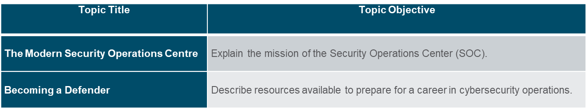

## 2.1 The Modern Security Operations Center

To use a formalized, structured, and disciplined approach for defending against cyber threats, organizations typically use the services of professionals from a Security Operations Center (SOC). 

SOCs provide a broad range of services, from monitoring and management, to comprehensive threat solutions and customized hosted security.

SOCs can be wholly in-house, owned and operated by a business, or elements of a SOC can be contracted out to security vendors, such as Cisco’s Managed Security Services.

|Tiers | Responsibilities |
|-|-|
| Tier 1 Alert Analyst | Monitor incoming alerts, verify that a true incident has occurred, and forward tickets to Tier 2, if necessary. |
| Tier 2 Incident Responder | Responsible for deep investigation of incidents and advise remediation or action to be taken. |
| Tier 3 Threat Hunter | Experts in network, endpoint, threat intelligence, malware reverse engineering and tracing the processes of the malware to determine its impact and how it can be removed. They are also deeply involved in hunting for potential threats and implementing threat detection tools. Threat hunters search for cyber threats that are present in the network but have not yet been detected. |
| SOC Manager | Manages all the resources of the SOC and serves as the point of contact for the larger organization or customer. |

First tier jobs are more entry level, while third tier jobs require extensive expertise.

### Process in the SOC

A Cybersecurity Analyst is required to monitor security alert queues and investigate the assigned alerts. A ticketing system is used to assign these alerts to the analyst’s queue. 

The software that generates the alerts can trigger false alarms. The analyst, therefore, needs to verify that an assigned alert represents a true security incident. 

When this verification is established, the incident can be forwarded to investigators or other security personnel to be acted upon. Otherwise, the alert is dismissed as a false alarm.

If a ticket cannot be resolved, the Cybersecurity Analyst forwards the ticket to a Tier 2 Incident Responder for deeper investigation and remediation. 

If the Incident Responder cannot resolve the ticket, it is forwarded it to a Tier 3 personnel.

### Technologies in the SOC: SIEM

An SOC needs a Security Information and Event Management (SIEM) system to understand the data that firewalls, network appliances, intrusion detection systems, and other devices generate.

SIEM systems collect and filter data, and detect, classify, analyze and investigate threats. They may also manage resources to implement preventive measures and address future threats. 

### Technologies in the SOC: SOAR

SIEM and Security Orchestration, Automation and Response (SOAR) are often paired together as they have capabilities that complement each other.
Large security operations (SecOps) teams use both technologies to optimize their SOC. 

SOAR platforms are similar to SIEMs as they aggregate, correlate, and analyze alerts. In addition, SOAR technology integrate threat intelligence and automate incident investigation and response workflows based on playbooks developed by the security team.

### SOC Metrics

| Metrics | Definition |
|-|-|
| Dwell Time | The length of time that threat actors have access to a network before they are detected, and their access is stopped |
| Mean Time to Detect (MTTD) | The average time that it takes for the SOC personnel to identify valid security incidents have occurred in the network |
| Mean Time to Respond (MTTR) | The average time it takes to stop and remediate a security incident |
| Mean Time to Contain (MTTC) | The time required to stop the incident from causing further damage to systems or data |
| Time to Control | The time required to stop the spread of malware in the network |

### Security and Availability

Security personnel understand that for the organization to accomplish its priorities, network availability must be preserved. Each business or industry has a limited tolerance for network downtime. That tolerance is usually based upon a comparison of the cost of the downtime in relation to the cost of ensuring against downtime. Security cannot be so strong that it interferes with the needs of employees or business functions. It is always a tradeoff between strong security and permitting efficient business functioning.