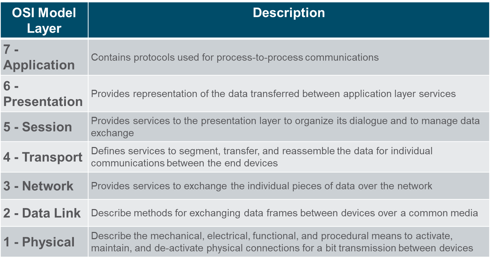
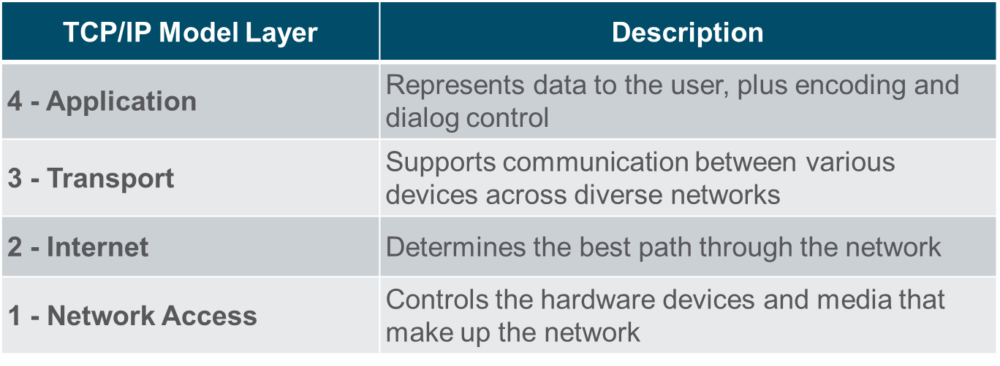
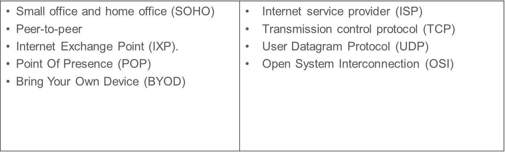

## 5.1 Network Communications Process

Networks vary in size. They range from simple networks consisting of two computers, to networks connecting millions of devices.

Businesses and large organizations use networks to provide consolidation, storage, and access to information on network servers. Networks provide email, instant messaging, and collaboration among employees. Many organizations use their network’s connection to the internet to provide products and services to customers.

Peer-to-peer network: In small businesses and homes, many computers function as both the servers and clients on the network. This type of network is called a peer-to-peer network.

Small Home networks: Small home networks connect a few computers to each other and to the internet.

Small Office and Home Office (SOHO) networks: The SOHO network allows a home office or a remote office to connect to a corporate network, or access centralized, shared resources.

Medium to Large networks: These are used by corporations and schools and can have many locations with hundreds or thousands of interconnected hosts.

World Wide networks: The internet is a network of networks that connects hundreds of millions of computers world-wide.

## Client-Server Communication

All computers that are connected to a network and that participate directly in network communication are classified as hosts. Hosts are also called end devices, endpoints, or nodes. 

Servers are simply computers with specialized software that enables servers to provide information to other end devices on the network. 

A server can be single-purpose, providing only one service, such as web pages or it can be multipurpose, providing a variety of services such as web pages, email, and file transfers.

Client computers have software installed that enables them to request and display the information obtained from the server. A single computer can run multiple types of client software.

The File Server stores corporate and user files in a central location. The client devices access these files with client software such as Windows Explorer.

The Web Server runs web server software and clients use their browser software, such as Windows Internet Explorer, to access web pages on the server.

The Email Server runs email server software and clients use their mail client software, such as Microsoft Outlook, to access email on the server.

### Typical sessions

A typical network user normally uses some type of computing device to establish many connections with network servers. Those servers could be located in the same room or around the world.
Let us see some examples.

At School
+ Students are encouraged to use devices such as laptops and tablets to access learning resources. 
Terry, connects to the school’s wi-fi network and searches for the required resources using a search engine. 
+ Her search is submitted wirelessly from her device to the school’s network. The search data is addressed so that it can find its way back to Terry. 
+ The search string of binary data is encoded into radio waves and is converted into electrical signals that travel on the school’s wired network to reach the  school’s Internet Service Provider’s (ISP) network.
+ A combination of technologies take Terry’s search to the search engine website, where the request is processed by the Search Engine’s servers. 
+ The results are then encoded and addressed to her school and eventually to Terry’s device.

While Gaming
+ Michelle uses a gaming console to play games against other players. Her network connects to an ISP using a router and a cable modem that allow her home network to connect to a cable TV network belonging to Michelle’s ISP.
+ The cable wires for Michelle’s neighborhood all connect to a central point on a telephone pole and then connect to a fiber-optic network that connects many neighborhoods served by Michelle’s ISP.
+ When Michelle connects her gaming console to a company that hosts a popular online game, her actions in her game become data that is sent to the gamer network. Information that identifies Michelle, the game she is playing, and Michelle’s network location are added to the game data. The pieces of data that represent Michelle’s game play are sent at high speed to the game provider’s network. 
+ The results are returned to Michelle in the form of graphics and sounds.

In Medical Consultations
+ Dr. Ismael Awad frequently needs to consult with other specialists on patient cases. His hospital has taken subscription to a special service called Cloud that allows medical data including patient x-rays to be stored at a central location that accessible over the internet. 
+ When a patient has an X-ray taken, the image is digitized as data. The hospital uses network services that encrypt the image data and patient information. This encrypted data cannot be intercepted and read as it travels across the internet to the cloud service provider’s data centers. The data is addressed so that it can be routed to the cloud provider’s data center to reach the correct services that provide storage and retrieval of high-resolution digital images.
+ All of this interaction is digital and takes place using networked services that are provided by the medical cloud service.

Cybersecurity analysts need to have a deep understanding of how networks operate. They must be able to determine the origin of traffic and its destination.

Traffic from a computer to an internet server can take many paths. 

## 5.2 Communications Protocols

Network Protocols

Simply having a connection between end devices is not enough to enable communication. For communication to occur, devices must know “how” to communicate. Communication is governed by rules called protocols. These protocols are specific to the type of communication method occurring. Network protocols specify many features of network communication.

Network protocols provide the means for computers to communicate on networks. Network protocols dictate the message encoding, formatting, encapsulation, size, timing, and delivery options.

Networking protocols define a common format and set of rules for exchanging messages between devices.
Some common networking protocols are Hypertext Transfer Protocol (HTTP), Transmission Control Protocol (TCP), and Internet Protocol (IP). 

### Communications Protocols: Unicast, Multicast, and Broadcast

A message can be delivered in different ways. Hosts on a network various delivery options to communicate. The different methods of communication are called as unicast, multicast, and broadcast.

Unicast: A one-to-one delivery option means there is only a single destination for the message. 

Multicast: When a host needs to send messages using a one-to many delivery option.

Broadcast: If all hosts on the network need to receive the message at the same time, a broadcast may be used. Broadcasting represents a one-to-all message delivery option.

### The Benefits of Using a Layered Model

A layered model is used to modularize the operations of a network into manageable layers. These are the benefits of using a layered model:
+ Assisting in protocol design 
+ Fostering competition 
+ Preventing technology or capability changes 
+ Providing a common language

Two layered models that are used to describe network operations are:
+ Open System Interconnection (OSI) Reference Model
+ TCP/IP Reference Model

### The OSI Reference Model

The OSI reference model provides list of functions and services that can occur at each layer. 
This type of model provides consistency within all types of network protocols and services by describing what must be done at a particular layer, but not prescribing how it should be accomplished. It also describes the interaction of each layer with the layers directly above and below.

While the TCP/IP model layers are referred only by name but the seven OSI model layers are more often referred by number rather than by name. 

The TCP/IP protocol model is also referred to as the internet model. It describes the functions that occur at each layer of protocols within the TCP/IP suite. TCP/IP is also used as a reference model. 

## 5.3 Data Encapsulation

When messages are being sent on a network, the encapsulation process works from top to bottom. At each layer, the upper layer information is considered data within the encapsulated protocol. For example, the TCP segment is considered data within the IP packet. This process is reversed at the receiving host and is known as de-encapsulation.

## 5.4 Network Protocols Summary

Networks come in all sizes and can be found in homes, businesses, and other organizations. The internet is the largest network in existence.

Servers are hosts that use specialized software to enable them to respond to requests for different types of data from clients.

Clients are hosts that use software applications such as web browsers, email clients, or file transfer applications to request data from servers.

Larger businesses may connect to Tier 2 ISPs through a Point of Presence (POP).

Tier 3 ISPs connect homes and businesses to the internet

Network protocols specify many features of network communication such as message encoding, message formatting and encapsulation, and delivery options.

Protocols specify how messages are structured and the way that networking devices share information about pathways to other networks. 

Common protocols at the application layer of the suite are DNS, DHCP, POP3, and HTTPS.
The OSI model has seven layers. The TCP/IP model has four layers.

Data is broken into a series of smaller pieces and sent over the network. This is called segmentation. 
Increased speed is gained because many data conversations can happen at the same time on the network. This is called multiplexing. 

As data is passed down the protocol stack to be sent, different information is added by each layer. This process is called encapsulation. 

The form that data takes at different layer is called a protocol data unit (PDU)

De-encapsulation is the process used by a receiving device to remove one or more of the protocol headers. 

## Terms

