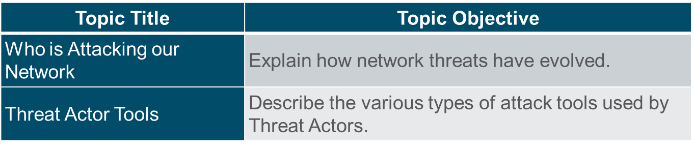
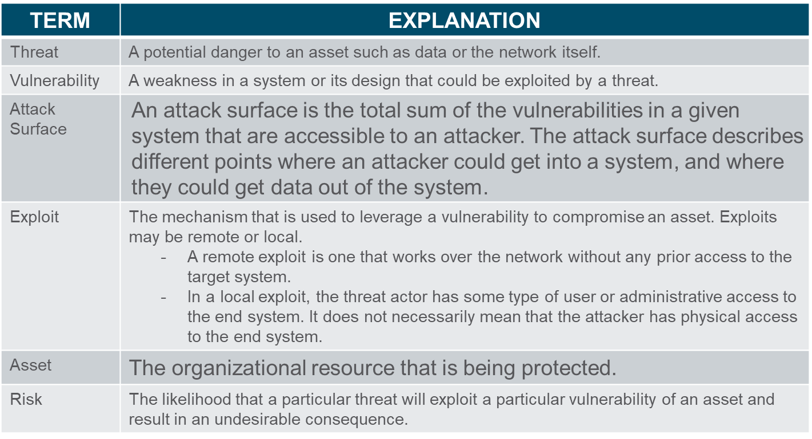
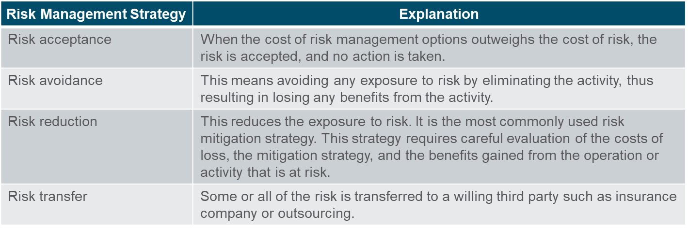
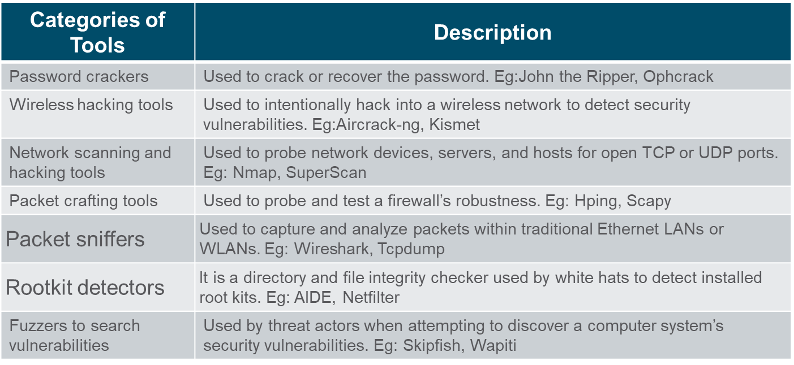
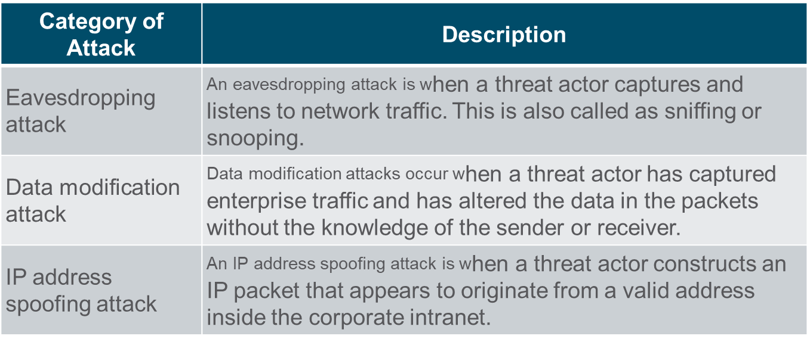
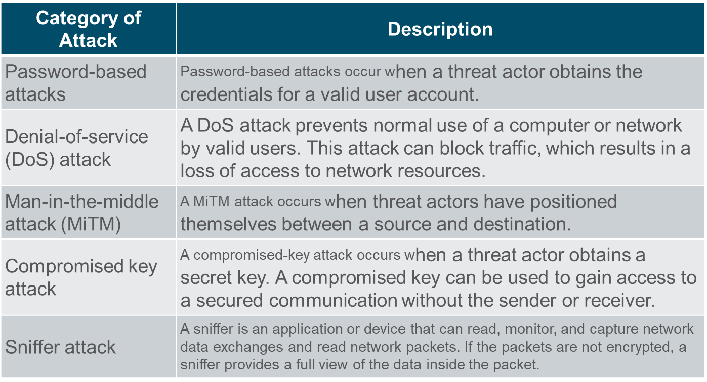
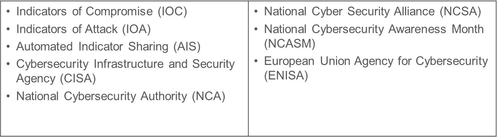

# 13.1 Who is Attacking Our Network?

Attackers wants to access our assets such as data and other intellectual property, servers, computers, smart phones, tablets, and so on.

## Threat, Vulnerability, and Risk 

Risk management is the process that balances the operational costs of providing protective measures with the gains achieved by protecting the asset. 

Four ways to manage risk:

Common network security terms:
+ Countermeasure/security control – Actions taken to protect assets by mitigating a threat or reducing risk.
+ Impact - The potential damage to the organization that is caused by the threat

## Hacker vs. Threat Actor

'Hacker' is a common term used to describe a threat actor. Hacker has a variety of meanings that are as follows:
+ A clever programmer capable of developing new programs and making coding changes to existing programs to make them more efficient.
+ A network professional that uses sophisticated programming skills to ensure that networks are not vulnerable to attack.
+ An individual who run programs to prevent or corrupt data on servers.

Types of hackers:
+ White Hat hackers
+ Gray Hat hackers
+ Black Hat hackers

White Hat Hackers: White hat hackers are ethical hackers who use their programming skills for good, ethical, and legal purposes.

Gray Hat Hackers: Gray hat hackers are individuals who commit crimes and unethical things, but not for personal gain or to cause damage.

Black Hat Hackers: Black hat hackers are unethical criminals who violate computer and network security for personal gain.

The term ‘threat actor’ is used when referring to individuals or groups that could be classified as gray or black hat hackers.

Types of Threat Actors:
+ **Script kiddies** - It refers to teenagers or inexperienced threat actors running existing scripts, tools, and exploits, to cause harm, but typically not for profit. Also called Amateur.
+ **Vulnerability brokers** - It refers to gray hat hackers who attempt to discover exploits and report them to vendors, for prizes or rewards.
+ **Hacktivists** - It refers to gray hat hackers who rally and protest against different political and social ideas. 
+ **Cybercriminals** -  It refers to black hat hackers who are either self-employed or working for large cybercrime organizations. 
+ **State-sponsored** - State-Sponsored hackers are threat actors who steal government secrets, gather intelligence, and sabotage networks of foreign governments, terrorist groups, and corporations.

Cybercriminals are threat actors who are motivated to make money using any necessary means. 
At times, cybercriminals work independently or they are financed and sponsored by criminal organizations.  They steal billions of dollars from consumers and businesses every year. They operate in underground economy and buy and sell personal information and intellectual property that they steal from victims. They target small businesses and consumers, as well as large enterprises and industries.

Threat actors target the home users, small-to-medium sized businesses, as well as large public and private organizations. Hence, Cybersecurity is a shared responsibility which all users must practice to make the internet and networks safer and more secure. Organizations must take action and protect their assets, users, and customers. They must develop and practice cybersecurity tasks such as those mentioned in the figure. Security awareness and improve the culture of security is also essential.

## Cyber Threat Indicators

Indicators Of Compromise are the evidence that an attack has occurred and each attack has unique identifiable attributes. Indicators Of Compromise can be features that identify malware files, IP addresses of servers that are used in attacks, filenames, and characteristic changes made to end system software, among others. Indicators Of Compromise help cybersecurity personnel identify what has happened in an attack and develop defenses against the attack. 

Indicators of Attack focus more on the motivation and strategies behind an attack and the attackers to gain access to assets. Indicators of Attacks helps to generate a proactive security approach that can be reused in multiple contexts and multiple attacks. Defending against a strategy can therefore prevent future attacks.

## Who is in charge of security in KSA?

The government of Saudi Arabia has established the National Cybersecurity Authority (NCA) to be the government entity in charge of cybersecurity in the country, and it serves as the national authority on its affairs. The NCA was established in 2017 by a Royal Order that links it directly to HM the King. The NCA has both regulatory and operational functions related to cybersecurity and it works closely with public and private entities to improve the cybersecurity posture of the country in order to safeguard its vital interests, national security, critical infrastructures, high-priority sectors, and government services and activities in alignment with Vision 2030.

# 13.2 Threat Actor Tools

## Introduction to Attack Tools

To exploit vulnerability, a threat actor must have a technique or tool. Over the years, attack tools have become more sophisticated, and highly automated. These new tools require less technical knowledge to implement. Recent tools are more sophisticated at the same time they require less technical knowledge to implement.

Ethical hacking involves using many different types of tools to test the network and end devices. To validate the security of a network and its systems, many network penetration testing tools have been developed and many of these tools can also be used by threat actors for exploitation. Threat actors have also created various hacking tools. Cybersecurity personnel must also know how to use these tools when performing network penetration tests.

Categories of common network penetration testing tools:

## Categories of Attacks

# 13.3 Attackers and Their Tools Summary

To understand network security, it is important to understand the terms such as threat, vulnerability, attack surface, exploit, assets, and risk.

Risk management is the process of providing protective measures by protecting the asset.

Four common ways to manage risk are risk acceptance, risk avoidance, risk reduction, and risk transfer.

Hacker is a term used to describe a threat actor. White hat hackers are ethical hackers that use their skills for good, ethical, and legal purposes. 
Gray hat hackers are individuals who commit crimes and do unethical things, but not for personal gain.

Black hat hackers are criminals who violate computer and network security for personal gain, or for malicious reasons, such as attacking networks.

Many network attacks can be prevented by sharing information about Indicators of Compromise (IOC). CISA,NSA, and NCSA are examples of cybersecurity promoting organizations.
Attack tools have become more sophisticated, and highly automated. 

Many of the tools are Linux or UNIX based and knowledge of these are useful to a cybersecurity professional. 

Tools include password crackers, wireless hacking tools, network security scanning and hacking tools, packet crafting tools, packet crafting tools, packet sniffers, rootkit detectors, fuzzers to search vulnerabilities, forensic tools, debuggers, hacking operating systems, encryption tools, vulnerability exploitation tools, and vulnerability scanners. 

Categories of attacks include eavesdropping attacks, data modification attacks, IP address spoofing attacks, password-based attacks, denial-of-service attacks, man-in the-middle attacks, compromised key attacks, and sniffer attacks.

## Terms

