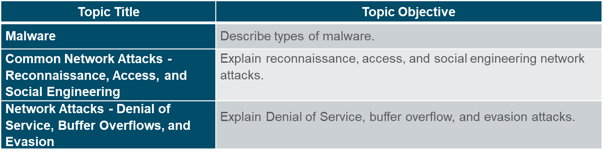

## 14.1 Malware

Malware is a code or software designed to damage, disrupt, steal, or inflict some other ‘bad’ or illegitimate action on data, hosts, or networks. The three most common types of malware are Virus, Worm, and Trojan horse.

The following video explains different types of malware.

https://www.kaspersky.com/resource-center/preemptive-safety/what-is-malware-and-how-to-protect-against-it

### Virus

A virus is a type of malware that spreads by inserting a copy of itself into another program. After the program is run, viruses spread from one computer to another, thus infecting the computers. A simple virus may install itself at the first line of code in an executable file. 

Viruses can be harmless, such as those that display a picture on the screen, or they can be destructive. They can also modify or delete files on the hard drive. Most viruses spread by USB memory drives, CDs, DVDs, network shares, and email. Email viruses are a common type of virus.

### Trojan horse

Trojan horse malware is a software that appears to be legitimate, but contains malicious code which exploits the privileges of the user that runs it. Trojans are found attached to online games.

Users are commonly tricked into loading and executing the Trojan horse on their systems. The Trojan horse concept is flexible.  It can cause immediate damage, provide remote access to the system, or access through a back door. Custom-written Trojan horses with a specific target are difficult to detect. Trojan horses are usually classified according to the damage that they cause, or the manner in which they breach a system.

Classification of Trojan Horse

| Type of Trojan Horse | Description |
|-|-|
| Remote-access | Enables unauthorized remote access. |
| Data-sending | Provides the threat actor with sensitive data, such as passwords. |
| Destructive | Corrupts or deletes files. |
| Proxy | Uses the victim's computer as the source device to launch attacks and perform other illegal activities. |
| FTP | Enables unauthorized file transfer services on end devices. |
| Security software disabler | Stops antivirus programs or firewalls from functioning. |
| Denial of Service (DoS) | Slows or halts network activity. |
| Keylogger | Actively attempts to steal confidential information, such as credit card numbers, by recording keystrokes entered into a web form. |

### Worms

Computer worms are similar to viruses, they replicate themselves by independently exploiting vulnerabilities in networks. Worms can slow down networks as they spread from system to system. Worms can run without a host program. However, once the host is infected, the worm spreads rapidly over the network. In 2001, the Code Red worm had initially infected 658 servers. Within 19 hours, the worm had infected over 300,000 servers.

The initial infection of the SQL Slammer worm is known as the worm that ate the internet. SQL Slammer was a Denial of Service (DoS) attack that exploited a buffer overflow bug in Microsoft’s SQL Server. The number of infected servers doubled in size every 8.5 seconds. The infected servers did not have the updated patch that was released 6 months earlier. Hence it is essential for organizations to implement a security policy requiring updates and patches to be applied in a timely fashion.

### Components of Worms

The three worm components are as follows:
+ Enabling vulnerability - A worm installs itself using an exploit mechanism, such as an email attachment, an executable file, or a Trojan horse, on a vulnerable system.
+ Propagation mechanism - After gaining access to a device, the worm replicates itself and locates new targets.
+ Payload - Any malicious code that results in some action is a payload. Most often this is used to create a backdoor that allows a threat actor to access the infected host or to create a DoS attack.

Worms are self-contained programs that attack a system to exploit a known vulnerability.
They reside in active memory and duplicate themselves. Upon successful exploitation, the worm copies itself from the attacking host to the newly exploited system and the cycle begins again. This propagation mechanism is commonly deployed in a way that is difficult to detect.

Worms never stop spreading on the internet. After they are released, worms continue to propagate until all possible sources of infection are properly patched.

### Ransomware

Ransomware is a malware that denies access to the infected computer system or its data. Ransomware frequently uses an encryption algorithm to encrypt system files and data. Email and malicious advertising, also known as malvertising, are vectors for ransomware campaigns. Social engineering is also used, when cybercriminals pretending to be security technicians make random calls at homes and persuade users to connect to a website that downloads ransomware to the user’s computer.

| Type of Malware | Description |
|-|-|
| Scareware | Includes scam software which uses social engineering to shock or induce anxiety by creating the perception of a threat. It is generally directed at an unsuspecting user and attempts to persuade the user to infect a computer by taking action to address the bogus threat. |
| Phishing | Attempts to convince people to divulge sensitive information. Examples include receiving an email from their bank asking users to divulge their account and PIN numbers. |
| Rootkits | Installed on a compromised system. After it is installed, it continues to hide its intrusion and provide privileged access to the threat actor. |
| Spyware | Used to gather information about a user and send the information to another entity without the user’s consent. Spyware can be a system monitor, Trojan horse, Adware, tracking cookies, and key loggers. |
| Adware | Displays annoying pop-ups to generate revenue for its author. The malware may analyze user interests by tracking the websites visited. It can then send pop-up advertising pertinent to those sites. |

### Common Malware Behaviors

Computers infected with malware often exhibit one or more of the following symptoms:
+ Appearance of strange files, programs, or desktop icons
+ Antivirus and firewall programs are turning off or reconfiguring settings
+ Computer screen is freezing or system is crashing
+ Emails are spontaneously being sent without your knowledge to your contact list
+ Files have been modified or deleted
+ Increased CPU and/or memory usage
+ Problems connecting to networks
+ Slow computer or web browser speeds
+ Unknown processes or services running
+ Unknown TCP or UDP ports open
+ Connections are made to hosts on the Internet without user action
+ Strange computer behavior

## 14.2 Common Network Attacks - Reconnaissance, Access, and Social Engineering

### Types of Network Attacks

Malware is a means to get a payload delivered. When a payload is delivered and installed, it can be used to cause a variety of network-related attacks from the inside as well as from the outside.

Network attacks are classified into three categories:
+ Reconnaissance Attacks
+ Access Attacks
+ Denial of Services Attacks

Reconnaissance is information gathering.

Threat actors use reconnaissance (or recon) attacks to do unauthorized discovery and mapping of systems, services, or vulnerabilities.

Reconnaissance attacks precede access attacks or DoS attacks.

| Technique | Description |-|
|-|-|-|
| Perform an information query of a target | The threat actor is looking for initial information about a target. | Google search, organizations website, whois |
| Initiate a ping sweep of the target network | The information query usually reveals the target’s network address. The threat actor can now initiate a ping sweep to determine which IP addresses are active. |-|
| Port scanner initiate a port scan of active IP addresses | This is used to determine which ports or services are available. | Nmap, SuperScan, Angry IP Scanner, NetScanTools. |
| Vulnerability scanners | This is to query the identified ports to determine the type and version of the application and operating system that is running on the host. | Nipper, Secuna PSI, Core Impact, Nessus v6, SAINT, Open VAS. |
| Exploitation tools | The threat actor now attempts to discover vulnerable services that can be exploited. A variety of vulnerability exploitation tools | Metasploit, Core Impact, Sqlmap, Social Engineer Toolkit, Netsparker. |

### Access Attacks

|-|-|
|-|-|
| Access attacks | exploit known vulnerabilities in authentication services, FTP services, and web services to gain entry into web accounts, confidential databases, and other sensitive information. |
| Password Attacks | The threat actor attempts to discover critical system passwords using a variety of password cracking tools. |
| Spoofing Attacks | The threat actor device attempts to pose as another device by falsifying data. |

Common spoofing attacks include IP spoofing, MAC spoofing, and DHCP spoofing.

+ Trust exploitations
+ Port redirections
+ Man-in-the-middle attacks
+ Buffer overflow attacks

Trust Exploitation: A hacker uses unauthorized privileges to gain access to a system, possibly compromising the target. For example, if a DMZ device has access to the inside network, an attacker could leverage that by gaining access to the DMZ device and using that location to launch his attacks from there to the inside network.

Port Redirection: A hacker uses a compromised system as a base for attacks against other targets

Man-in-the-Middle Attack: An attacker places himself in line between two legitimate devices that are communicating, with the intent to perform reconnaissance or to manipulate the data as it moves between them. This can happen at Layer 2 or Layer 3. The main purpose is eavesdropping, so the attacker can see all the traffic.

Buffer Overflow Attack: An attacker exploits a buffer overflow vulnerability, which is a programming flaw. If a service accepts input and expects the input to be within a certain size but does not verify the size of input upon reception, it may be vulnerable to a buffer overflow attack. This means that an attacker can provide input that is larger than expected, and the service will accept the input and write it to memory, filling up the associated buffer and also overwriting adjacent memory. This overwrite may corrupt the system and cause it to crash, resulting in a DoS. In the worst cases, the attacker can inject malicious code, leading to a system compromise.

### Social Engineering

Social Engineering is an access attack that attempts to manipulate individuals into performing actions or divulging into confidential information. Some social engineering techniques are performed in-person or via the telephone or internet.

| Social Engineering Attack | Description |
|-|-|
| Pretexting | A threat actor pretends to need personal or financial data to confirm the identity of the recipient. |
| Phishing | A threat actor sends fraudulent email which is disguised as being from a legitimate, trusted source to trick the recipient into installing malware on their device, or to share personal or financial information. |
| Spear phishing |A threat actor creates a targeted phishing attack tailored for a specific individual or organization. |
| Spam | Also known as junk mail, this is unsolicited email which often contains harmful links, malware, or deceptive content. |
| Something for Something | Sometimes called “Quid pro quo”, this is when a threat actor requests personal information from a party in exchange for something such as a gift. |
| Baiting | A threat actor leaves a malware infected flash drive in a public location. A victim finds the drive and unsuspectingly inserts it into their laptop, unintentionally installing malware. |
| Impersonation | In this type of attack, a threat actor pretends to be someone else to gain the trust of a victim. |
| Tailgating | This is where a threat actor quickly follows an authorized person into a secure location to gain access to a secure area. |
| Shoulder surfing | This is where a threat actor inconspicuously looks over someone’s shoulder to steal their passwords or other information. |
| Dumpster diving | This is where a threat actor rummages through trash bins to discover confidential documents. |

The Social Engineer Toolkit was designed to help white hat hackers and other network security professionals to create social engineering attacks to test their own networks.

Enterprises must educate their users about the risks of social engineering, and develop strategies to validate identities over the phone, via email, or in person.

Cybersecurity is as strong as its weakest link. The weakest link in cybersecurity can be the personnel within an organization, and social engineering is a major security threat. One of the most effective security measures that an organization can take is to train its personnel and create a ‘security-aware culture’.

## 14.3 Network Attacks - Denial of Service, Buffer Overflows, and Evasion

**DoS Attack**: attempts to consume all of the resources of a critical computer or network in order to make it unavailable for valid use. A DoS attack typically results in some sort of interruption of service to users, devices, or applications.

**DDoS Attack**: Malicious hosts can also coordinate to flood a victim with an abundance of attack packets, so that the attack takes place simultaneously from potentially thousands of sources. This type of attack is called a DDoS attack. DDoS attacks typically emanate from networks of compromised systems, known as botnets.

A Denial of Service (DoS) attack creates some sort of interruption in network services to users, devices, or applications. The two types of DoS attacks are as follows:
+ Overwhelming Quantity of Traffic - The threat actor sends an enormous quantity of data at a rate that the network, host, or application cannot handle. 
+ Maliciously Formatted Packets - The threat actor sends a maliciously formatted packet to a host or application and the receiver is unable to handle it.

Mirai is a malware that targeted IoT devices configured with default login information. The botnet was used as part of a Distributed Denial of Service (DDoS) attack.

### Buffer Overflow Attack

The threat actor uses the buffer overflow DoS attack to find a system memory-related flaw on a server and exploit it. For instance, a remote denial of service attack vulnerability was discovered in Microsoft Windows 10, where the threat actor created malicious code to access out-of-scope memory. Another example is ping of death, where a threat actor sends a ping of death, which is an echo request in an IP packet that is larger than the maximum packet size. The receiving host cannot handle a packet size and it would crash. It is estimated that one third of malicious attacks are the result of buffer overflows.

### Evasion Methods

| Evasion Method | Description |
|-|-|
| Encryption and tunneling | This evasion technique uses tunneling to hide, or encryption to scramble, malware files. This makes it difficult for many security detection techniques to detect and identify the malware. Tunneling can mean hiding stolen data inside of legitimate packets. |
| Resource exhaustion | This evasion technique makes the target host too busy to properly use security detection techniques. |
| Traffic fragmentation | This evasion technique splits a malicious payload into smaller packets to bypass network security detection. After the fragmented packets bypass the security detection system, the malware is reassembled and may begin sending sensitive data out of the network. |
| Protocol-level misinterpretation | This evasion technique occurs when network defenses do not properly handle features of a PDU like a checksum or TTL value. This can trick a firewall into ignoring packets that it should check. |
| Traffic substitution | In this evasion technique, the threat actor attempts to trick an IPS by obfuscating the data in the payload. This is done by encoding it in a different format. For example, the threat actor could use encoded traffic in Unicode instead of ASCII. The IPS does not recognize the true meaning of the data, but the target end system can read the data. |
| Traffic insertion | Similar to traffic substitution, but the threat actor inserts extra bytes of data in a malicious sequence of data. The IPS rules miss the malicious data, accepting the full sequence of data. |
| Pivoting | This technique assumes the threat actor has compromised an inside host and wants to expand their access further into the compromised network. An example is a threat actor who has gained access to the administrator password on a compromised host and is attempting to login to another host using the same credentials. |
| Rootkits | A rootkit is a complex attacker tool used by experienced threat actors. It integrates with the lowest levels of the operating system. When a program attempts to list files, processes, or network connections, the rootkit presents a sanitized version of the output, eliminating any incriminating output. The goal of the rootkit is to completely hide the activities of the attacker on the local system. |
| Proxies | Network traffic can be redirected through intermediate systems in order to hide the ultimate destination for stolen data. In this way, known command-and-control not be blocked by an enterprise because the proxy destination appears benign. Additionally, if data is being stolen, the destination for the stolen data can be distributed among many proxies, thus not drawing attention to the fact that a single unknown destination is serving as the destination for large amounts of network traffic. |

## 14.4 Common Threats and Attacks Summary

Malware is short for malicious software or malicious code.

Most viruses are spread through USB memory drives, CDs, DVDs, network shares, and email.

Trojans are found in online games.  

Three common types of malware are virus, worm, and Trojan horse.

Threat actors can also attack the network from outside.

The three major categories are reconnaissance, access, and DoS attacks.

Recon attacks precede access or DoS attacks.

Access attacks exploit known vulnerabilities in authentication services, FTP services, and web services. 
DoS attacks create some sort of interruption of network services to users, devices, or applications.

DDoS attacks are similar in intent to DoS attacks, except that the DDoS attack increases in magnitude because it originates from multiple, coordinated sources.

Mirai is a malware that targets IoT devices configured with default login information.

The goal of a threat actor when using a buffer overflow DoS attack is to find a system memory-related flaw on a server and exploit it. 

## Terms

+ Social Engineer Toolkit (SET)
+ Denial of Service (DoS)
+ Distributed Denial of Service (DDoS)
+ Buffer Overflows
+ Mirai Botnet
+ Reconnaissance Attack
+ Access Attack
+ Social Engineering