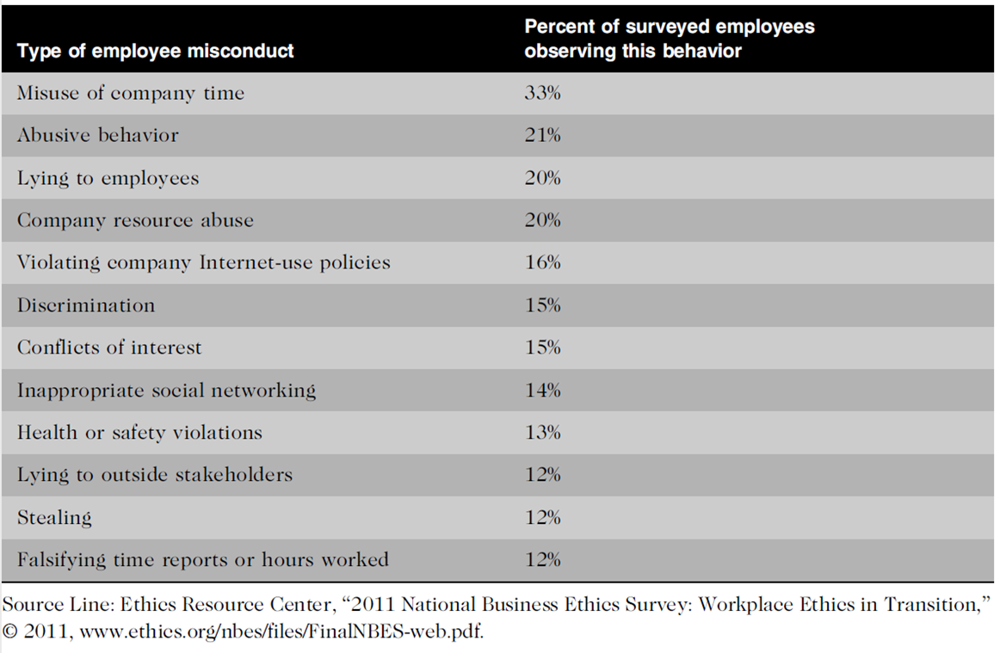
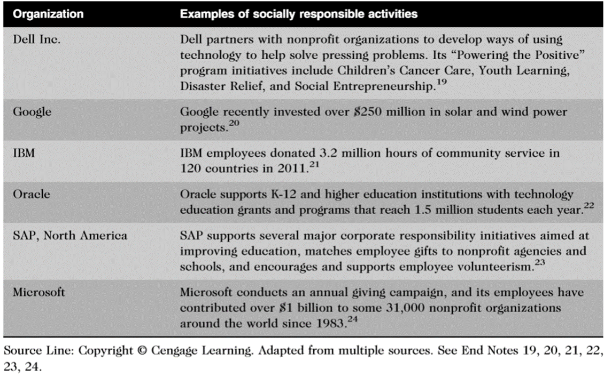

## Moral code

Every society forms a set of rules that establishes the boundaries of generally accepted behavior. These rules are often expressed in statements about how people should behave, and the individual rules fit together to form the moral code. The different rules often have contradictions, and people are sometimes uncertain about which rule to follow. For instance, if you witness a friend copy someone else’s answers while taking an exam, you might be caught in a conflict between loyalty to your friend and the value of telling the truth by which a society lives.

Sometimes the rules do not seem to cover new situations, and an individual must determine how to apply existing rules or develop new ones. You may strongly support personal privacy, but do you think an organization should be prohibited from monitoring employees’ use of its email and Internet services?

The term morality refers to social conventions about right and wrong that are so widely shared that they become the basis for an established consensus. However, individual views of what behaviour is moral may vary by age, cultural group, ethnic background, religion, life experiences, education, and gender.

Some behaviours that are accepted in one culture might be unacceptable in another
Even within the same society, people can have strong disagreements over important moral issues. Examples?

## Ethics

Ethics is a set of beliefs about right and wrong behavior within a society. Another definition, ethics describes standards or codes of behavior expected of an individual by a group (nation, organization, profession) to which an individual belongs. For example, the ethics of the law profession demand that defense attorneys defend an accused client to the best of their ability, even if they know that the client is guilty of the most heinous and morally objectionable crime one could imagine. Ethical behavior conforms to generally accepted norms—many of which are almost universal. However, although nearly everyone would agree that certain behaviors—such as lying and cheating—are unethical, opinions about what constitutes ethical behavior can vary dramatically.

## Virtue and Vice 

A virtue is a habit that inclines people to do what is acceptable i.e. fairness, generosity, and loyalty. A vice is a habit of unacceptable behaviour i.e. vanity, greed, envy, and anger. People’s virtues and vices help define their personal value system—the complex scheme of moral values by which they live.

Moral code: Statements about how people should behave within a society

Morality: shared social conventions about right and wrong that become the basis for an established consensus

Ethics is a set of beliefs about right and wrong behavior within a society

Virtues and vices define an individual’s moral values system 

Virtue: Habit that inclines people to do what is acceptable i.e. Fairness, generosity, and loyalty

Vice: Habit of unacceptable behavior i.e. greed, envy, and anger

## Law

Law is a system of rules that tells us what we can and cannot do. Laws are enforced by a set of institutions (the police, courts, law-making bodies). Legal acts are acts that conform to the law. Moral acts conform to what an individual believes to be the right thing to do. Laws can proclaim an act as legal, although many people may consider the act immoral—for example, abortion.

Morals 

Personal beliefs about right and wrong. Moral acts conform to what an individual believes to be the right thing to do.

Ethics

Standards or codes of behavior expected of an individual by a group to which the individual belongs
i.e. the ethics of the law profession to defend the client even if he/she is guilty. Ethical behaviour conforms to generally accepted norms—many of which are almost universal.

Laws

System of rules, enforced by a set of institutions, that tells us what we can and cannot do
Legal acts are acts that conform to the law. Laws are enforced by a set of institutions (the police, courts, law-making bodies).

## Integrity

Is it okay to lie to protect someone’s feelings? Should you intervene with a co-worker who seems to have a chemical dependency problem? Is it acceptable to exaggerate your work experience on a résumé? Can you cut corners on a project to meet a tight deadline?

A person who acts with integrity acts in accordance with a personal code of principles. One approach to acting with integrity—one of the cornerstones of ethical behavior—is to extend to all people the same respect and consideration that you expect to receive from others. Applying the same moral standards in all situations (consistency)

## Inconsistency

Unfortunately consistency can be difficult to achieve. When you are in a situation that conflicts with your moral standards. For example, you might believe it is important to do as your employer requests while also believing that you should be fairly compensated for your work. Thus, if your employer insists that, due to budget constraints, you not report the overtime hours that you have worked, a moral conflict arises. You can do as your employer requests or you can insist on being fairly compensated, but you cannot do both. In this situation, you may be forced to compromise one of your principles and act with an apparent lack of integrity.

If you apply moral standards differently according to the situation or people involved. For example, you might consider it morally acceptable to tell a little white lie to spare a friend some pain or embarrassment, but would you lie to a work colleague or customer about a business issue to avoid unpleasantness?

## Ethical dilemma

An ethical dilemma is one in which a person has to choose between two options, both of which are morally correct but in conflict. Many ethical dilemmas are not as simple as right versus wrong but involve choices between right versus right. 
+ Individual versus community
+ Truth versus loyalty
+ Short term versus long term
+ Justice versus mercy

Example 1: A teenager going to the concert without her mom knowing 

Example 2: would you lie about your friend hair style? 

## Ethics In Business World

Ethics has risen to the top of the business agenda because the risks associated with inappropriate behavior have increased. Numerous corporate officers and senior managers  have been sentenced to prison terms for their unethical behavior. Many financial institutions have been collapsed. The financial crisis due to unwise and/or unethical decision making regarding the approval of mortgages, loans, and lines of credit to unqualified individuals and organizations. Unethical behavior has led to serious negative consequences that have had a major global impact.

Some organizations are sorely tempted to resort to unethical behavior to maintain profits. For example, the chairman of the India-based outsourcing firm Satyam Computer Services admitted he had overstated the company’s assets by more than $1 billion. The revelation represented India’s largest ever corporate scandal and caused the government to step in to protect the jobs of the company’s 53,000 employees.

Factors which lead to increase in unethical behavior
+ Highly complex work environments make it difficult to apply principles and codes of ethics consistently (diverse cultures and societies)
+ Pressure to maintain revenue and profits
+ The ability to capture and store vast amounts of personal data, and greater reliance on information systems in all aspects of life have increased the risk that information technology will be used unethically. 

Employees, shareholders, and regulatory agencies are increasingly sensitive to:
+ violations of accounting standards
+ failures to disclose substantial changes in business conditions
+ nonconformance with required health and safety practices
+ production of unsafe or substandard products.

How?

Companies that produce safe and effective products avoid costly recalls and lawsuits. i.e. Samsung

Companies that develop and maintain strong employee relations enjoy lower turnover rates and better employee morale.

Suppliers and other business partners often place a priority on working with companies that operate in a fair and ethical manner.

As a result, ethical companies tend to be more profitable over the long term than unethical companies.

A classic example of the many risks of unethical decision making can be found in the Enron accounting scandal. In 2000, Enron employed over 22,000 people and had annual revenue of $101 billion. During 2001, it was revealed that much of Enron’s revenue was the result of deals with limited partnerships, which it controlled. In addition, as a result of faulty accounting, many of Enron’s debts and losses were not reported in its financial statements. As the accounting scandal unfolded, Enron shares dropped from $90 per share to less than $1 per share, and the company was forced to file for bankruptcy.

In 2011, IBM agreed to pay $10 million to settle civil charges arising from a lawsuit filed by the Securities and Exchange Commission (SEC) alleging the firm had violated the Foreign Corrupt Practices Act for bribing government officials in China and South Korea to secure the sale of IBM products.
The act makes it illegal for corporations listed on U.S. stock exchanges to bribe foreign officials.

## Corporate social responsbility

Corporate social responsibility is the concept that an organization should act ethically by taking responsibility for the impact of its actions on the environment, the community, and the welfare of its employees. Setting corporate social responsibility goals encourages an organization to achieve higher moral and ethical standards.

Companies often declare their corporate social responsibility goals. They may also issue a formal statement of their company’s values, principles, or beliefs.

Supply chain sustainability is a component of corporate social responsibility that focuses on developing and maintaining a supply chain that meets the needs of the present without compromising the ability of future generations to meet their needs. Supply chain sustainability takes into account such issues as fair labor practices, energy and resource conservation, human rights, and community responsibility. 

Many IT equipment manufacturers have made supply chain sustainability a priority, in part, because they must adhere to various standards. In many cases, meeting supply chain sustainability goals can also lead to lower costs. For example, since 2001, Intel has invested over $45 million in efforts to reduce its energy costs. As a result of those initiatives, the company has saved on average $23 million per year.

Why fostering corporate social responsibility and good business ethics is important?

To gain the good will of the community

To create an organization that operates consistently

To foster good business practices

To protect organization/employees from legal action

To avoid unfavorable publicity

Company’s Value System

Although each company’s value system is different, many share the following values:

Operate with honesty and integrity, staying true to organizational principles.

Operate according to standards of ethical conduct, in words and action.

Treat colleagues, customers, and consumers with respect.

Strive to be the best at what matters most to the organization.

Value diversity.

Make decisions based on facts and principles.

Improving Corporate Ethics

A well-implemented ethics and compliance program and a strong ethical culture can lead to less pressure on employees to misbehave and a decrease in observed misconduct. It also creates an environment in which employees are more comfortable reporting instances of misconduct, partly because there is less fear of potential retaliation by management against reporters

Characteristics of a Successful Ethics Program

Employees are willing to seek advice about ethics issues

Employees feel prepared to handle situations that could lead to misconduct

Employees are rewarded for ethical behavior

Organization does not reward success obtained through questionable means

Employees feel positively about their company

Scenario1: buying a present to a co-worker by encouraging employees to contribute by giving money!
Do you think that this is a fair request? How would you respond if such pressure is applied to you?

Scenario2: signing unfair terms in a contract!

The board of directors are responsible for establishing a strong organizational ethics program

Provides an organization with vision and leadership in the area of business conduct.

Ideally, the corporate ethics officer should be a well-respected, senior-level manager who reports directly to the CEO. Also known as corporate compliance officer.

Ethics officers come from diverse backgrounds, such as legal staff, human resources, finance, auditing, security, or line operations.

Responsibilities

Ensuring compliance of ethical procedures

Creating and maintaining the ethics culture that the highest level of corporate authority wishes to have
Being the key contact person for ethics issues

The board of directors is responsible for the careful and responsible management of an organization. 

In a for-profit organization, the board’s primary objective is to oversee the organization’s business activities and management for the benefit of all stakeholders, including shareholders, employees, customers, suppliers, and the community.

The board is not normally responsible for day-to-day management and operations; these responsibilities are delegated to the organization’s management team.

Board members:
+ Conduct themselves according to the highest standards of personal and professional integrity
+ Set examples of high-level ethical behavior
+ Set standards for company-wide ethical conduct 
+ Ensure compliance with laws and regulations
+ Creat an environment in which employees can:
  + Seek advice about business conduct
  + Raise issues
  + Report misconduct

## Corporate code of ethics

A code of ethics is a statement that highlights an organization’s key ethical issues and identifies the overarching values and principles that are important to the organization and its decision making. Codes of ethics frequently include a set of formal, written statements about the purpose of an organization, its values, and the principles that should guide its employees’ actions. An effective code of ethics helps ensure that employees abide by the law, follow necessary regulations, and behave in an ethical manner.

Organizational code of ethics should: 
+ apply to staff cross all seniority
+ focus on employees in work-roles susceptible to ethical risk
+ provide mechanisms for reporting unethical conduct
+ foster a culture of honesty and accountability

A code of ethics cannot gain company-wide acceptance unless it is developed with employee participation and fully endorsed by the organization’s leadership. It must also be easily accessible by employees, shareholders, business partners, and the public. It must continually be applied to a company’s decision making and be an important part of its culture. Breaches in the code of ethics must be identified and dealt with appropriately so the code’s relevance is not undermined.

Organization reviews its ethical and social responsibility goals, and communicates its goals for the upcoming year.

Information is shared with
+ Stakeholders
+ Market analysts
+ Government agencies
+ Communities in which the organization operates

Includes

Showing employees examples of how to apply the code of ethics in real life 

Comprehensive ethics education program that encourages employees to act ethically

Goal 

Encourage employees to report any misconducts

Show employees effective ways of reporting incidents

Reassure employees that such feedback will be acted on and that they will not be subjected to retaliation

Increasingly, managers are including ethical conduct as part of an employee’s performance appraisal.

Treating others fairly and with respect

Operating effectively in a multicultural environment

Accepting personal accountability for meeting business needs

Continually developing others and themselves

Operating openly and honestly with suppliers, customers, and other employees

Concerns about the ethical use of information technology
+ E-mail and Internet access monitoring at work
+ Downloading in violation of copyright laws
+ Unsolicited e-mail 
+ Identify theft
+ Plagiarism by students 
+ Cookies and spyware to track visitors' hard drives

## Summary

Organizations require successful ethics programs

The corporate ethics officer ensures that ethical procedures are installed and followed

Managers’ behaviors and expectations can strongly influence employees’ ethical behavior

Most of us have developed a simple decision-making model that includes five steps

Ethical considerations must be incorporated into decision making

Four common approaches to ethical decision making
+ Virtue ethics approach
+ Utilitarian approach
+ Fairness approach
+ Common good approach

### Terms

Bathsheba syndrome: the moral corruption of people in power, which is often facilitated by a tendency for people to look the other way when their leaders act inappropriately

Code of ethics: a statement that highlights an organization’s key ethical issues and identifies the overarching values and principles that are important to the organization and its decision making

Common good approach: based on a vision of society as a community whose members work together to achieve a common set of values and goals

Corporate compliance officer: a senior-level manager who provides an organization with vision and leadership in the area of business conduct; ethics officers come from diverse backgrounds, such as legal staff, human resources, finance, auditing, security, or line operations

Corporate social responsibility: the concept that an organization should act ethically by taking responsibility for the impact of its actions on the environment, the community, and the welfare of its employees

Ethics: a set of beliefs about right and wrong behavior within a society
Fairness approach—focuses on how fairly actions and policies distribute benefits and burdens among people affected by the decision

Integrity:  one of the cornerstones of ethical behavior; a person who acts with integrity acts in accordance with a personal code of principles

Law: a system of rules that tells us what we can and cannot do; laws are enforced by a set of institutions (the police, courts, law-making bodies)

Moral code: a set of rules that establishes the boundaries of generally accepted behavior

Morality: refers to social conventions about right and wrong that are so widely shared that they become the basis for an established consensus

Morals: one’s personal beliefs about right and wrong

Problem statement: a clear, concise description of the issue that needs to be addressed in a decision-making process

Sarbanes-Oxley Act of 2002: the goal of the bill was to renew investors’ trust in corporate executives and their firms’ financial reports; the act led to significant reforms in the content and preparation of disclosure documents by public companies

Social audit: an organization reviews how well it is meeting its ethical and social responsibility goals, and communicates its new goals for the upcoming year

Supply chain sustainability: a component of CSR that focuses on developing and maintaining a supply chain that meets the needs of the present without compromising the ability of future generations to meet their needs

Stakeholder: someone who stands to gain or lose, depending on how a situation is resolved; an organization’s stakeholders include shareholders, employees, customers, suppliers, and the community

Utilitarian approach: states that you should choose the action or policy that has the best overall consequences for all people who are directly or indirectly affected

Vice: a habit of unacceptable behavior

Virtue: a habit that inclines people to do what is acceptable

Virtue ethics approach: focuses on how you should behave and think about relationships if you are concerned with your daily life in a community