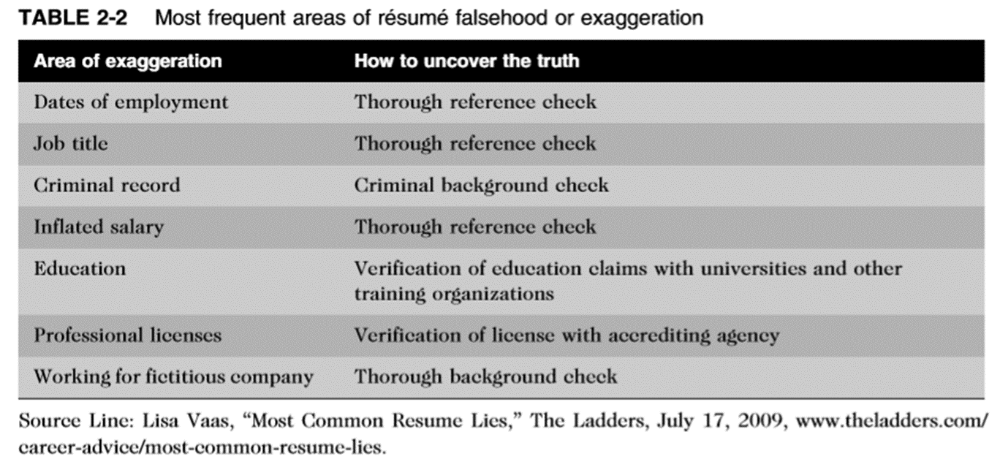
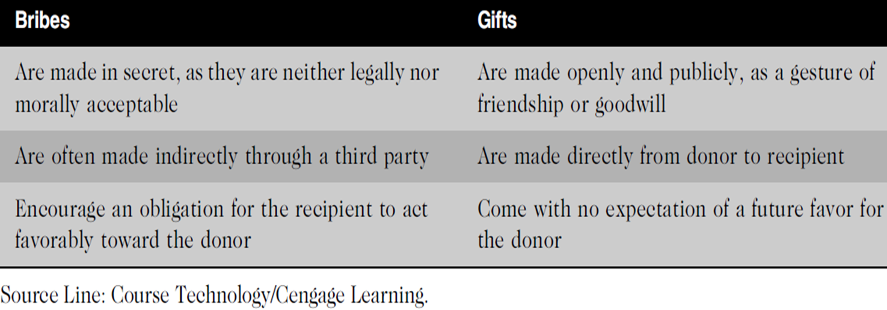

The growth of the Internet, the ability to capture and store vast amounts of personal data,
and greater reliance on information systems in all aspects of life have increased the risk
that information technology will be used unethically. In the midst of the many IT breakthroughs
in recent years, the importance of ethics and human values has been underemphasized — with a range of consequences. Here are some examples that raise public concern about the ethical use of information technology:

• Many employees have their email and Internet access monitored while at work, as employers struggle to balance their need to manage important company assets and work time with employees’ desire for privacy and selfdirection.

• Millions of people have downloaded music and movies at no charge and in apparent violation of copyright laws at tremendous expense to the owners of those copyrights.

• Organizations contact millions of people worldwide through unsolicited email (spam) as an extremely low-cost marketing approach.

• Hackers break into databases of financial and retail institutions to steal customer information, then use it to commit identity theft—opening new accounts and charging purchases to unsuspecting victims.

• Students around the world have been caught downloading material from the Web and plagiarizing content for their term papers.

• Web sites plant cookies or spyware on visitors’ hard drives to track their online purchases and activities.

Requires specialized knowledge and a long and intensive academic preparation

The United States Code of federal regulations defines a “professional employee” as one who is engaged in the performance of work:
1. requiring knowledge of an advanced type in a field of science or learning customarily acquired by a prolonged course of specialized intellectual instruction and study in an institution of higher learning or a hospitalPossess advanced training and experience
2. requiring the consistent exercise of discretion and judgment in its performance;
3. which is predominantly intellectual and varied in character of developments in their field
4. which is of such character that the output produced or the result accomplished by such work cannot be standardized in relation to a given period of time

## IT workers

One could argue, that not every IT role requires

"Knowledge of an advanced type in a field of science or learning customarily acquired by a prolonged course of specialized intellectual instruction and study,"

IT workers typically become involved in many different relationships, including those with employers, clients, suppliers, other professionals, IT users, and society at large. In each relationship, an ethical IT worker acts honestly and appropriately.

IT workers agree on many aspects of work relationship before workers accept job offer. Other aspects of work relationship defined in company’s policy and procedure manual or code of conduct. Some aspects develop over time. As steward of organization’s IT resources, IT workers must set an example and enforce policies regarding the ethical use of IT.

## Software piracy

Act of illegally making copies of software or enabling access to software to which they are not entitled
Although end users often get the blame when it comes to using illegal copies of commercial software, software piracy in a corporate setting is sometimes directly traceable to IT staff members—either they allow it to happen or they actively engage in it,
The Business Software Alliance (BSA) is a trade group representing the world’s largest software and hardware manufacturers; mission is to stop the unauthorized copying of software  (Adobe, Apple, Intel, McAfee, Microsoft…)

## Trade secret

A trade secret is information, generally unknown to the public, that a company has taken strong measures to keep confidential.

It represents something of economic value that has required effort or cost to develop and that has some degree of uniqueness or novelty. (examples: the Colonel’s secret recipe of  KFC,  Intel’s formula for i7….)

Companies often require employees to sign confidentiality agreements and promise not to reveal the company’s trade secrets. especially if they leave the company.

## Whistle-blowing

Effort by an employee to attract attention to a negligent, illegal, unethical, or abusive act by a company that threatens the public interest.

In 2012, the Alexander Automotive Group paid $325,000 to settle claims that it was using unlicensed Microsoft software on its computers. As part of the settlement agreement with BSA, the firm deleted all unlicensed copies of software from its computers, purchased the licenses required to become compliant, and agreed to implement more effective software management procedures. BSA was alerted to this situation by a report sent to its Web site.

Relationships between IT workers and clients

IT workers provide services to clients; sometimes those “clients” are coworkers who are part of the same organization as the IT worker. In other cases, the client is part of a different organization. 
In relationships between IT workers and clients, each party agrees to provide something of value to the other. 

IT worker provides:

Hardware, software, or services at a certain cost and within a given time frame

Client provides: 

Compensation

Access to key contacts

Work space

Relationship is usually documented in contractual terms

Ethical problem that can interfere with the relationship between IT workers and their clients :

## Conflict of interest

Example : an IT consulting assessing a firm’s IT strategic plan as poor in order to recommend its proprietary products and services 

Example 2: project manager may be reluctant to share status information because of contractual penalties for failure to meet the schedule or to develop certain system functions.

## Fraud

Obtaining goods, services, or property through deception or trickery
Example : Paul Ceglia 2010 sued Facebook claiming to own a majority of the company.

## Misrepresentation

Misstatement or incomplete statement of a material fact 
Example:   A user filed a lawsuit against Apple after he realized that Siri  (the voice-activated software) was not performing as expected. When he  asked Siri for directions, it did not understand the question or after a long delay gave incorrect directions.

## Breach of contract

Occurs when one party fails to meet the terms of a contract
Example: Oracle entered into a contract with the GSA (an independent agency of the U.S.  Government )   for the sale of software and technical support. The contract required Oracle to provide the government with its pricing policies.  However, Oracle failed to disclose that other customers received greater discounts than the GSA 

When IT projects go wrong because of cost overruns, schedule slippage, lack of system functionality, and so on, aggrieved parties might charge fraud, fraudulent misrepresentation, and/or breach of contract. 

Trials can take years to settle, generate substantial legal fees, and create bad publicity for both parties. 

As a result, the vast majority of such disputes are settled out of court, and the proceedings and outcomes are concealed from the public. In addition, IT vendors have become more careful about protecting themselves from major legal losses by requiring that contracts place a limit on potential damages (Limitation Of Liability Clause).

The limitation of liability clause restricts the amount and type of damages that one party can recover from another. 

Example: "In no event shall a party's liability to the other party for direct damages exceed an amount equal to the greater of (1) three times the amount of fees paid by Customer to Vendor under this Agreement; and (2) $1,000,000."

Clients and vendors often disagree about who is to blame when IT projects go wrong Consider the following frequent causes of problems in IT projects.

The customer changes the scope of the project or the system requirements.

Poor communication between customer and vendor leads to performance that does not meet expectations.

The vendor delivers a system that meets customer requirements, but a competitor comes out with a system that offers more advanced and useful features.

The customer fails to reveal information about legacy systems or databases that make the new system extremely difficult to implement.

IT workers deal with many different hardware, software, and service providers.
Suppliers strive to maintain positive relationships with their customers in order to make and increase sales. 

To achieve this goal, they may sometimes engage in unethical actions—for example, offering an IT worker a gift that is actually intended as a bribe.

Clearly, IT workers should not accept a bribe from a vendor, and they must be careful when considering what constitutes a bribe

Bribery: Providing money, property, or favors to someone in business or government in order to obtain a business advantage

There is growing global recognition of the need to prevent corruption. 

The United Nations Convention Against Corruption is a legally binding global treaty designed to fight bribery and corruption.

Professionals owe each other adherence to their profession’s code of conduct

Ethical problems among the IT profession

Résumé inflation: Lying on a résumé about one’s qualifications – example Thompson and Yahoo

Inappropriate sharing of corporate information

Information may be sold or shared informally to third parties

IT user refers to a person who uses a hardware or software product

IT users need the product to deliver organizational benefits or to increase their productivity.

IT workers should understand a user’s needs and capabilities to deliver products and services that best meet those needs to budget and time constraints. They should establish an environment that supports ethical behavior by users. Such an environment discourages software piracy, minimizes the inappropriate use of corporate computing resources, and avoids the inappropriate sharing of information.

Regulatory laws establish safety standards for products and services to protect the public. However, these laws are less than perfect, and they cannot safeguard against all negative side effects of a product or process. Professionals often see the effect their work will have and can take action to eliminate potential public risks. Thus, society expects members of a profession to provide significant benefits and to not cause harm through their actions. One approach to meeting this expectation is to establish and maintain professional standards that protect the public.

A professional code of ethics states the principles and core values that are essential to the work of a particular occupational group. There are a number of professional organizations that provide useful professional codes of ethics to guide actions that support the ethical behavior of IT workers. Practitioners in many professions subscribe to a code of ethics that governs their behaviour. Most codes of ethics created by professional organizations have two main parts

outlines what the organization aspires to become

Lists rules and principles by which members of the organization are expected to abide

Many codes also include a commitment to continuing education for those who practice the profession.

## Ethical decision making

Adherence to a professional code of ethics means that practitioners use a common set of core values and beliefs as a guideline for ethical decision making.

High standards of practice and ethical behavior

Adherence to a code of ethics reminds professionals of the responsibilities and duties that they may be tempted to compromise to meet the pressures of day-to-day business. The code also defines acceptable and unacceptable behaviors to guide professionals in their interactions with others. Strong codes of ethics have procedures for censuring professionals for serious violations, with penalties that can include the loss of the right to practice.

Trust and respect from the general public

Adherence to a code of ethics enhances trust and respect for professionals and their profession.
Public trust is built on the expectation that a professional will behave ethically. People must often depend on the integrity and good judgment of a professional to tell the truth, abstain from giving self-serving advice, and offer warnings about the potential negative side effects of their actions.

Evaluation benchmark for self-assessment

A code of ethics provides an evaluation benchmark that a professional can use as a means of self-assessment. Peers of the professional can also use the code for recognition or censure.

No one IT professional organization has emerged as preeminent, so there is no universal code of ethics for IT workers. However, the existence of such organizations is useful in a field that is rapidly growing and changing. In order to stay on top of the many new developments in their field, IT workers need to:  Network with others,  Seek out new ideas, and  Continually build on their personal skills and expertise. Professional organizations help IT workers to network with others, seek out new ideas, and continually build on their personal skills and expertise

Four of the most prominent IT-related professional organization 

Association for Computing Machinery (ACM) :
Institute of Electrical and Electronics Engineers Computer Society (IEEE-CS)
Association of Information Technology Professionals (AITP)
SysAdmin, Audit, Network, Security (SANS) Institute

## Impact of Government Licensing on Ethical Behaviour

Government license: permission to engage in an activity or to operate a business

It is generally administered at the state level and often requires that the recipient pass a test of some kind. Some professionals must be licensed, including certified public accountants (CPAs), lawyers, doctors, various types of medical and daycare providers, and some engineers.

Licensing IT workers, would it make a difference? 

Licensing would strongly encourage IT workers to follow the highest standards of the profession and practice a code of ethics

Allows for violators to be punished

Without licensing, there are no clear, well defined requirements for heightened care and no concept of professional malpractice.

Negligence: Not doing something that a reasonable person would do, or doing something that a reasonable person would not do

Professional negligence can only occur when people fail to perform within the standards of their profession, and software engineering is not a uniformly licensed profession in some countries. Because there are no uniform standards against which to compare a software engineer’s professional behavior, he or she cannot be subject to malpractice lawsuits.

Duty of care refers to the obligation to protect people against any unreasonable harm or risk. 

For example, people have a duty to keep their pets from attacking others and to operate their cars safely. Similarly, businesses must keep dangerous pollutants out of the air and water, make safe products, and maintain safe operating conditions for employees. Failure results in breach of the duty of care.

The courts decide whether parties owe a duty of care by applying a reasonable person standard to evaluate how an objective, careful, and conscientious person would have acted in the same circumstances
Defendants who have particular expertise or competence are measured against a reasonable professional standard.

For example, in a medical malpractice suit based on improper treatment of a broken bone, the standard of measure would be higher if the defendant were an orthopedic surgeon rather than a general practitioner. In the IT arena, consider a hypothetical negligence case in which an employee inadvertently destroyed millions of customer records in an Oracle database. The standard of measure would be higher if the defendant were a licensed, Oracle certified database administrator (DBA) with 10 years of experience rather than an unlicensed systems analyst with no DBA experience or specific knowledge of the Oracle software. 

A breach of the duty of care is the failure to act as a reasonable person would act.  A breach of duty might consist of: an action, such as throwing a lit cigarette into a fireworks factory and causing an explosion, or a failure to act when there is a duty to do so—for example, a police officer not protecting a citizen from an attacker.

Professionals who breach the duty of care are liable for injuries that their negligence causes. This liability is commonly referred to as professional malpractice. For example, a Certified Public Accountants  (CPA) who fails to use reasonable care, knowledge, skill, and judgment when auditing a client’s books is liable for accounting malpractice. Professionals who breach this duty are liable to their patients or clients, and possibly to some third parties.

Chapter 1 outlined the general topic of how corporations are addressing the increasing risks of unethical behavior. This section focuses on encouraging employees’ ethical use of IT.

Software piracy in a corporate setting can sometimes be directly traceable to IT  professionals—they might allow it to happen, or they might actively engage in it.

Sometimes IT users are the ones who commit software piracy. A common violation
occurs when employees copy software from their work computers for use at home.

Popularity of the Android smartphone operating system has contributed to the software piracy problem

Some IT end users have figured out how to download applications from the Android Market Web site without paying for them, and then use the software or sell it to others. One legitimate Android application developer complained that his first application was pirated within a month and that the number of downloads from the pirate’s site were greater than his own. Professional developers become discouraged as they watch their sales sink while pirates’ sales rocket.

