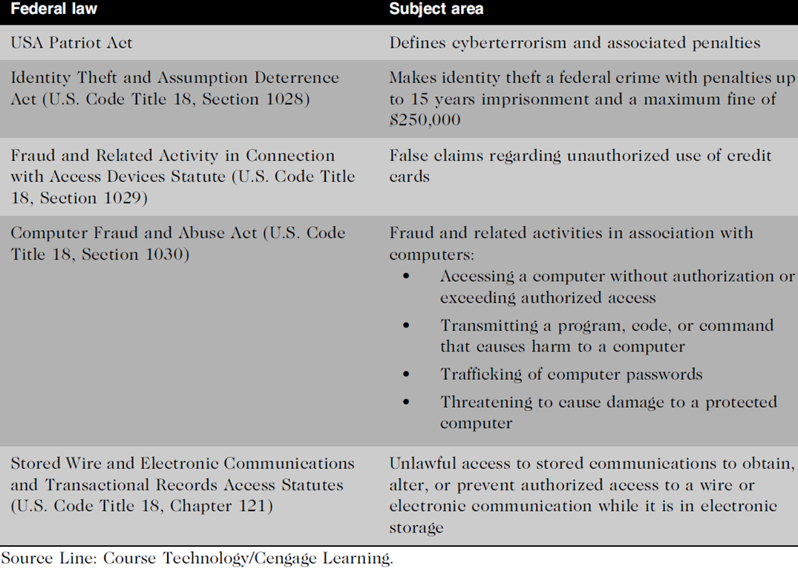
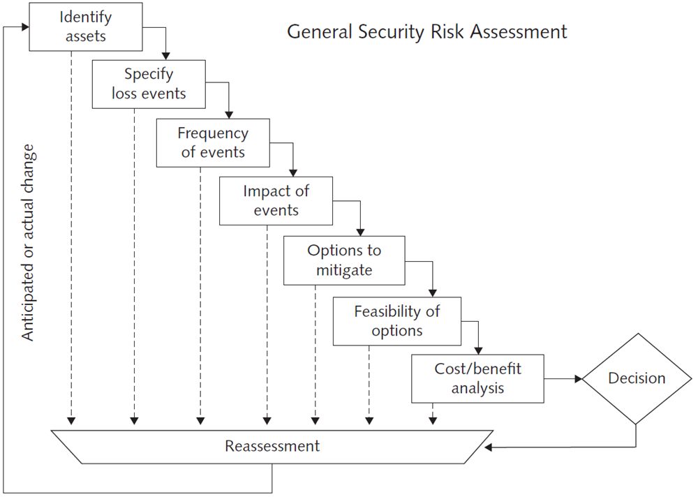

Business managers, IT professionals, and IT users all face a number of ethical decisions regarding IT security, such as the following:
+ If a firm is a victim of a computer crime, 
  + should it pursue prosecution of the criminals at all costs, 
  + maintain a low profile to avoid the negative publicity, 
  + inform its affected customers, or take some other action? 
+ How much effort and money should be spent to safeguard against computer crime? (In other words, how safe is safe enough?) 
+ If a company realizes that it has produced software with defects that make it possible for hackers to attack customer data and computers, what actions should it take? 
+ What should be done if recommended computer security safeguards make conducting business more difficult for customers and employees, resulting in lost sales and increased costs?
+ How much resources should be spent to safeguard against computer crime
+ What actions should be taken when a software is found susceptible to hacking
+ What should be done if recommended computer security safeguards increase operating costs

Increasing complexity increases vulnerability

Number of entry points to a network expands continually, increasing the possibility of security breaches
Cloud computing: Environment where software and data storage are provided via the Internet
Virtualization software: Operates in a software layer that runs on top of the operating system
Enables multiple virtual machines to run on a single computer

Higher computer user expectations

Not verifying users’: computer help desks are under intense pressure to respond very quickly to users’ questions. Under duress, help desk personnel sometimes forget to verify users’ identities or to check whether they are authorized to perform a requested action

Sharing of login IDs and passwords by users

It is increasingly difficult to keep up with the pace of technological change, successfully perform an ongoing assessment of new security risks, and implement approaches for dealing with them.

Bring your own device: Business policy that permits employees to use their own mobile devices to access company computing resources and applications

Increased reliance on commercial software with known vulnerabilities
+ Exploit: Attack on an information system that takes advantage of a particular system vulnerability
+ Zero-day attack: Takes place before the security community or software developer knows about the vulnerability or has been able to repair it

## Virus

Piece of programming code, disguised as something else, that causes a computer to behave in an unexpected and undesirable manner

## Worm

Harmful program that resides in the active memory of the computer and duplicates itself i.e. CODE RED and ILOVEYOU

The negative impact of a worm attack on an organization’s computers can be considerable—lost data and programs, lost productivity due to workers being unable to use their computers, additional lost productivity as workers attempt to recover data and programs, and lots of effort for IT workers to clean up the mess and restore everything to as close to normal as possible

## Trojan Horse

Program in which malicious code is hidden inside a seemingly harmless program
Logic bomb: Executes when it is triggered by a specific event i.e. by a specific time or date

## Spam

Abuse of email systems to send unsolicited email to large numbers of people
The Controlling the Assault of Non-Solicited Pornography and Marketing (CAN-SPAM) Act: The act says that it is legal to spam, provided the messages meet a few basic requirements—
1. spammers cannot disguise their identity by using a false return address, 
2. the email must include a label specifying that it is an ad or a solicitation, 
3. the email must include a way for recipients to indicate that they do not want future mass mailings.

The percentage of spam in email messages averaged 68% in October 2012, according to Securelist, a blog run by Kaspersky Labs.

A partial solution: CAPTCHA (Completely Automated Public Turing Test to Tell Computers and Humans Apart) to ensure that only humans obtain free accounts. Generates and grades tests that humans can pass but computer programs cannot.

## Denial-of-Service (DoS) Attack

DoS attack is a cyber-attack where the perpetrator seeks to make a machine or network resource unavailable to its intended users, such as to temporarily or indefinitely interrupt or suspend services of a host connected to the Internet.

## Distributed Denial-of-Service (DDoS) Attack

DDoS attack is one in which a malicious hacker takes over computers via the Internet and causes them to flood a target site with demands for data and other small tasks.

## Botnet

Group of computers which are controlled from one or more remote locations by hackers, without the knowledge or consent of their owners

Zombies: Computers that are taken over used to distribute spam and malicious code

Botnets are also frequently used to distribute spam and malicious code. 

Example: the Grum botnet was first detected in 2008 and operated until 2012 when it was brought down by cybercrime fighters. Grum infected several hundred thousand computers around the world. It generated prodigious amounts of spam advertising cheap pharmaceutical products. At its peak, Grum is estimated to have been responsible for 35% of the world’s spam

## Rootkit

Enables user to gain administrator-level access to a computer without the end user’s consent or knowledge. Once installed, the attacker can gain full control of the system and even obscure the presence of the rootkit from legitimate system administrators.

The fundamental problem with trying to detect a rootkit is that the operating system currently running cannot be trusted to provide valid test results. When it is determined that a computer has been infected with a rootkit, there is little to do but reformat the disk;

Rootkit typically consists of three snippets of code: a dropper, loader, and rootkit. The dropper is the code that gets the rootkit's installation started. Activating the dropper program usually entails human intervention, such as clicking on a malicious e-mail link. Once initiated, the dropper launches the loader program and then deletes itself. Once active, the loader typically causes a buffer overflow, which loads the rootkit into memory.

### Sony BMG copy protection rootkit scandal

A scandal erupted in 2005 regarding Sony BMG's implementation of deceptive, illegal, and potentially harmful copy protection measures on about 22 million CDs. When inserted into a computer, the CDs installed one of two pieces of software which provided a form of digital rights management (DRM) by modifying the operating system to interfere with CD copying. Neither program could easily be uninstalled, and they created vulnerabilities that were exploited by unrelated malware. Sony claims this was unintentional. One of the programs installed, even if the user refused its EULA, would still "phone home" with reports on the user's private listening habits; the other was not mentioned in the EULA (End-user license agreement) at all, contained code from several pieces of open-source software in an apparent infringement of copyright, and configured the operating system to hide the software's existence, leading to both programs being classified as rootkits. The Sony brand name was already in trouble—it lost 16% of its value between 2004 and 2005.

In 2008, the Federal Trade Commission sued Sony BMG for collecting and displaying personal data of 30,000 minors without parental consent via its websites since 2004, violating the Federal Trade Commission Act and the Children's Online Privacy Protection Act. Sony did not restrict minor children's participation in its websites. Sony paid a $1 million fine. Defunct on 1st of October 2008.

## Types of expliots

### Phishing

Fraudulently using email to try to get the recipient to reveal personal data
3% of all emails sent in October 2012 were phishing attacks.
It is part of Social Engineering 
Social engineering is the art of manipulating people so they give up confidential information. The types of information these criminals are seeking can vary, but when individuals are targeted the criminals are usually trying to trick you into giving them your passwords or bank information, or access your computer to secretly install malicious software–that will give them access to your passwords and bank information as well as giving them control over your computer.

Spear-phishing: Phisher sends fraudulent emails to a certain organization’s employees
Emails are designed to look like they came from high-level executives within the organization

Smishing: Legitimate-looking text message sent to people, telling them to call a specific phone number or to log on to a Web 

Vishing: Victims receive a voice mail telling them to call a phone number or access a Web site

### Types of prepetrators

Thrill seekers wanting a challenge

Common criminals looking for financial gain

Industrial spies trying to gain a competitive advantage

Terrorists seeking to cause destruction to further their cause

Hackers: Test the limitations of information systems out of intellectual curiosity

Lamers or script kiddies: Terms used to refer to technically inept (unskilled) hackers

DEF CON hackers convention an annual gathering in Las Vegas.

Malicious insiders

Employees, consultants, or contractors

Have some form of collusion 

Collusion: Cooperation between an employee and an outsider

Negligent insiders: Poorly trained and inadequately managed employees who cause damage accidently

The Saudi Arabian Oil Company (Aramco) is the state-owned oil company of Saudi Arabia. It owns approximately one-fifth of the world’s oil reserves and employs more than 55,000 workers in 77 countries. In 2012, the firm was a victim of a cyberattack that erased data on about 30,000 of its personal computers. Security experts believe that the attack was led by a company insider who had privileged access to Aramco’s network.

#### Industrial spies

Competitive intelligence: Legally obtained data gathered using sources available to the public
Industrial espionage: Using illegal means to obtain information that is not available to the public

#### Cybercriminals

Hack into computers to steal and engage in computer fraud
Data breach: is an incident in which sensitive, protected or confidential data has potentially been viewed, stolen or used by an individual unauthorized to do so.

### Steps to prevent insider attack

There are several steps organizations can take to reduce the potential for attacks from insiders, including the following:
1. Perform a thorough background check as well as psychological and drug testing of candidates for sensitive positions.
2. Establish an expectation of regular and ongoing psychological and drug testing as a normal routine for people in sensitive positions.
3. Carefully limit the number of people who can perform sensitive operations, and grant only the minimum rights and privileges necessary to perform essential duties.
4. Define job roles and procedures so it is not possible for the same person to both initiate and approve an action. Segregation of duty 
5. Periodically rotate employees in sensitive positions so that any unusual procedures can be detected by the replacement.
6. Immediately revoke all rights and privileges required to perform old job responsibilities when someone in a sensitive position moves to a new position. 
7. Implement an ongoing audit process to review key actions and procedures.

Hacktivists: Hack to achieve a political or social goal

Cyberterrorists: Launch computer-based attacks to intimidate or coerce an organization in order to advance certain political or social objectives
+ Use techniques that destroy or disrupt services
+ Consider themselves to be at war
+ Have a very high acceptance of risk 
+ Seek maximum impact

Cybercriminals and credit cards

Credit card companies are so concerned about making consumers feel safe while shopping online that many are marketing new and exclusive zero-liability programs, although the Fair Credit Billing Act limits consumer liability to only $50 of unauthorized charges. When a charge is made fraudulently in a retail store, the bank that issued the credit card must pay the fraudulent charges. For fraudulent credit card transactions over the Internet, the Web merchant absorbs the cost.
A high rate of disputed transactions, known as charge-backs, can greatly reduce a Web merchant’s profit margin.

However, the permanent loss of revenue caused by lost customer trust has far more impact than the costs of fraudulent purchases and bolstering security.

Strategies to Reduce Online Credit Card Fraud
+ Use encryption technology
+ Verify the address submitted online against the issuing bank
+ Request a card verification value
+ Use transaction-risk scoring software
+ Use smart cards
  + Smart cards: Memory chips are updated with encrypted data every time the card is used

## Federal Laws in the US

## Trustworthy Computing

Trustworthy computing is a method of computing that delivers secure, private, and reliable computing experiences based on sound business practices—which is what organizations worldwide are demanding today.

Threat is a possible danger that might exploit a vulnerability to breach security and therefore cause possible harm.

Vulnerability is a cyber-security term that refers to a flaw in a system that can leave it open to attack.

Security Breach is any incident that results in unauthorized access of data, applications, services, networks and/or devices by bypassing their underlying security mechanisms.

Data breach: is an incident in which sensitive, protected or confidential data has potentially been viewed, stolen or used by an individual unauthorized to do so.

Security incident is the act of violating an explicit or implied security policy

In June 2005, MasterCard announced that up to 40 million credit card holders were at risk of having their data stolen -- and 200,000 definitely had -- because of a Trojan on the computers of a credit card processing company. The processor, CardSystems Solutions, had improperly stored the card data, unencrypted, in order to do research on the transactions. The CardSystems chief executive admitted: "We should not have been doing that."

In one of the instances of a physical security breach rather than an electronic one, the Bank of New York Mellon simply lost a tape. In February 2008, the company sent 10 unencrypted backup tapes to a storage facility. When the storage firm's truck arrived at the facility, however, only nine tapes were still on board. The missing tape contained social security numbers and bank account information on 4.5 million customers. Oops.

In 2009, the Department of Veterans Affairs was having trouble with one of the hard drives in a database RAID array. So, naturally, the agency sent the drive out for repair. Unfortunately, it neglected to erase the unencrypted data on the disc. When the contractor was unable to repair the disc, they simply recycled it -- again without erasing -- leaving the personal information for some 76 million veterans accessible to whoever next got the disc.

Somebody at the Oklahoma Department of Human Services left the office in April 2009 with a laptop containing unencrypted client records. They left the laptop in their car, someone broke into the car, and the names, social security numbers, and other sensitive information on about a million Oklahomans went missing. While the data was unencrypted, the laptop itself was password-protected, so the agency deemed the risk of data loss "low."

In May 2009, the Connecticut health care provider Health Net reported that an unencrypted portable storage device was missing, containing seven years' worth of financial and medical information on 1.5 million customers. The device actually went missing six months before the company reported it. The Connecticut attorney general promptly filed suit. Health Net settled for $250,000 and is on the hook for another $500,000 if any of the data is accessed and misused before November 30, 2011.

Arkon Children Hospital: The amount of data actually lost by the Akron Children's Hospital in 2008 wasn't great, but the story's too good to leave out. In February of that year, a man sent an email with spyware to his ex-girlfriend, hoping to monitor what she did on her computer. Unfortunately for him (and the hospital), she opened the email on her work computer. Over the course of ten days, the spyware emailed the miscreant more than a thousand screenshots of confidential data on 62 patients. The man agreed to pay $33,000 to the hospital and faced a five-year prison sentence.

The security of any system or network is a combination of: technology, policy, and people and requires a wide range of activities to be effective

A strong security program begins by
+ assessing threats to the organization’s computers and network, 
+ identifying actions that address the most serious vulnerabilities, and 
+ educating end users about the risks involved and the actions they must take to prevent a security incident.

An organization’s IT security group must lead the effort to prevent security breaches by
+ Implementing security policies and procedures, 
+ Effectively employing available hardware and software tools
+ Continually monitoring systems and procedures to detect possible intrusion
+ If an intrusion occurs, there must be a clear reaction plan that addresses notification, evidence protection, activity log maintenance, containment, eradication, and recovery.

## Risk assessment

Assessing security-related risks to an organization’s computers and networks from internal and external threats.

Identify investments that will protect the organization from most likely and serious threats.

Asset is hardware, software, information system, network, or database used by an organization to achieve its business objectives.

Loss event is any occurrence that has a negative impact on an asset.

A completed risk assessment identifies the most dangerous threats to a company and helps focus security efforts on the areas of highest payoff.

## General Security Risk Assessment Process
1. Identify the set of IT assets about which the organization is most concerned. Priority is typically given to those assets that support the organization’s mission and the meeting of its primary business goals.
2. Identify the loss events or the risks or threats that could occur, such as a distributed denial-of-service attack or insider fraud.
3. Assess the frequency of events or the likelihood of each potential threat; some threats, such as insider fraud, are more likely to occur than others.
4. Determine the impact of each threat occurring. Would the threat have a minor impact on the organization, or could it keep the organization from carrying out its mission for a lengthy period of time?
5. Determine how each threat can be mitigated so that it becomes much less likely to occur or, if it does occur, has less of an impact on the organization. For example, installing virus protection on all computers makes it much less likely for a computer to contract a virus. Due to time and resource limitations, most organizations choose to focus on those threats that have a high frequency and a high impact. In other words, first address those threats that are likely to occur and that would have a high negative impact on the organization.
6. Assess the feasibility of implementing the mitigation options.
7. Perform a cost-benefit analysis to ensure that your efforts will be cost effective. No amount of resources can guarantee a perfect security system, so organizations must balance the risk of a security breach with the cost of preventing one. The concept of reasonable assurance recognizes that managers must use their judgment to ensure that the cost of control does not exceed the system’s benefits or the risks involved. 
8. Make the decision on whether or not to implement a particular countermeasure. If you decide against implementing a particular countermeasure, you need to reassess if the threat is truly serious and, if so, identify a less costly countermeasure

## Security policy

Defines an organization’s security requirements and the controls and sanctions needed to meet those requirements

Explains responsibilities and expected behavior

Outlines what needs to be done and not how it should be done – how is in another document (i.e. the procedures)

Examples of security policies templates from NIST:
+ Ethics Policy—This template defines the means to establish a culture of openness, trust, and integrity in business practices.
+ Information Sensitivity Policy—This sample policy defines the requirements for classifying and securing the organization’s information in a manner appropriate to its level of sensitivity.
+ Risk Assessment Policy—This template defines the requirements and provides the authority for the information security team to identify, assess, and remediate risks to the organization’s information infrastructure associated with conducting business.
+ Personal Communication Devices and Voice-mail Policy—This sample policy describes security requirements for personal communication devices and voice mail

### Establishing a Security Policy

There are some trade-offs between ease of use and increased security; however, when a decision is made to favour ease of use, security incidents sometimes increase. As security techniques continue to advance in sophistication, they become more transparent to end users.

Areas of concern
+ Use of email attachments
+ Sophisticated attackers may be able to penetrate a network via email attachments, regardless of the existence of a firewall and other security measures
+ Virtual private network (VPN): Works by using the Internet to relay communications
+ Encrypts data at the sending end and decrypts it at the receiving end

Motivates them to understand and follow the security policies

Users must help protect an organization’s information systems and data by:
+ Guarding their passwords
+ Prohibiting others from using their passwords
+ Applying strict access controls
+ Reporting all unusual activity to the organization’s IT security group
+ Ensuring that portable computing and data storage devices are protected

Detection

Even when preventive measures are implemented, no organization is completely secure from a determined attack. Thus, organizations should implement detection systems to catch intruders in the act. Organizations often employ an intrusion detection system to minimize the impact of intruders.

Prevention

The key is to implement a layered security solution to make computer break-ins so difficult that an attacker eventually gives up. In a layered solution, if an attacker breaks through one layer of security, there is another layer to overcome

Install a corporate firewall

A firewall stands guard between an organization’s internal network and the Internet, and it limits network access based on the organization’s access policy

Intrusion detection system (IDS)

Monitors system and network resources and activities

Notifies network security personnel when network traffic attempts to circumvent the security measures

Two approaches of IDS: knowledge based or behaviour based.

Antivirus software
Scans for a specific sequence of bytes, known as a virus signature, that  indicates the presence of a specific virus
Good antivirus software:
- Checks vital system files when the system is booted up,      
- Monitors the system continuously for virus like activity, 
- Scans disks, 	
- Scans memory when a program is run, 	
- Checks programs when they are downloaded, and 
- Scans email attachments before they are opened. 

Implement safeguards against attacks by malicious insiders:

Promptly delete the computer accounts, login IDs, and passwords of departing employees and contractors
Separating of duties: define employee roles carefully and separate key responsibilities properly, so that a single person is not responsible for accomplishing a task that has high security implications.
Rotation of duties: Rotate people in sensitive positions to prevent potential insider crimes
Least privilege: create roles and user accounts so that users have the authority to perform their responsibilities and nothing more, i.e. An accountant should not be able to review the pay and attendance records of an employee

Defend against cyberterrorism

In the face of increasing risks of cyberterrorism, organizations need to be aware of the resources available to help them combat this serious threat. i.e. Ransomware  and Bitcoins
The government has to secure critical infrastructure and information systems
It helps in identifying threats and vulnerabilities and to develop countermeasures and defensive strategies

Critical infrastructures include telecommunications, energy, banking and finance, water, government operations, and emergency services. Specific targets might include telephone-switching systems, an electric power grid that serves major portions of a geographic region, or an air traffic control centre that ensures airplanes can take off and land safely

Address critical Internet security threats

High-impact vulnerabilities should be fixed on priority basis

Conducting periodic IT security audits

Security audit: evaluates whether an organization has a well-considered security policy in place and if it is being followed

One result of a good audit is a list of items that need to be addressed in order to ensure that the security policy is being met

A thorough security audit should also test system safeguards to ensure that they are operating as intended. Such tests might include trying the default system passwords that are active when software is first received from the vendor. The goal of such a test is to ensure that all such known passwords have been changed.

Penetration test: Assigning individuals to try to break through the measures and identify vulnerabilities that still need to be addressed.

Response plan

An organization should be prepared for the worst—a successful attack that defeats all or some of a system’s defenses and damages data and information systems. 

A response plan should be developed well in advance of any incident and be approved by both the organization’s legal department and senior management. 

A well-developed response plan helps keep an incident under technical and emotional control.
Incident notification
+ Define who to notify and who not to notify
+ Refrain from giving out specific information about a compromise in public forums

Protection of evidence and activity logs
+ Document all details of a security incident to help with future prosecution and incident eradication

Incident containment
+ Determine if an attack is dangerous enough to warrant shutting down the systems

Eradication

Before the IT security group begins the eradication effort, it must collect and log all possible criminal evidence from the system, and then verify that all necessary backups are current, complete, and free of any virus.

Creating a forensic disk image of each compromised system on write-only media both for later study and as evidence can be very useful.

After virus eradication, the group must create a new backup. 

Throughout this process, a log should be kept of all actions taken.

Incident follow-up

An essential part of follow-up is to determine how the organization’s security was compromised so that it does not happen again.

Conduct a review to evaluate how the organization responded

Write a formal incident report that includes a detailed chronology of events and the impact of the incident

This report should identify any mistakes so that they are not repeated in the future.
The experience from this incident should be used to update and revise the security incident response plan

Creating a detailed chronology of all events will also document the incident for later prosecution. To this end, it is critical to develop an estimate of the monetary damage

Potential costs include loss of revenue, loss in productivity, and the salaries of people working to address the incident, along with the cost to replace data, software, and hardware.

Combines elements of law and computer science to identify, collect, examine, and preserve data from computer systems. Collect data in a manner that preserves the integrity of the data gathered so that it is admissible as evidence in a court of law.

## Summary

Ethical decisions in determining which information systems and data most need protection

Most common computer exploits
+ Viruses and worms
+ Trojan horses
+ Distributed denial-of-service attacks
+ Rootkits and spam
+ Phishing and spear-fishing
+ Smishing and vishing

Perpetrators include:
+ Hackers
+ Crackers
+ Malicious insider
+ Industrial spies
+ Cybercriminals
+ Hacktivist
+ Cyberterrorists

Must implement multilayer process for managing security vulnerabilities, including:
+ Assessment of threats
+ Identifying actions to address vulnerabilities
+ User education

IT must lead the effort to implement:
+ Security policies and procedures
+ Hardware and software to prevent security breaches

Computer forensics is key to fighting computer crime in a court of law