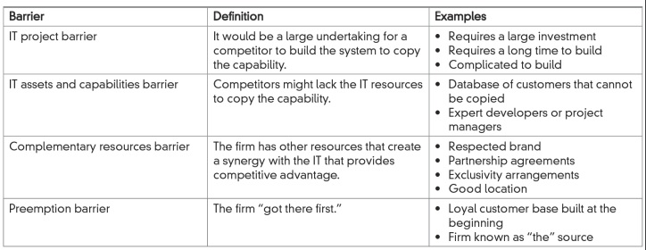
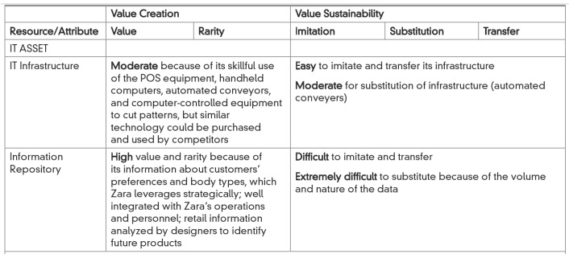
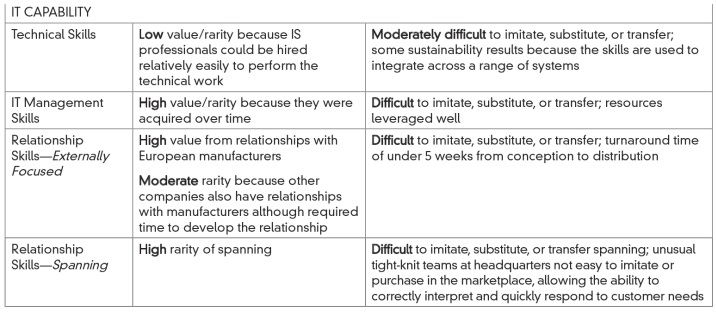

Zara
+ Chapter opening case
+ How often do customers visit Zara each year?
+ When do customers buy the designs? Why?
+ How many designs do they make each year?
+ Is this possible without IT?  

Information Resources as Strategic Tools

What are information resources?

IT assets and capabilities (not just assets!)

IT Assets and Capabilities

IT Assets

IT infrastructure
+ Hardware
  + Software and company apps
  + Network
  + Data
  + Website
+ Information Repository
  + Customer information
  + Employee information
  + Marketplace information
  + Vendor information
   
IT Capabilities
+ Technical Skills
  + Proficiency in systems analysis
  + Programming and web design skills
  + Data analysis/data scientist skills
  + Network design and implementation skills
+ IT Management Skills
  + Business process knowledge
  + Ability to evaluate technology options
  + Project management skills
  + Envisioning innovative IT solutions
+ Relationship Skills
  + Spanning skills such as business -IT relationship management
  + External skills such as vendor - management

IT Assets
+ Infrastructure
  + Information technology, people and processes available to perform business processes and tasks.
  + Might even include resources not owned by the firm (e.g., eBay, Facebook, LinkedIn)
+ Information repository
  + Data captured, organized, and retrievable by the firm
  
IT Capabilities
+ Technical Skills (designing, developing, implementing IS)
+ Management Skills (managing the IT function and IT projects)
+ Relationship Skills
  + Outside the organization (vendors, customers)
  + Within the organization (managers)
  
Examples
+ Assets:
  + Proprietary technology (e.g., platforms)
  + Online community
  + Customer information
+ Capabilities:
  + Knowledge
  + Technical skills of IT staff
  + Friendly, helping nature of IT staff
  
The Strategic Landscape
+ Managers must take multiple views of the strategic landscape, such as:
  + First view -Porter’s five competitive forces model.
  + Second view -Porter’s value chain.
  + Third view –focuses on the types of information systems resources needed (Resource Based View).
  
Five competitive forces with potential strategic use of information resources

### Application of five competitive forces model

| Competitive Force  | IT Influence on Competitive Force | Zara |
|--------------------|-----------------------------------|------|
| Threat of New Entrants | Can be lowered if there are barriers to entry. Sometimes information systems can be used to create barriers to entry | Zara supports its tightly knit group of designers, market specialists, production managers, and planners. These relationships take time. Rich customer information in its database would take time to develop |
| Bargaining Power of Buyers | Can be high if it’s easy to switch. Switching costs are increased by giving buyers things they value in exchange such as lower costs, effort, or time; or useful information | Recently, Zara has created a laser -created database of sizes for , “real” women volunteers. New products will be more likely to fit. |
| Bargaining Power of Suppliers | Strongest when there are few firms to choose from, quality of inputs is crucial, or the volume of purchases is insignificant to the supplier | Computer-controlled cutting machine can cut 1000 layers at a time. A large number of sewers are available. |
| Threat of Substitute Products | Depends on buyers’ willingness to substitute and the level of switching costs buyer’s face | IT helps Zara offer extremely fashionable clothing that would last  wears. The result is trendy clothes at reasonable prices, making substitutes difficult |
| Industrial Competitors | Rivalry is high when it is expensive to leave an industry, the industry’s growth rate is declining, or products have lost differentiation | Zara tracks breaking trends and customer preferences. The result is the highest sales per square foot in the industry without much advertising, low inventories, only % of inventory unsold, new products from idea to shelves in  days, and manufacturing efficiencies |

Porter’s Value Chain Model
+ Value Chain model addresses the activities that create, deliver, and support a company’s product or service.
+ Two broad categories:
  + Primary activities –relate directly to the value created in a product or service.
  + Support activities –make it possible for the primary activities to exist and remain coordinated.
+ Competitiveness can increased thru:
  + Lowering the cost to perform an activity, increasing profit.
  + Adding value to a product or service so buyers will be willing to pay more (again, increasing profit).
  
Value chain of the firm
 
The Value System
+ The value chain model can be extended by linking many value chains into a value system .
+ Much of the advantage of supply chain management comes from understanding how information is used within each value chain within the larger system .

The value system: interconnecting relationships between organizations.
 
Zara and Primary Activities

| Primary Activity | Zara's Value Chain |
|------------------|-------------------|
| Inbound Logistics | <ul><li>IT-enabled Just-in-time strategy</li><li>Most dyes are purchased from Zara subsidiaries</li><li>Suppliers are located near production facilities</li></ul> |
| Operations | <ul><li>IT supports decisions about fabric, cut, and pricing</li><li>Products are hung on hangers to avoid ironing at stores</li><li>Price tags are already on the products</li><li>60% of merchandise is produced in house</li><li>Fabric is cut and dyed by robots in 23 highly automated factories</li></ul> |
| Outbound Logistics | <ul><li>Clothes move on miles of conveyer belts</li><li>Clothes reach stores within 24 hours of the order</li></ul> |
| Marketing and Sales | <ul><li>Limited inventory permits low percent of unsold goods (10%)</li><li>Point-of-Sales systems linked to headquarters</li><li>Managers provide information on customer needs daily via hand-held computers</li></ul> |
| Service | <ul><li>No focus on service; clothes only last 2-3 wears</li></ul> |

Zara and Secondary Activities Secondary 

| Activity | Zara’s Value Chain |
|----------|--------------------|
| Organization | Tightly-knit collaboration between designers, store managers, market specialists, production managers, production planners |
| Human Resources | <ul><li>Managers are trained to understand customer needs and report to designers daily</li><li>Managers help Zara keep on cutting edge of fashion</li></ul> |
| Technology | <ul><li>All primary activities are supported by integrated technology</li><li>Automated conveyers speed up logistics</li></ul> |
| Purchasing | Vertical integration reduces the amount of purchasing needed |

Sustainability
+ Attaining competitive advantage is one thing
+ A firm often exploits rare and valuable resources
+ But sustaining competitive advantage is another 
+ Resources must be difficult to transfer or relatively immobile
  
Sustainability Framework

Source: Piccoli & Ives
 
But isn’t sustaining an advantage a "deadly distraction"?
+ Some focus on sustaining would be useful
  + Some sustaining steps are not too difficult or expensive
  + It will help profitability while inventing more “disruptive” measures
  + It might save the firm if disruption measures fail
+ But some focus on disruption is also useful
  + Sometimes sustaining requires too much effort
  + Disruption can have a huge payoff

### The Resource Based View

IT Assets at Zara
  

IT Capabilities at Zara

Social capital as an IT resource
+ Social capital:
  + the sum of the actual and potential resources embedded within, available through, and derived from the individual or firm’s network of relationships
  + Structural –Who is connected to whom
  + Relational –How the people interact (e.g., respect, friendship)
  + Cognitive –How the people think and the impact of a shared language

Relationships with other firms
+ Strategic Alliances
  + Inter-organizational relationship that affords one or more company a strategic advantage
  + Example: Zynga and Facebook
  + Business ecosystems provide abundant examples
+ Co-opetition
  + Companies cooperate and compete at the same time
  + Example: Microsoft builds laptops but also supplies operating systems to other laptop makers

Potential Risks
+ There are many potential risks that a firm faces when attempting to use IT to outpace their competition.  
+ Executives should be aware of these risks in advance!
  + Awakening a sleeping giant –a large competitor with deeper pockets may be nudged into implementing IS with 
  even better features (Schwab/eTrade; FedX /UPS)
  + Demonstrating bad timing –sometimes customers are not ready to use the technology designed to gain strategic 
  advantage (Apple’s Newton, Shelternet ) + Implementing IS poorly –information systems can fail because they are poorly implemented (Nike; Hershey)
  + Failing to deliver what users want –systems that don’t meet the firm’s target market likely to fail (Streamline.com groceries)
  + Running afoul of the law –Using IS strategically may promote litigation (Airline reservation systems)
  
Co-Creating IT and Business Strategy
+ Not just alignment, but partnership
+ Example: FedEx
  + Are you paying only for the delivery?
  + Or are you also paying for information about the delivery?
  + Fedex would not be able to accomplish the delivery without the information systems components.
+ Can you separate IT strategy from your business strategy?
  + The trend is towards integrating the two.