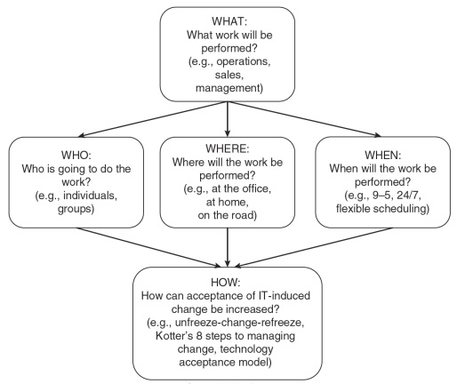
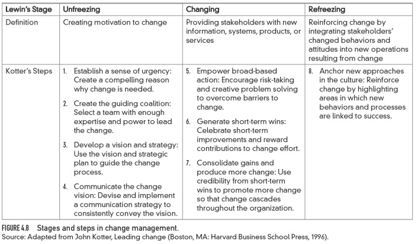

American Express Opening Case
+ What is the "Blue Work" program?
+ What was the strategic thrust behind the Blue Work program?
+ What are "hub", "club", "home", and "roam" employees?
+ What is the role of technology in these arrangements?
+ What was the impact of Blue Work?
+ Have other firms found roaming employment useful?

American Express introduced the "Blue Work" program as a strategic lever, viewing workplace flexibility as a crucial element in their operations. This initiative aimed to redefine work structures by leveraging digital systems, showcasing the transformative power of technology in modern work environments. The program categorizes employees into distinct groups such as "hub," "club," "home," and "roam" employees, possibly reflecting different work arrangements or roles within the organization. Technology plays a pivotal role in these arrangements, likely facilitating online management, tracking, and reporting of corporate expenses and card usage, thereby enhancing efficiency and flexibility in work practices.

The strategic thrust behind the Blue Work program was to provide a comprehensive platform for corporate card management, policy compliance monitoring, and expense tracking, aligning with American Express's vision of workplace flexibility as a strategic advantage. The impact of the Blue Work program has been significant, streamlining corporate expense management, enhancing policy compliance, and offering efficient tools for tracking and reporting expenses, ultimately contributing to improved operational efficiency and effectiveness within the organization.

Moreover, the query raises the question of whether other firms have found roaming employment, as facilitated by the Blue Work program, useful. This suggests that the concept of roaming employment, enabled by technology and flexible work arrangements, has implications beyond American Express and may serve as a model of interest for other companies seeking to enhance work design and management practices in their organizations.

Work Design Framework

IT Has Changed Work
+ IT has:
+ Created new types of work
+ Bureau of Labor Statistics: IT employment in the USA is at an all -time high
+ New jobs such as:
+ Data scientists/data miners
+ Social media managers
+ Communications managers
+ Enabled new ways to do traditional work
+ Supported new ways to manage people
  
How IT Changes Traditional Work
+ Changes the way work is done 
+ Broadens skills; faster but more tasks
+ Sometimes IT disconnects us from the tasks
+ Sometimes people can perform more strategic tasks
+ Few staff are engaged in order entry any longer
+ Crowdsourcing is now possible at very low cost ( M.Turk )
+ Changes how we communicate
+ More asynchronous and more irregular
+ Social networking has provided new opportunities for customer interaction
+ Collaboration allows a firm to look “big” with new tools  

How IT Changes Traditional Work
+ Changes decision-making 
  + Real-time information; more information available
  + Data mining can identify new insights
  + Ideas can be gleaned from social networks
  + Middle management ranks have shrunk as Leavitt/ Whisler predicted
+ Changes collaboration
  + Work is now more team oriented; more collaborative
  + Sharing is easier than ever, using multiple methods
  + Crowdsourcing can now provide quick answers from tens, hundreds, or even thousands of people
  
Collaboration Technologies Matrix

How IT Changes Traditional Work
+ New ways to connect
+ Many employees are always connected
+ Lines between work and play are now blurred
+ For many, home technologies are better than work technologies
+ New ways to manage people
+ Behavior controls –direct supervision
+ Outcome controls –examining outcomes not actions
+ Personnel controls –pick the right person for the task
+ The digital approach provides new opportunities at any of those three levels (Fig. .)
  
Changes to Supervision/Evaluations/Compensation/Hiring

Where Work is Done: Mobile and Virtual Work
+ Much work can be done anywhere, anytime
+ People desire the flexibility
+ Telecommuting = teleworking = working from home or even in a coffee shop
+ Mobile workers work from anywhere (often while traveling)
+ Remote workers = telecommuters + mobile workers
+ Virtual teams include remote workers as well as those in their offices, perhaps scattered geographically
+ Virtual teams have a life cycle
  
Key Activities in the Life Cycle of Teams
  
Telecommuting: Global Status
+ A poll of , employees in  countries:  in  telecommute
+ When employees in  countries were asked if they need to be in the office to be productive:
+ Overall % said “yes”
+ But specific countries differed in the “yes” votes:
+ Only % in India, but
+ % in Japan
+ % in Germany
  
Driver Effect

Shift to knowledge-based work

Changing demographics and lifestyle preferences

New technologies with enhanced bandwidth

Web ubiquity

“Green” concernsDecouples work from any particular place

Workers desire geographic and time-shifting flexibility 

Remotely -performed work is practical and cost -effective

Can stay connected/Reduced commuting costs; real estate energy consumption; travel costs

Drivers of Remote Work and Virtual Teams
 
| Advantages of Remote Work | Potential Problems |
|---------------------------|-------------------|
| <ul><li>Reduced stress: better ability to meet schedules; less distraction at work</li><li>Higher morale and lower absenteeism</li><li>Geographic flexibility</li><li>Higher personal productivity</li><li>Housebound individuals can join the workforce</li><li>Informal Dress</li></ul> | <ul><li>Increased stress: Harder to separate work from home life</li><li>Harder to evaluate performance</li><li>Employee may become disconnected from company culture</li><li>Telecommuters are more easily replaced by offshore workers</li><li>Not suitable for all jobs or employees</li><li>Security might be more difficult</li><li>Some advantages and disadvantages of remote work</li></ul> |
 
Virtual Teams
+ Virtual Teams: geographically and/or organizationally dispersed coworkers:
+ Assembled using telecommunications and IT
+ Aim is to accomplish an organizational task
+ Often must be evaluated using outcome controls
+ Why are they growing in popularity?
+ Information explosion: some specialists are far away
+ Enhanced bandwidths/fast connections to outsiders
+ Technology is available to assist collaboration 
+ Less difficult to get relevant stakeholders together 
  
Challenges facing virtual teams/

| Challenges | Virtual Teams | Traditional Teams |
|------------|---------------|-------------------|
| Communications | <ul><li>Multiple time zones can lead to greater efficiency but can lead to communication difficulties and coordination costs (passing work)</li><li>Non-verbal communication is difficult to convey</li><li>Same time zone</li></ul> | <ul><li>Scheduling is less difficult</li><li>Teams may use richer communication media</li></ul> |
| Technology | <ul><li>Proficiency is required in several technologies</li></ul> | <ul><li>Support for face-to-face interaction without replacing it</li><li>Skills and task - technology fit is less critical</li></ul> |
| Team Diversity | <ul><li>Members represent different organizations and/or cultures</li><li>Harder to establish a group identity</li><li>Necessary to have better communication skills</li></ul> | <ul><li>More difficult to build trust, norms</li><li>Impact of deadlines not always consistent</li><li>More homogeneous members</li><li>Easier group identity</li><li>Easier to communicate</li></ul> |

Managerial Issues In Telecommuting and Mobile Work
+ Planning, business and support tasks must be redesigned to support mobile and remote workers
+ Training should be offered so all workers can understand the new work environment
+ Employees selected for telecommuting jobs must be self-starters

Managing the Challenges
+ Communications challenges
+ Policies and practices must support the work arrangements
+ Must prepare differently for meetings
+ Slides and other electronic material must be shared beforehand
+ Soft-spoken people are difficult to hear; managers must repeat key messages
+ Frequent communications are helpful (hard to "overcommunicate")
+ Technology challenges
+ Provide technology and support to remote workers
+ Use high quality web conferencing applications
+ Clarify time zones for scheduling
+ Information should be available for everyone (cloud storage can help)
+ Policies and norms about use of the technology can be important
  
Managing the Challenges
+ Diversity challenges
+ Concept of time differs throughout the world
+ Anglo-American cultures view time as a continuum (deadlines are important; many prefer not to multitask)
+ Indian cultures have a cyclical view of time (deadlines are less potent; many prefer to multitask)
+ Team diversity might need nurturing:
  + Communications differences
  + Trust building
  + Group identity formation

Gaining Acceptance For It - induced Change
+ Many changes might be a major concern for employees
+ Changes might be resisted if they are viewed as negative impacts
+ Several types of resistance:
  + Denying that the system is up and running
  + Sabotage by distorting or otherwise altering inputs
  + Believing and/or spreading the word that the new system will not change the status quo
  + Refusing to use the new system
  
Kotter’s Model
