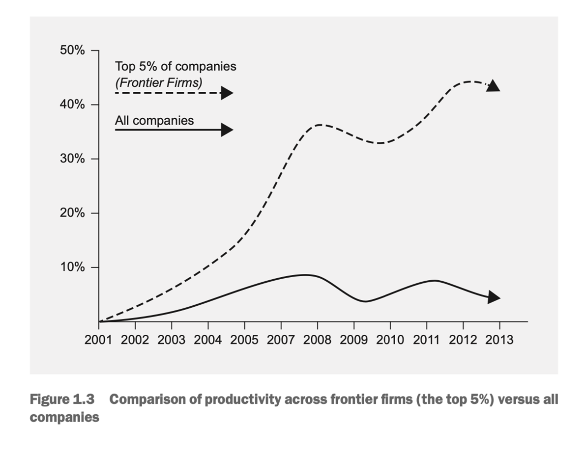
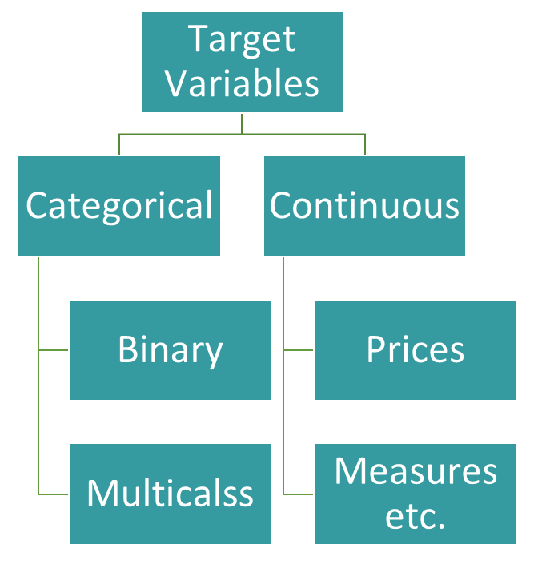
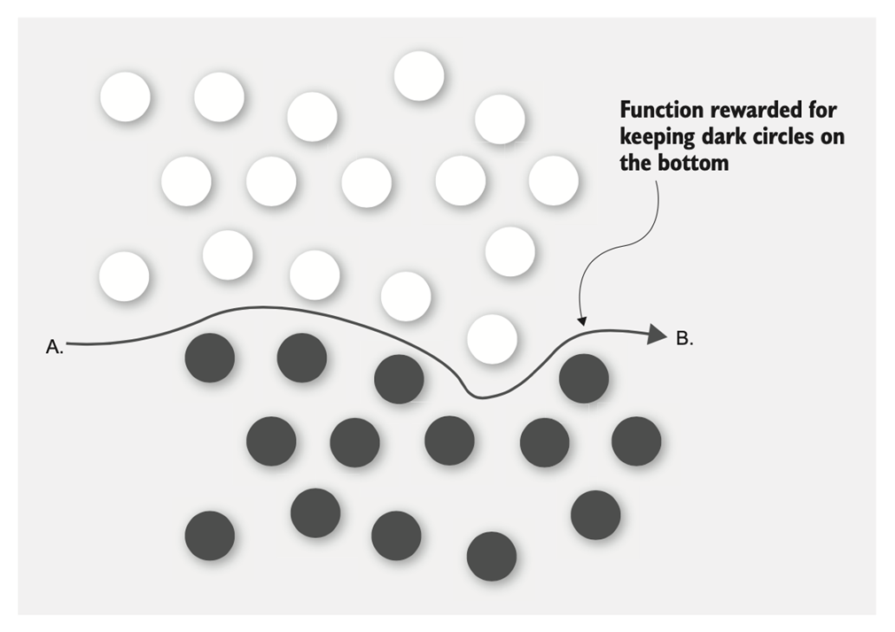

Most companies still use people to perform repetitive tasks.

Small decisions may waste a lot of time. For instance, submitting a leave request: dozen steps, each one requires entering information that the system should already know to make a decision
Determining why you exceeded the budget this month
Submitting a purchase order for a new chair

Machine Learning (ML) applications can automate all of the small decisions that may delay processes. Today, companies are competing to become more automated and more productive.

You’ll learn how to:
implement ML, decision-making systems in your company to become more productive. 
identify where ML will create benefits within your company in areas such as
+ Back-office financials
+ Customer support and retention
+ Sales and marketing
+ Payroll and human resources

Change is hard, easy for one person, not for a group of people. Managing multiple business systems is challenging. Companies normally use end-to-end enterprise software system for as many tasks as possible, such as SAP or Oracle. Handle your inventory, pay staff, manage the finance department, and handle most other aspects of your business. 
Advantage: everything is integrated. 
Problem: because they do everything, there are better systems available for each thing that they do. 

There are better systems available for each task, known as best-of-breed systems.
Do one task particularly well. 
For example: an expense management system
Problem: this system doesn’t fit neatly with the other systems your company uses.

Instead of implementing a best-of-breed expense management system, your company could implement a machine learning application to:
+ Identify information about the expense, such as the amount spent and the vendor name
+ Decide which employee the expense belongs to
+ Decide which approver to submit the expense claim to

If computers were really helping us become more productive, why is it that much faster computers don’t lead to much greater productivity? In 1987, Robert Solow, an American economist, stated: "You can see the computer age everywhere but in the productivity statistics." This is called the Solow paradox. Top 5% of companies have increased productivity by 40%, the other 95% have barely increased productivity at all. This low-growth trend is found across nearly all countries with mature economies.

## What is productivity?

Productivity = Gross Domestic Product (GDP)➗ number of hours worked in a year.

We're at the end of the Solow Paradox. Machine learning will enable many companies to become more productive (as the top 5%). Companies that do not dramatically improve their productivity, will wither and die.

## How will machine learning help?

Automation: the use of SW to perform a repetitive task. Repetitive tasks are everywhere:
+ places orders with suppliers
+ sends marketing material to customers 
+ manages products in inventory
+ creates entries in their accounting system
+ makes payments to their staff, etc.

Q: Why is it so hard to automate these processes? 

A: There are small decisions that need to be made at several steps along the way. This is where ML fits in. 

## How do machines make decisions?

Machine learning is a method used by the computer to arrive at a decision, based on patterns in a dataset. This can be described as pattern-based decision making. This is in contrast to most software development these days, which is rules-based decision making.

## Illustration

Traditionally, to send a marketing newsletter we query a database and pulls out only those customers selected by the query. Males younger than 25 who live within 20 Kilos of a certain clothing outlet store.

Machine learning, instead: 
+ Users who have a purchasing history similar to that of a specific 23-year-old male who happens to live close to one of your outlet stores.

This query yields same results as the one above. Those who have a similar purchasing pattern and are willing to drive further to get to your store.

### How do people think?

Consider Karen, an employee that review purchase orders.

There are some rules for these orders. IT products must be approved by the IT department but there are exceptions. For example, she knows that when Jim orders toner from the stationery catalogue, she needs to send the order to IT for approval. But when Jim orders a new mouse from the IT catalogue, she does not.

There are some patterns also. Rules are hard to automate.

Karen thinking: rule-base + pattern-based

The pattern based part is even harder to automate using a rule-base system.

## Can you trust a pattern-based answer?

Any point in a process that needs a decision is an opportunity to use machine learning to automate the decision or to present a restricted choice of options for the person to consider.

Machine learning uses examples rather than rules

Novel situation: machine learning makes a decision with a lower level of confidence

A new product coming into Karen’s catalogue. A voice-controlled device like Amazon Echo or Google Home. 

The device looks somewhat like an IT product 🡪 requires IT approval. 

But, because it’s also a way to get information into a computer (an accessory such as a stylus or a mouse) 🡪 it doesn’t require IT approval.

With ML there is a level of uncertainty which may happen with human.

## How can machine learning improve your business systems?

+ ERP systems used by meduim to large enterprises
+ ERP systems can't handle everything
+ Programming/editing ERP is expensive and time consming
+ ERP didn’t improve prodcutivity since it doesn’t everything
+ Implementing ML 🡪 little change in the management process
+ Can be migrated with existing ERP

## Can a machine help Karen make decisions?

When an order comes in, Karen needs to decide send it straight to the requester’s financial approver or send it to a technical approver first. She needs to send an order to a technical approver if the order is for a technical product like a computer or a laptop. She does not need to send it to a technical approver if it is not a technical product. She does not need to send the order for technical approval if the requester is from the IT department.

The question she asks for every order is, "Should I send this for technical approval?" Her decision will either be yes or no. The things she needs to consider when making her decision are:
+ Is the product a technical product?
+ Is the requester from the IT department?

In machine learning, Karen’s decision is called the target variable. the types of things she considers when making the decision are called features. When you have a target variable and features, you can use machine learning to make a decision.

### Target variables

### Features

Features is the most important machine learning concept to understand. The things that Karen considers when making this decision are its features.

Machine learning is a process of rewarding a mathematical function for getting answers right and punishing the function for getting answers wrong. What does it mean to reward or punish a function? You can think of a function as a set of directions on how to get from one place to another.

To get from point A to point B: 
1. Go right
2. Go a bit up. 
3. Go a bit down. 
4. Go down sharply. 
5. Go up! 
6. Go right. 

## Machine learning types

Machine learning problems can be broken down into two types: 
+ Supervised machine learning: 
  + Classification
  + Labelled data
+ Unsupervised machine learning: 
  + Clustering
  + Unlabelled data

Supervised machine learning

Classification

For example, using sales team’s historical success rate for calling customers to train a machine learning application how to recognize customers who are most likely to be receptive to receiving a sales call. Uses labelled data: each sample shows what the target variable should be for that sample.

For Karen, historical dataset shows: 
+ what product was purchased
+ whether it was purchased by someone from the IT department or not 
+ whether Karen sent it to a technical approver or not

Unsupervised machine learning

Clustering

Example: provide the ML application with some customer data, 🡪 determines how to group that customer data into clusters of similar customers.

Getting approval in your company to use machine learning to make decisions.

Your company just needs four things:
1. It needs a person who can identify opportunities to automate and use ML, 
2. Put together a proof of concept that shows the opportunity is worth pursuing. That’s you, by the way. Access the data required to feed your ML applications.
3. Your risk and management teams need to be comfortable with using pattern-based approaches to making decisions, (the most difficult)
4. Your company needs a way to turn your work into an operational system.

## How to reduce risk with ML?

Some orders to Karen’s 🡪 very clearly need to be sent to a technical approver

ML 🡪 100% confident that it should go to a technical approver. 

Other orders are less clear cut, and instead of returning a 1 (100% confidence), the application might return a 0.72 (a lower level of confidence). 

We can implement a rule that if the application has less than 75% confidence that the decision is correct, then route the request to Karen for a decision. The risk team can set this confidence level for orders to be reviewed by a human.

## Amazon AWS

AWS is Amazon’s cloud service. It allows companies set up servers and interact with services in the cloud rather than building their own data centres. AWS has dozens of services: computing services such as cloud-based servers (EC2), messaging and integration services, domain-specific machine learning services such as Amazon Transcribe (for converting voice to text) and AWS DeepLens (for machine learning from video feeds).

### SageMaker

SageMaker is Amazon’s environment for building and deploying ML applications. 

SageMaker provides the following functionalities:
+ Serves as your development environment in the cloud 
+ Uses a preconfigured ML application on your data
+ Uses inbuilt tools to validate the results from ML application
+ Hosts your machine learning application
+ Automatically sets up an endpoint that takes in new data and returns predictions

SageMaker development environment uses: 
+ Jupyter notebook
+ Jupyter: based on Python programming language
+ Jupyter is the most popular tools for data scientists/ML
+ Python is the fastest growing programming language for data scientists.

## Jupyter Notebook

Combine text, code, and charts in a single document. The Jupyter Project started in 2014. In 2017, awarded the prestigious ACM Software System award "for developing a software system that has had a lasting influence, reflected in contributions to concepts, in commercial acceptance, or both." This award is a big deal, previous awards were for things like the internet.

### Setting up SageMaker

The workflow we’ll follow in each chapter:
1. From the links listed in the chapter, download: 
   + the prepared Jupyter notebook 
   + the dataset 
   + each chapter has 1 Jupyter notebook and 1 or more datasets.
2. Upload the dataset to S3, your AWS file storage bucket.
3. Upload the Jupyter notebook to SageMaker.

## Summary

Companies need to become more productive to thrive.

Machine learning can help companies becoming more productive by automating all of the little decisions that hold your company back. 

Machine learning creates a mathematical function that best fits previous decisions and that can be used to guide current decisions. 

Amazon SageMaker is a service that lets you set up a machine learning application that you can use in your business. 

Jupyter Notebook is one of the most popular tools for data science and machine learning

## Lab

Appendix A: How to sign up for AWS

Appendix B: How to set up S3 to store files

Appendix C: Setting up and using AWS SageMaker to build a machine learning system