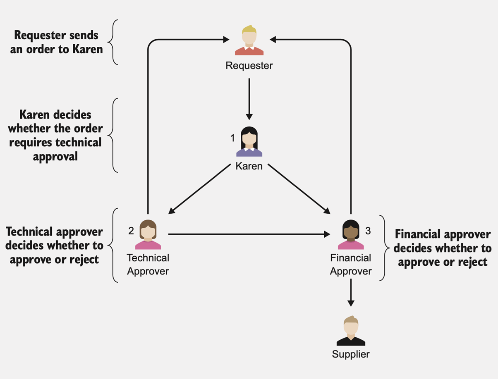

The approach Karen takes: 
+ if a product looks like an IT product, she’ll send it to a technical approver. 
+ With an exception: 
  + if it’s something that can be plugged in and used, such as a mouse or a keyboard, she doesn’t send it for technical approval. 
  + Nor does she send it for technical approval if the requester is from the IT department.

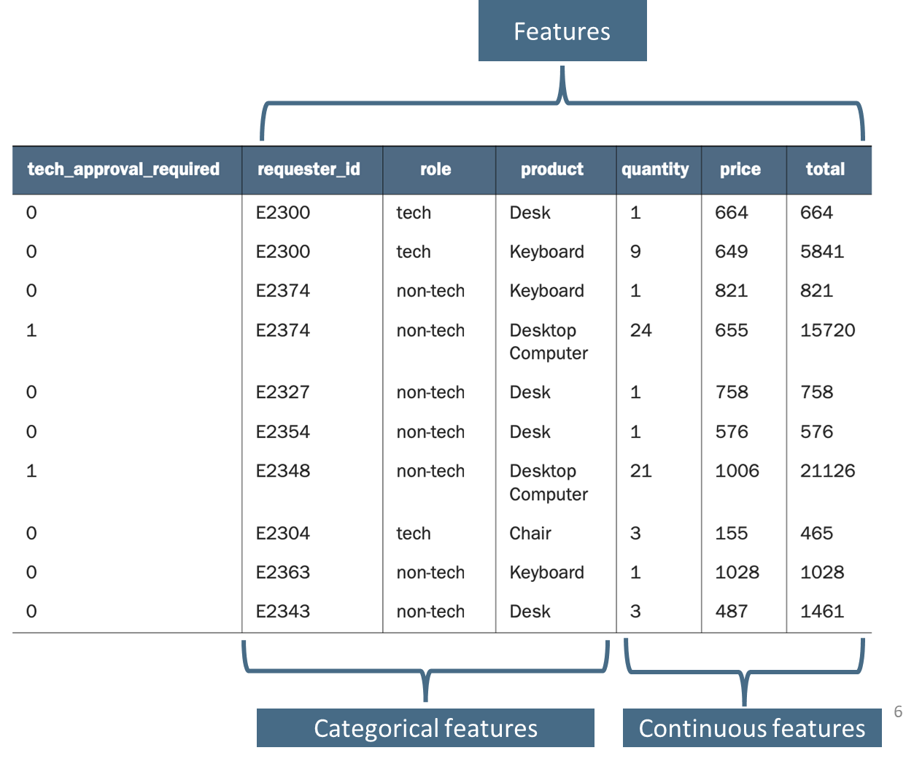

Objectives
+ The end goal is to be able to submit an order to the machine learning model and have it return a result that recommends sending the order to a technical approver or not
+ We have identified the features to use to make the decision (the type of product and whether the requester is from the IT department).
+ We have created the labelled historical dataset (the dataset shown in the previous slide).

Recap, what is machine learning model?
+ It is a mathematical function that is rewarded for guessing right and punished for guessing wrong. 
+ To get more guesses right, the function associates certain values in each feature with right guesses or wrong guesses. 
+ As it works through more and more samples, it gets better at guessing. 
+ When it’s run through all the samples 🡪 the model is trained.

Machine learning algorithm is the mathematical function that underlies a machine learning model.

Here we will focus on one only, XGBoost
+ works well across a wide range of problems without significant tuning.
+ doesn’t require a lot of data to provide good results.
+ easy to explain: why it returns a particular prediction in a certain scenario.
+ high-performing algorithm and the choice for many participants in machine learning competitions with small datasets.

Steps
1. Load and examine the data.
2. Get the data into the right shape.
3. Create training, validation, and test datasets.  Train the machine learning model.
4. Host the machine learning model.
5. Test the model and use it to make decisions.

Explaining the code

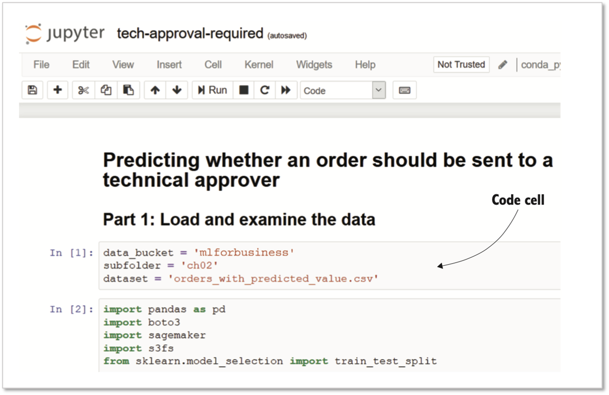

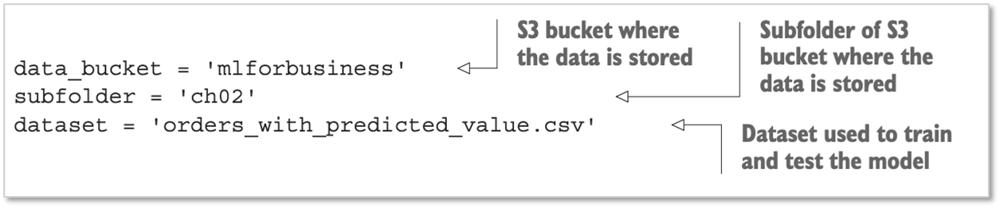

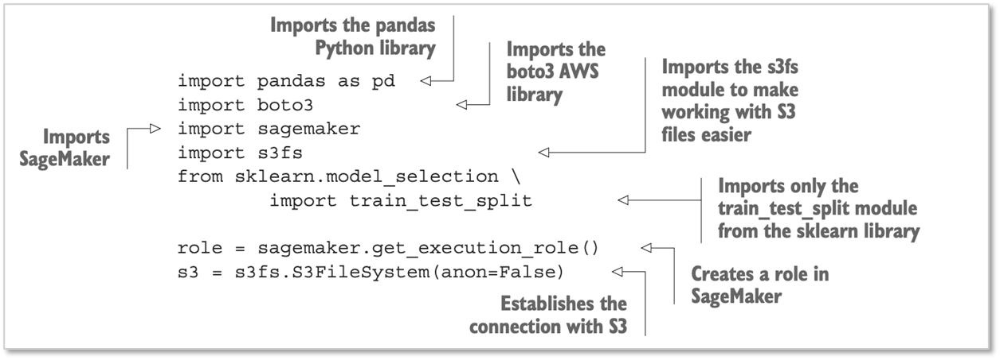

Setting up the notebook

Import Python libraries:
+ Pandas: A Python library used in data science projects. load pandas as `pd.` we will preface any use of any module in the pandas library with pd. 
+ boto3 and sagemaker: The libraries created by Amazon to help Python users interact with AWS resources.boto3 is used to interact with S3. Sagemaker is used to interact with SageMaker. s3fs makes it easier to use boto3 with S3.
+ sklearn: short for scikit-learn, which is a comprehensive library of machine learning algorithms that is used widely in both the commercial and scientific communities. 
+ `train_test_split` function

Ceate a role on SageMaker that allows the sagemaker library to use the resources it needs to build and serve the machine learning application. 

Call the sagemaker function get_execution_role. 

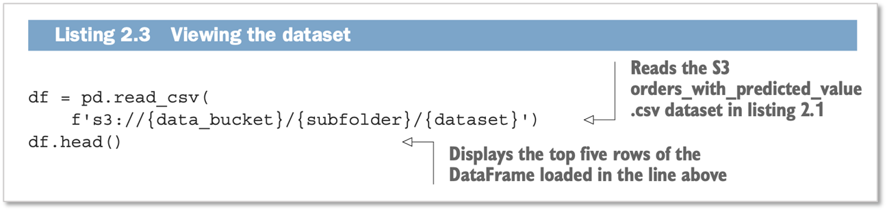

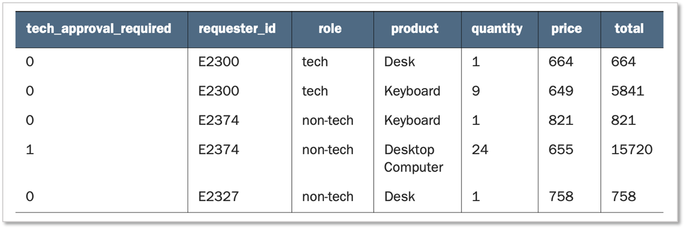

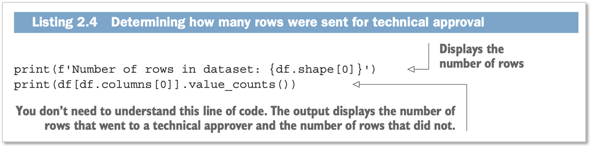

Shape property of a DataFrame provides information about the number of rows and the number of columns. 

df.shape[0] shows the number of rows

df.shape[1] shows the number of columns 

The value_counts property of the df DataFrame shows the number of rows in the dataset where the order was sent to a technical approver. 

It contains a 1 if it was sent for technical approval and a 0 if it was not. 

Getting the data into the right shape

Machine learning models work with numbers rather than text-based data. We'll use the pandas get_dummies function to convert all of the text data into numbers.

Applying get_dummies

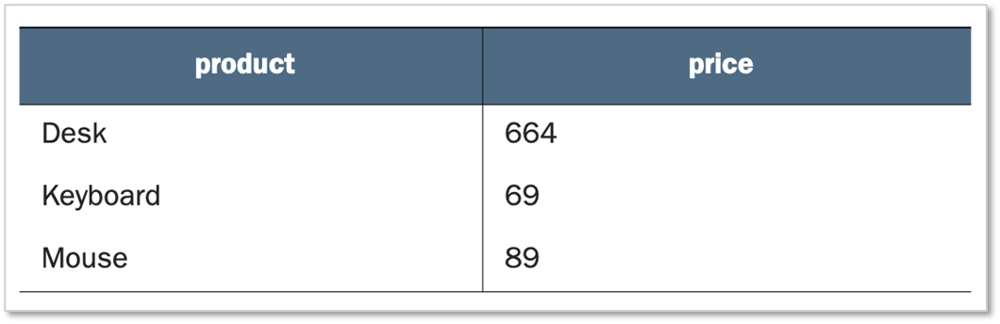

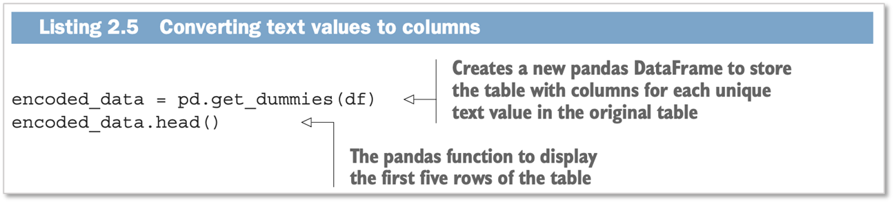

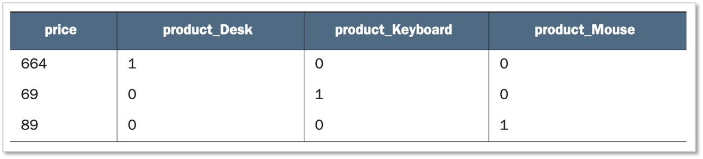

Relevant columns

get_dummies create more columns

The sample dataset in the SageMaker Jupyter notebook goes to 111 columns

Machine learning can handle datasets with thousands of columns

BUT: a problem for you because it becomes more difficult to reason about the data

Solution: reduce the number of columns to only the most relevant ones

A relevant column: a column that contains values that are correlated to the value you are trying to predict

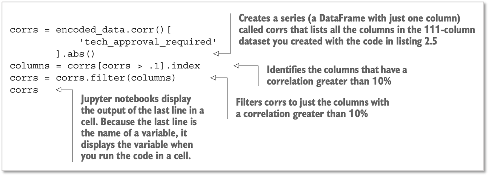

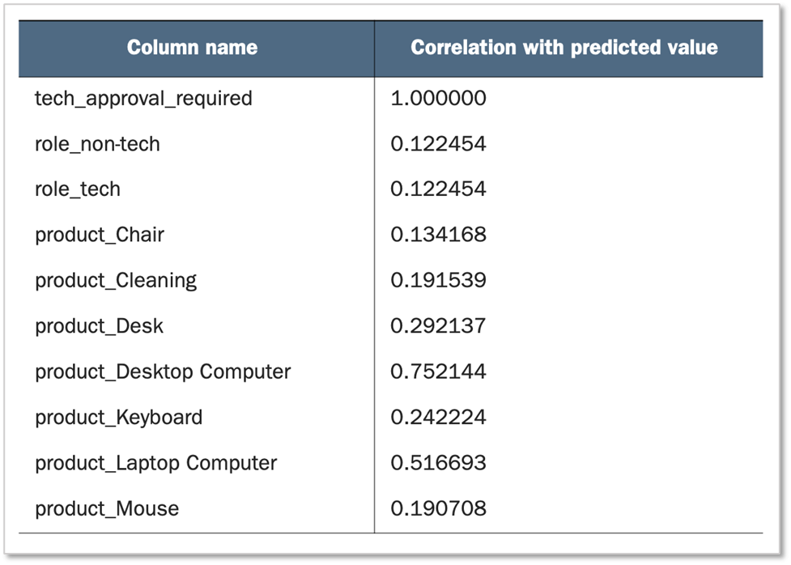

After identifying the most highly correlated columns, we need to filter the `encoded_data` table to contain just those columns.

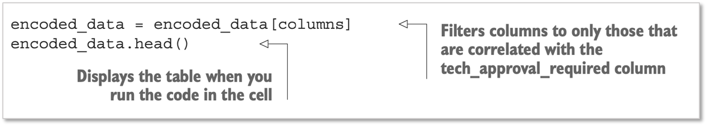

## Creating training, validation, and test datasets

Train: to train the model.

Validate: used by the algorithm to determine whether the algorithm is improving

Test: to determine how well the algorithm performs

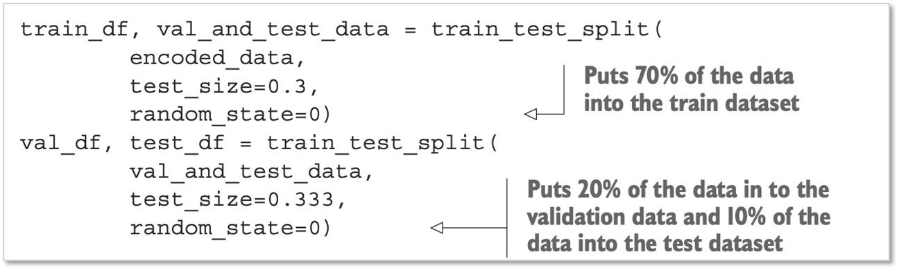

Note: The `random_state` argument ensures that repeating the command splits the data in the same way. 

## Converting the data to CSV

XGBoosts deals with the data in CSV format.

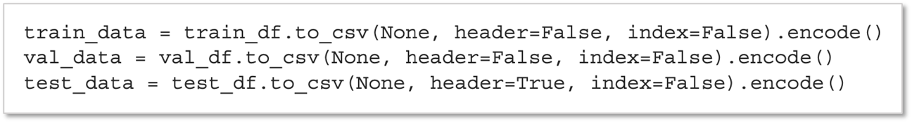

The `None` argument: indicates that you do not want to save to a file. 

The `header` argument indicates whether the column names will be included in the CSV file or not. 

For the `train_data` and `val_data` datasets, don’t include the column headers (header=False) ML algorithm expect only numbers. 

For the `test_data` dataset: include headers, helpful to have column names

The `index=False` argument tells the function to not include a column with the row numbers. 

The `encode()` function ensures that the text in the CSV file is in the right format. 

## Saving the CSV file to S3

<!-- 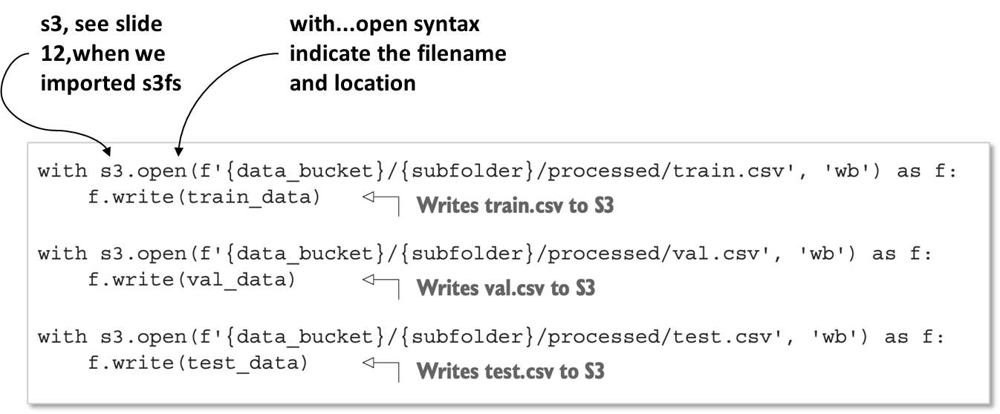 -->

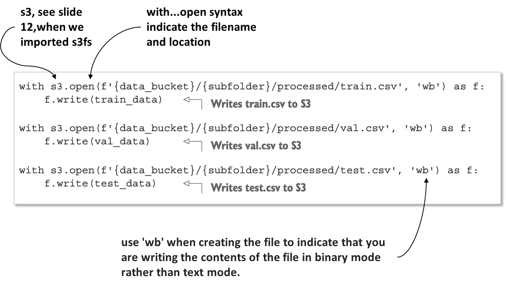

The next code listing will:
+ Create your model 
+ Start a server to run your model
+ Train the model on the data

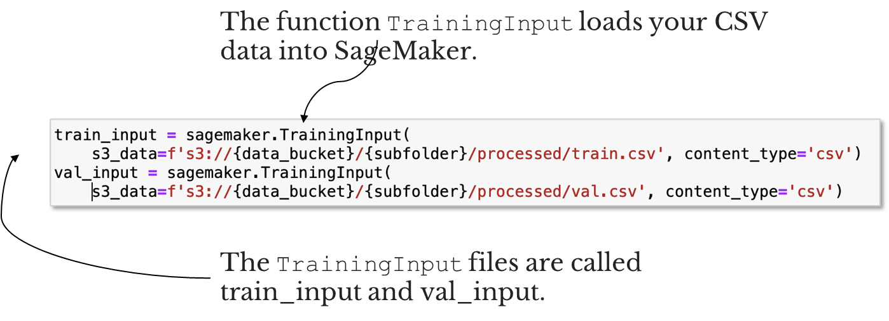

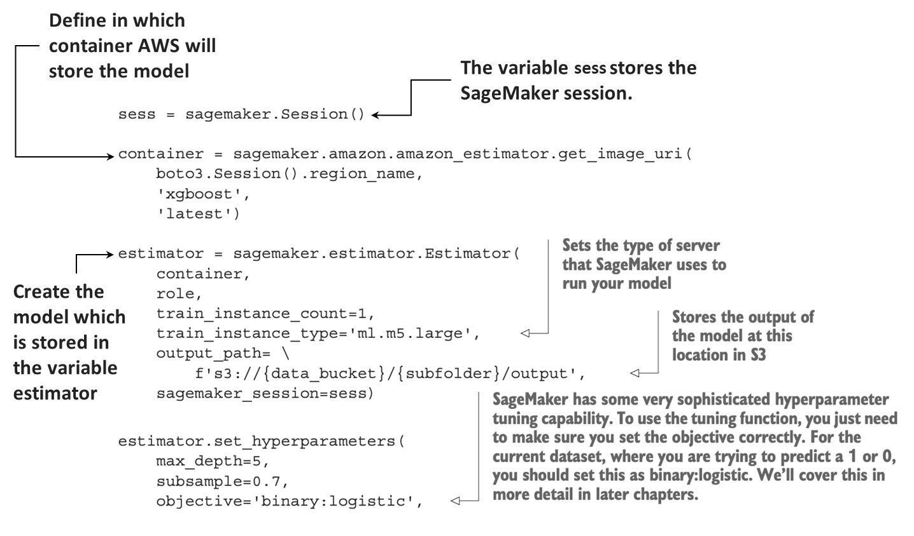

The training step takes about 5 minutes to finish. There is no need to manually configure a server and install the software to train the model. The server only runs for about a minute, so you will only be charged for about a minute of compute time. 

At the time of writing of this book, the m5-large server was priced at under US$0.10 per hour. Once you have stored the model on S3, you can use it again whenever you like without retraining the model. More on this in later chapters.

We will launch another server to host the model. This is the server that you will use to make predictions from the trained model.

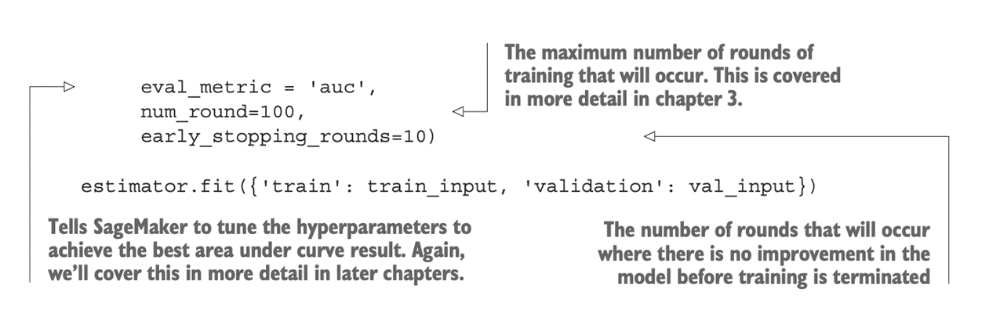

## Testing the model

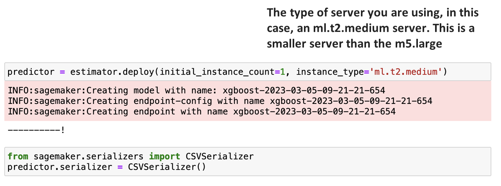

## Summary

+ Identify decision points.
+ You learned how to apply machine learning using AWS SageMaker and Jupyter notebooks.
+ You send data to the machine learning endpoints to make predictions.
+ You can test the predictions by sending the data to a CSV file for viewing.