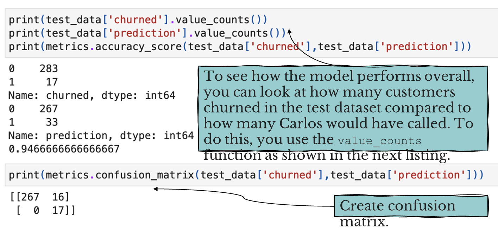

Carlos has a bakery and many competitors. Carlos calls those who have stopped buying. Carlos wants to find customers who are in the process of trying another bakery. Once identified the customers, he can call them to see if there’s something he can do to keep them. 

In Carlos’s conversations with his lost customers, he notices a common pattern:
+ Customers place orders in a regular pattern, daily.

When a customer tries another bakery 🡪 reduce the number of orders from Carlos’s bakery.

The customer negotiates an agreement with the other bakery, which may result in stopping temporarily the orders from Carlos’s bakery. Customers stop ordering from his bakery.

## The process flow

In this chapter, you make decisions about customers: should Carlos call a customer.

## Preparing the dataset

Carlos has 3,000 customers who, on average, place 3 orders per week. Over the past 3 months, Carlos received 117,000 orders.

3,000 customer × 3 orders per week × 13 weeks

We need to turn order data into customer data. Turn 117,000 rows into a 3,000-row table

To turn 117,000 rows into a 3,000-row table (one row per customer), you need to group the non-numerical data and summarize the numerical data. 

In the dataset shown in the table, the non-numerical fields are `customer_code`, `customer_name`, and `date`. The only numerical field is `amount`. 

We’ll apply two transformations to the data: 

Normalize the data:

calculate the percentage spend, relative to the average week, instead of dollars, you are looking at a weekly change relative to the average sales

Calculate the change from week to week: 

so the machine learning algorithm see the patterns in the weekly changes as well as the relative figures for the same time period.

### Transformation 1: Normalizing the data

1. Find the sum of the total spent over the year for each customer (total_sales). 
2. Find the average per week (total_sales/52)
3. For each week, calculate the total spent per week divided by the average spent per week to get a weekly spend as a percentage of an average spend
4. Create a column for each week. 

### Transformation 2: Calculating the change from week to week

For each week from the column named `week_minus_3` to `last_week`, subtract the value from the preceding week and call it the delta between the weeks. 

For example, in `week_minus_3`, the Gibson Group has sales that are 1.18 times their average week. In `week_minus_4`, their sales are 1.13 times their average sales. This means that weekly sales rose by 0.05 of their normal sales. 

## XGBoost primer

XGBoost is an ensemble machine learning model. It uses a number of different approaches to improve the effectiveness of its learning. 

XGBoost stands for Extreme Gradient Boosting:
+ Gradient boosting
+ Extreme

Gradient boosting is a technique where different learners are used to improve a function. 

The Extreme part of the name: XGBoost has a number of other characteristics that makes the model accurate. It can handle sparse data and handles overfitting problem by setting some parameters.

Overfitting is an undesirable machine learning behavior that occurs when the machine learning model gives accurate predictions for training data but not for new data. 

## Machine learning model evaluation

There are many evaluation metrics to measure the performace of a machine learning medel. Precsion/ recall/ f1 score is among the most popular.
+ Accuracy 
+ Area under the curve

### Confusion Matrix

True Positives : Predicted YES 🡪 actual YES

True Negatives : Predicted NO 🡪 actual is NO

False Positives : Predicted YES 🡪 actual NO

False Negatives : Predicted NO 🡪 actual was YES

### Area Under the Curve (AUC)

Q: How the machine learning model determines whether the function is getting better or getting worse?

A: We use the AUC – ROC curve

ROC (Receiver Operator Characteristic) curve shows how much model is capable of distinguishing between classes. 

AUC - ROC curve is a performance measurement for classification problem at various cutoff settings. 
The higher the AUC, the better the model is at predicting 0s as 0s and 1s as 1s. The higher the AUC, the better the model is at distinguishing between patients with disease and no disease.

In XGBoost: objective is binary: logistic 

This means not a prediction of a positive or negative label. 

It means: the probability of a positive label. 

Result: a continuous value between 0 and 1. 

It is then up to us to decide what probability will produce a positive prediction.

The normal choice is 0.5 (50%) as the cutoff point. 

But we may change this.  

Because in some cases, the cost of missing a positive can be more important and justify choosing a cutoff much less than 0.5.

### ROC* curve

AUC – ROC

One probability cutoff means the model captures all of the true positives. Accidentally predict more negatives as positives.

When we use AUC as our evaluation metric, we are telling XGBoost to optimize our model by maximizing the area under the ROC curve to give us the best possible results.

## Building the model

We will use same steps as we did in chapter 2.
1. Upload a dataset to S3.
2. Set up a notebook on SageMaker. 
3. Upload the starting notebook.
4. Run it against the data.

Six parts
1. Load and examine the data.
2. Get the data into the right shape.
3. Create training, validation, and test datasets. 
4. Train the machine learning model.
5. Host the machine learning model.
6. Test the model and use it to make decisions.

### 1. Load and examine the data

### 2. Get the data into the right shape

Machine learning can only work with numbers, so we need to either remove our categorical data or encode it.

The categorical data here are `customer_name`, `customer_code`, and `id`

We will remove them as they do not have an influence on the model. To remove the data, use the pandas drop function. To display the first five rows of the dataset use the head function. 

`axis=1` indicates that you want to remove columns rather than rows in the pandas DataFrame.

### 3. Create training, validation, and test datasets

Split the data into test, validation, and training datasets as you did in chapter 2. We will use the stratify parameter during the split.

In our dataset the target variable we are predicting is relatively rare. The parameter works by making sure that the train, validate, and test datasets contain similar ratios of target variables. 

#### Converting the datasets to CSV and saving to S3

### 4. Train the machine learning model

We will explain XGBoost a bit more. The interesting parts of the following are the estimator hyperparameters. 

The hyperparameters of interest to us are:

Objective: we set this hyperparameter to binary. logistic. 

Use this setting when the target variable is 1 or 0

`eval_metric`: The evaluation metric you are optimizing for. The metric argument auc (area under the curve).

`num_round`: How many times you want to let the machine learning model run through the training data.

With each loop through the data, the function gets better at separating the dark circles from the light circles.  

After a while though, the model gets too good; it begins to find patterns in the test data that are not reflected in the real world (overfitting).

The larger the number of rounds, the more likely you are to be overfitting. 

To avoid this, you set early stopping rounds.

`early_stopping_rounds`: The number of rounds where the algorithm fails to improve.

`scale_pos_weight`: The scale positive weight is used with imbalanced datasets to make sure the model puts enough emphasis on correctly predicting rare classes during training. 

In the current dataset, about 1 in 17 customers will churn. 

So we set `scale_pos_weight` to 17 to accommodate for this imbalance. 

This tells XGBoost to focus more on customers who actually churn rather than on happy customers who are still happy.

The output shown is taken from the output of the Train the Model cell in the notebook. 

You can see that round 24: 0.977821

This is not better than the previous best of 0.978943 from round 14. Because we set `early_stopping_rounds`=10, the training stops at round 24, which is 10 rounds past the best result in round 14.

### 5. Host the machine learning model

Host the model on SageMaker so it is ready to make decisions. This is setting up a server that receives data and returns decisions.

### 6. Test the model and use it to make decisions

Now that the endpoint is set up and hosted, you can start making decisions. Start by running your test data through the system to see how the model works on data it hasn’t seen before.

<!--  -->

## Summary
+ We created a machine learning model to determine which customers to call because the risk of taking their business to a competitor.
+ XGBoost is a gradient-boosting, machine learning model that uses an ensemble of different approaches to improve the effectiveness of ML learning.
+ Stratify is one technique to help you handle imbalanced datasets. It makes sure that the train, validate, and test datasets contain similar ratios of target variables.
+ Confusion matrix is one of the most helpful tools in understanding the performance of a model.