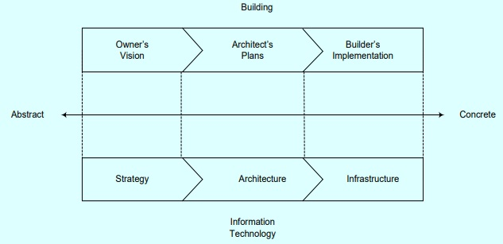
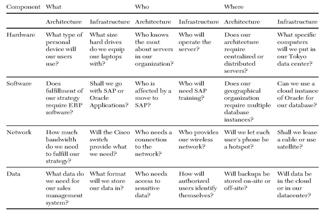

Mohawk Paper
+ What did Mohawk paper see as an opportunity?
+ What did they do?
+ What was the result?

Mohawk Paper saw an opportunity in the anticipated bankruptcy of the largest envelope manufacturing firm in the United States. This situation led Mohawk to develop a list of six outsourced firms to turn its premium papers into envelopes. After utilizing these suppliers and investing in building its in-house envelope manufacturing capabilities, Mohawk successfully transitioned to an insourcing model for 90% of its volume, seizing the opportunity presented by the changing market dynamics.

From Vision to Implementation
+ Architecture translates strategy into infrastructure
+ Home architect develops a blueprint of a proposed  house —based on customer
+ Business architect develops a blueprint of a company’s  proposed systems —based on strategy
+ This “blueprint” is used for translating business strategy into a plan for IS.
+ The IT infrastructure is everything that supports the flow and processing of information (hardware, software, data, and networks).

From abstract to concrete – building vs IT

Strategy Architecture Infrastructure Information Technology Building

The Manager’s Role
+ Must understand what to expect from IT architecture and infrastructure.
+ Must clearly communicate business vision.
+ May need to modify the plans if IT cannot realistically support them.
+ Must be involved in the decision making process.

From Strategy to Architecture
+ Manager starts out with a strategy.
+ Strategy is used to develop more specific goals
+ Business requirements must be determined for each goal so the architect knows what the information system must accomplish.
 
Example
+ Strategy: be a customer-oriented company
+ Goal: 30-day money back guarantee
+ Business Requirement: 
  + ability to track purchases
  + ability to track problems
+ Goal: answer email questions within 6 hours
+ Business Requirement: ability to handle the volume
 
From Business Requirements to Architecture

The Example Continues
+ Business Requirement: ability to track purchases
+ Architectural Requirement: database that can handle all details of more than a-day history
 
From Architecture to Infrastructure
+ adds more detail to the architectural plan.
+ actual hardware, software, data, and networking
+ components need coherent combination
 
From Architecture to Infrastructure
 
The Example Continues

Architectural Requirement: Database that can handle all details of more than a 30-day history
  + Functional Specification: be able to hold 150,000 customer records, 30 fields; be able to insert 200 records per hour
    + Hardware specification: 3 gigaherz core 2 duo server
    + Hardware specification: half terabyte RAID level 3 hard drive array
    + Software specification: Apache operating system
    + Software specification: MySQL database
    + Data protocol: IP (internet protocol)
 
A framework for the translation
+ Considerations for moving from strategy to architecture to infrastructure:
  + Hardware –physical components
  + Software –programs
  + Network –software and hardware
  + Data –utmost concern: data quantity & format
+ What-who-where is a useful framework

Infrastructure and architecture analysis framework with sample questions

### Common IT architecture configurations
+ Centralized architecture: All purchases, support, and management from data center
+ Decentralized architecture: uses multiple servers perhaps in different locations
+ Service-Oriented architecture: uses small chunks of functionality to build applications quickly.
+ Example: e-commerce shopping cart
+ Software-Defined architecture: instantly reconfigures under load or surplus
 
#### Software-Defined architecture
+ Birdbath example: Thanks to the Oprah Winfrey show, sales went from 10 per month to 80000.
  + Increased sales seen as an attack with static system
  + Adaptive system warns other parts of sales fluctuations, preventing lost sales
+ Famous Coffee Shop example: 
  + WiFi shares lines with production systems; problems in one can be shunted to another
  + Coffee bean automatic reordering; spot market purchasing
  + High potential for decreasing costs
 
New Technologies
+ Peer to peer architecture: Allows networked computers to share resources without a central server
+ Wireless (mobile) infrastructure: allows communication without laying wires
+ Web-based architecture: places information on web servers connected to the Internet
+ Cloud-based architecture: places both data and processing methods on servers on the Internet, accessible anywhere
+ Capacity-on-demand: enables firms to make available more processing capacity or storage when needed
 
### Architectural Principles

Fundamental beliefs about how the architecture should function

| Principle   | Description of what the architecture should promote |
| ----------- | ----------- |
| Ease of use      | Ease of use in building and supporting the architecture and solutions based on the architecture       |
| Single point of view   | A consistent, integrated view of the business regardless of how it is accessed        |
| Buy rather than build   | Purchase of applications, components, and enabling frameworks unless there is a competitive reason to develop them internally        |
| Speed and quality   | Acceleration of time to market for solutions while still maintaining requried quality levels        |
| Flexibility and agility   | Flexibility to support changing business needs while enabling evolution of the architecture and the solutions built on it        |
| Innovation   | Incorporation of new technologies, facilitating innovation        |
| Data security   | Data protection from unauthorized use and disclosure        |
| Common data vocabulary   | Consistent definitions of data throughout the enterprise, which are understandable and available to all users        |
| Data quality  | Accountatbility of each data element through a trustee responsible for data quality        |
| Data asset   | Management of data like other valuable assets        |

Enterprise Architecture
+ The “blueprint” for all IS and interrelationships in the firm
+ Four key elements:
  + Core business processes
  + Shared data
  + Linking and automation technologies
  + Customer groups
+ One example is TOGAF (The Open Group Architecture Foundation)
  + Methodology and set of resources for developing an EA
  + Specifications are public
+ Business and IT leaders develop EA together
 
Virtualization and Cloud Computing
+ Cloud computing refers to:
  + Resources that are available “on the Internet”
  + No software for the organization to develop or install (only web browser)
  + No data for the organization to store (it stays somewhere in the Internet “cloud”)
+ The provider keeps and safeguards programs and data
+ This is “infrastructure as a service” (IaaS)
+ Also available is SaaS (Software as a service)
+ And there is also PaaS (Platform as a service)
+ Utility Computing: Pay only for what you use (like power, lights)

Examples of Systems Provided in the “Cloud?”
+ Word processing; spreadsheeting ; email (Google Docs: $50 per user annually)
+ Buying/selling Financial services (Salesforce.com)
+ Email (Gmail, Hotmail)
+ Social networking (Facebook)
+ Business networking (LinkedIn)
+ Music (iTunes)
+ Storage (Amazon’s Simple Storage Service —S3)
+ A server (Amazon’s Elastic Compute Cloud —EC2)

Assessing Strategic Timeframe
+ Varies from industry to industry
+ Level of commitment to fixed resources
+ Maturity of the industry
+ Cyclicality
+ Barriers to entry
+ Also varies from firm to firm
+ Management’s reliance on IT
+ Rate of advances affecting the IT management counts on

The strategic timeframe for assessing IT infrastructure varies based on several factors, both at the industry and firm level. At the industry level, the timeframe depends on the maturity of the industry, the level of cyclicality, and the barriers to entry. A rapidly evolving industry with low barriers to entry may require a shorter strategic timeframe compared to a mature industry with high barriers to entry.

At the firm level, the strategic timeframe is influenced by the level of commitment to fixed resources, the reliance on IT by management, and the rate of technological advances affecting the IT management. Firms with a high commitment to fixed resources may have a longer strategic timeframe, as they need to ensure that their IT infrastructure can support their operations for an extended period. Conversely, firms that rely heavily on IT and operate in industries with rapid technological advances may need to adopt a shorter strategic timeframe to stay competitive.

Companies like 3M and Google exemplify the power of well-defined core values that guide their business operations and employee culture. 3M, a global company known for innovative technologies, emphasizes values such as honesty, customer satisfaction, environmental respect, employee development, and global growth, ensuring a holistic approach to business success. On the other hand, Google, a tech giant, follows its "ten things we know to be true" values, reflecting a commitment to innovation, user focus, and excellence. These companies showcase how strong core values can shape organizational identity and drive success across diverse industries

### Assessing Adaptability
+ Guidelines for planning adaptable IT architecture and infrastructure
  + Plan for applications and systems that are independent and loosely coupled
  + Set clear boundaries between infrastructure components
  + When designing a network architecture, provide access to all users when it makes sense to do so
 
### Assessing Scalability
+ Scalability refers to how well a component can adapt to increased or decreased demand
+ Needs are determined by:
  + Projections of growth
  + How architecture must support growth
  + What happens if growth is much higher than projected
  + What happens if there is no growth
 
Other Assessments
+ Standardization –Common, shared standards are easy to plug in
+ Maintainability –Can the infrastructure be maintained?
+ Security –Decentralized architecture is more difficult to secure
 
#### Assessing Financial Issues
+  Quantify expected return on investment
+  Can be difficult to quantify
+  Steps 
   +  Quantify costs
   +  Determine life cycles of components
   +  Quantify benefits
   +  Quantify risks
   +  Consider ongoing dollar costs and benefits