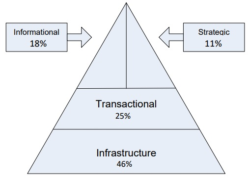

The Horner/Alcoa Story
+ High-performing tech worker —almost dismissed as CIO
+ What were the issues?
+ What did they expect from him?
+ What did he deliver at first?
+ What change did he make to become more valuable to Alcoa?

The Alcoa lesson: Business Demands
+ IT offerings need to be aligned with business demands
+ IT complexities should be translated to business needs

#### Challenges as CIO 
Kevin Horner, the former Chief Information Officer (CIO) of Alcoa's Industrial Chemicals Business, faced challenges in effectively communicating the value of IT to the business leadership. Despite providing technically solid IT services, Horner struggled to convey the financial impact and cost savings of IT initiatives in a language that the business leaders could understand.

Horner's boss, the president of the business, expected him to provide useful information and pinpoint cost savings, but Horner delivered jargon-heavy presentations that failed to resonate with the audience. The business leaders wanted Horner to communicate in terms of people, time, money, and the possibilities that technology created for their businesses. They wanted Horner to help them use IT to grow the business, either through increased sales or reduced costs.

#### Partnering with the CFO and Benchmarking
To address these issues, Horner partnered with the Chief Financial Officer (CFO) to better understand the financials of the business. The CFO helped identify hidden IT costs, and Horner found answers within two months. Horner also engaged the Hackett Group, a benchmarking consulting firm, to compare Alcoa's IT costs against similar firms. This analysis provided valuable insights for the business leadership, helping them find ways to reduce costs while continuing to provide improved services.

#### Streamlining IT Spending and Improving Supply Chain
Horner also focused on streamlining IT spending by eliminating unnecessary services, negotiating larger contracts to leverage the company's bargaining power, and prioritizing the highest-cost elements. Additionally, he improved the supply chain process, providing reliable information to customers and ensuring fast delivery of products without excessive inventory.

#### Lessons learned
Horner's efforts ultimately paid off, as he was promoted several times, eventually becoming Alcoa's global CIO. His experience highlights the importance of CIOs and IT leaders in understanding the business, communicating effectively with business stakeholders, and aligning IT initiatives with the company's strategic objectives.

#### Transition into CEO

Kevin Horner leveraged his extensive experience as CIO at Alcoa to successfully transition into the CEO role at Mastech, a much smaller IT staffing firm. Despite initial skepticism from some employees about his lack of staffing industry experience, Horner's deep understanding of IT and his network of CIO contacts proved invaluable.

As CEO, Horner quickly identified and addressed several issues at Mastech, such as changing how profit-and-loss was managed and eliminating two executive leadership positions. He also worked with the board to develop a three-year growth plan focused on organic growth rather than acquisitions. Under Horner's leadership, Mastech's sales increased 14% in his first year as CEO.

Horner's experience as a CIO at a large multinational company like Alcoa, where he oversaw IT spending of up to $500 million annually, helped him bring a strategic, business-oriented perspective to Mastech. He understood the importance of aligning IT with the company's overall objectives and communicating the value of IT to business stakeholders.

As CEO, Horner continued to apply these principles, working closely with the CFO to understand Mastech's financials and using benchmarking data to identify cost savings opportunities while maintaining service levels. His ability to speak the language of business and focus on growth and profitability helped drive Mastech's success under his leadership.

[Read more](https://www.coursehero.com/file/61602251/Case-study-chapter-8docx/)
[sbnonline](https://sbnonline.com/article/how-kevin-horner-used-his-background-as-alcoa-s-cio-to-become-mastech-s-ceo/)

### Merlyn’s Business - IT Maturity Model

| Maturity Level | Nature            | Engagement Characteristics                 |
|----------------|-------------------|--------------------------------------------|
| Level 3        | Business partner  | <ul><li>Proactive</li><li>Outside-in</li><li>Relationship-centric</li><li>Focused on business growth</li><li>Framed on a context of business value</li></ul> |
| Level 2        | Solutions provider| <ul><li>Active</li><li>Process-centric</li><li>Focused on solutions</li><li>Framed in a context of projects</li></ul> |
| Level 1        | Order taker| <ul><li>Reactive</li><li>Inside-out</li><li>Technology-centric</li><li>Framed in a context of cost</li></ul> |

### What a Manager Can Expect From the IT Organization

A manager typically can expect some level of support in 14 core activities 
+ Develop and maintain information systems
+ Manage supplier relationships 
+ Manage data, information, and knowledge
+ Manage Internet and network services
+ Manage human resources 
+ Operate the data center 
+ Provide general support 

What a Manager Can Expect From the IT Organization
+ Plan for business discontinuities 
+ Innovate current processes 
+ Establish architecture platforms and standards+  
+ Promote enterprise security 
+ Anticipate new technologies 
+ Participate in setting and implemente strategic goals 
+ Integrate social IT 
 

What The IT Organization Does Not Do
+ Does not perform core business functions such as:
  + Selling
  + Manufacturing
  + Accounting
+ Does not set business strategy.
  + General managers must not delegate critical technology decisions.

Chief Information Officer (CIO): the most senior IT Executive
+ Responsible for technology vision
+ Leads design, development, implementation, and management of IT initiatives
+ Is a business technology strategist or strategic business leader
+ Uses technology as the core tool in 
+ creating competitive advantage 
+ aligning business and IT strategies
 
CIO’s Focus

+ CIO’s focus has shifted:
+ From efficiency to effectiveness in a constantly changing/competitive marketplace
+ Formerly: reported to the CFO. Now: reports to the CEO.
+ Shift over time towards helping executive team formulate business strategy
 
CTO, CPO, and Other Roles
+ CIO Can’t have allskills —can’t know everything!
+ Other roles are important:
+ CTO: Chief Technology Officer (tracks technologies)
+ CKO: Chief Knowledge Officer
+ CDO: Chief Data Officer
+ CAO: Chief Analytics Officer
+ CTO: Chief Telecommunications Officer
+ CNO: Chief Network Officer
+ CRO: Chief Resource Officer
+ CISO: Chief Information Security Officer
+ CPO: Chief Privacy Officer
+ CMO: Chief Mobility Officer
+ CSMO: Chief Social Media Officer

So Who Should Make the Decisions?
+ Ross & Weill say
+ The CEO should not make those decisions alone
+ C-level executives should not even make those 
decisions
+ Input is needed from both IT and the business units 
alike
+ Steering (or Executive) Committee solution

Peter Weill and Jeanne Ross[,](https://dl.acm.org/doi/10.5555/1014896) researchers at MIT's Center for Information Systems Research, developed a framework for effective IT governance that emphasizes the importance of involving both business and IT executives in decision-making. They argue that IT decisions should not be made solely by the CEO or C-level executives, but rather through a collaborative process that includes input from both IT and business unit leaders. Weill and Ross recommend establishing an IT steering committee or executive committee, composed of senior business and IT executives, to make key IT decisions and ensure alignment between IT and business objectives. Their research suggests that this approach, which they call the "federal" archetype, leads to more effective IT governance and better business outcomes.

Building a Business Case - Components
+ Executive Summary
+ Overview and Introduction
+ Assumptions and Rationale
+ Project Summary
+ Financial Discussion and Analysis
+ Benefits and Business Impacts
+ Schedule and Milestones
+ Risk and Contingency Analysis
+ Conclusion and Recommendation
+ Appendices

Sample of benefits in a business case for adding chat function linked from Facebook page
+ Busy chat operators; busy Facebook page;
+ Customers seem happier
+ Sales improved by $250k; costs decreased by $50k after change
+ Facebook page likes; number of chats; Customer satisfaction scores moved from 3.3 to 4.1 (out of 5)
+ Converted 150 calls per day to chats; reaching 200 more customers per day 

IT Portfolio Management
+ IT investments should be managed as any other investment.
+ Evaluate and approve IT investments as they relate to other potential investments of all kinds
+ Goals: 
  + Pick the right mix of investments
  + Invest in the most valuable IT initiatives

### Asset Classes
+ Weill and Aral say that there are four asset classes of IT investments:
  + Transactional systems –systems that streamline or cut costs on business operations.
  + Informational systems –any system that provides information used to control, manage, communicate, analyze or collaborate.
  + Strategic systems –any system used to gain competitive advantage in the marketplace.
  + Infrastructure systems –the base foundation or shared IT services used for multiple applications.
 
Average company’s IT portfolio profile

Comparative IT portfolios for different business strategies

Valuing IT Investments
+ Soft benefits, such as the ability to make future decisions, make it difficult to measure the payback of IT investment
+ IT is expensive, thus under close scrutiny.  
+ IT is complex; calculating the costs is an art, not a science.  
+ Payback period for infrastructure is much longer than other types of capital investments.
+ With necessary systems (due to laws, etc.), the payback period cannot be calculated
+ Many valuation methods are available.…

Financial Valuation Methods

| Valuation Method | Description      |
|----------------|--------------------|
| Return on Investment (ROI) | Return on Investment = (𝑅𝑒𝑣𝑒𝑛𝑢𝑒 −𝐼𝑛𝑣𝑒𝑠𝑡𝑚𝑒𝑛𝑡)/𝐼𝑛𝑣𝑒𝑠𝑡𝑚𝑒𝑛𝑡 |
| Net Present Value (NPV) | Discount the costs and benefits for each year of the system’s lifetime using present value factor  1/(1+𝐷𝑖𝑠𝑐𝑜𝑢𝑛𝑡 𝑟𝑎𝑡𝑒)^𝑦𝑒𝑎𝑟𝑠 |
| Economic Value Added (EVA) | Economic Value Added = net operating profit after taxes (capital x cost of capital) |
| Payback Analysis | Time that will lapse before accrued benefits overtake accrued and continuing costs |
| Internal Rate of Return (IRR) | Return of the IT investment compared to the corporate policy on rate of return |
| Weighted Scoring Methods | Costs and revenues/savings are weighted based on their strategic importance, accuracy/confidence, other opportunities |
 
IT Investment Monitoring
+ Old saying: “If you can’t measure it, you can’t manage it ”
+ Management needs to achieve organizational benefits from IT investments
+ Must agree upon a set of metrics for monitoring IT investments.
+ Often financial in nature (ROI, NPV, etc.).

The Balanced Scorecard
+ Focuses attention on the organization’s value drivers (which include financial performance).
+ Assesses the full impact of corporate strategies on customers and workforce, as well as financial performance.
+ Allows managers to look at a business from four related perspectives :
 
The Four Balanced Scorecard perspectives
+ How do our customers see us?
+ At what must we excel?
+ Can we continue to improve and create value?
+ How do we look to shareholders?

The IT Balanced Scorecard
+ Using it within the MIS department helps senior information systems managers
+ Understand their organization’s performance
+ Measure it in a way that supports its business strategy
+ Linked to the corporate scorecard
+ By ensuring that the measures used by IT are those that support the corporate goals.
 
IT Dashboards
+ Snapshot of metrics at a given point in time (often “right now”)
+ Offer "at a glance" idea of how things are going
+ Often colors depict conditions:
+ Areas with problems (red)
+ Areas in good shape (green)
+ In-between or average (yellow)
 
ITDashboard.gov
 
Architecture for Dashboards
 
Funding the IT department 
+ How are costs of design, development, delivery and maintenance of IT systems recovered (or simply covered)?
  + Chargeback 
  + Allocation  
  + Corporate budget
+ The first two are done for management reasons
+ The latter covers costs using corporate coffers

### Comparison of IT funding methods
| Funding Method | Description | Why do it? | Why not do it? |
|----------------|----------------|----------------|----------------|
| Chargeback | Charges are calculated based on actual usage| Fairest method for recovering costs since it is based on actual usage | Must collect details on usage; often expensive and difficult | 
| Allocation | Expenditures are divided by non-usage basis (revenues, headcount, etc. ) | Less book keeping for IT | Users can question rates & basis of allocation Free riders |
| Corporate Budget | Corporate allocates funds to IT in annual budget  -to general P&L | No billing to the businesses. No rates to compute. Encourages use of new technologies. | Have to compete with all other budgeted items for funds. Potential for overspending. |

How to Determine Cost
+ Basic method: add up costs of hardware, software, network, and people involved in IS.
+ Real cost is not always easy to determine
  + Remains a mystery for many firms

Total Cost of Ownership (TCO)
+ Has become the industry standard.
+ Looks beyond initial capital investments to include costs often forgotten. For example:
  + technical support
  + administration 
  + training
+ Estimates total annual costs per user for each potential infrastructure choice.
+ Provide the best foundation for comparing to other IT and non-IT investments.
 
TCO Component Breakdown 
+ Shared components (servers and printers): 
+ TCO divided among all users who access each
+ When only certain groups of users possess certain components, segment the hardware analysis by platform.
+ Soft costs, such as technical support, administration, and training are important to include 

Soft cost considerations

| Soft Cost Areas | Example Components of Cost | Source |
|-----------------|----------------------------|--------|
| Technical support | Hardware phone support | Call center |
|                 | In-person hardware troubleshooting | IT operations |
|                 | Hardware hot swaps | IT operations |
|                 | Physical hardware repair | IT operations |
|                 | Total cost of technical support |        |
| Administration  | Hardware setup | System administrator |
|                 | Hardware upgrades/modifications | System administrator |
|                 | New hardware evaluation | IT operations |
|                 | Total cost of administration |           |
| Training     | New employee training | IT operations |
|              | Ongoing administrator training | Hardware vendor |
|              | Total cost of training |              |
|              | Total soft costs for hardware |         |