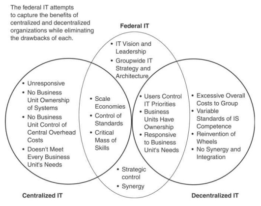
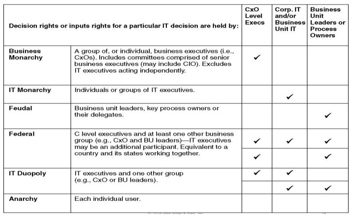

Learning Objectives

+ Understand how governance structures define how decisions are made
+ Describe governance based on organization structure, decision rights, and control
+ Discuss examples and strategies for implementation.

Intel’s Transformation
+ Huge performance improvements between 2013 and 2014
+ Was it due to a spending increase?
+ Intel ’s evolution
+  1992: Centralized IT
+  2003: Protect Era –lockdown (SOX & virus)
+  2009: Protect to Enable Era (BYOD pressure)

Intel Reached Level 3:
1. Developing programs and delivering services
2. Contributing business value
3. Transforming the firm

Previously: categorized problems as “business ” or “IT”

Now: Integrated solutions are the only way 

Intel's IT governance has evolved significantly over the past few decades, driven by the need to adapt to changing business requirements and technological advancements. In the early 1990s, Intel had a centralized IT structure, but as the company faced increasing regulatory pressures and security threats in the early 2000s, it shifted to a more protective approach, locking down systems and enforcing strict controls. However, by 2009, the rise of bring-your-own-device trends and the need to enable business innovation prompted Intel to move towards a more enabling IT governance model, where IT began developing programs and delivering services that contributed direct business value and transformed the firm. This evolution allowed Intel to achieve significant performance improvements between 2013 and 2014, not due to increased spending, but rather through the implementation of effective IT governance practices that aligned IT with business objectives and enabled digital transformation.

### IT Governance
+ Governance (in business) is all about making decisions that
  + Define expectations
  + Grant authority
  + Ensure performance
+ Empowerment and monitoring will help align behavior with business goals.
  + Empowerment: granting the right to make decisions.
  + Monitoring: evaluating performance .
+ IT governance focuses on how decision rights can be distributed differently to facilitate three possible modes of decision making:
  + centralized, 
  + decentralized, or 
  + hybrid
+ Organizational structure plays a major role .
 
Four Perspectives
+ Traditional –Centralized vs decentralized
+ Accountability and allocation of decision rights
+ Ecosystem
+ Control structures from legislation
 
Centralized vs. Decentralized Organizational Structures
+ Centralized –bring together all staff, hardware, software, data, and processing into a single location.
+ Decentralized –the components in the centralized structure are scattered in different locations to address local business needs.
+ Federalism –a hybrid of centralized and decentralized structures.
 
Organizational continuum

### Federalism
+ Most companies would like to achieve the advantages of both centralization and decentralization.
+ Leads to federalism
  + Distributes, power,  hardware, software, data and personnel  
  + Between a central information systems group and information systems in business units
  + A hybrid approach
  + Some decisions centralized; some decentralized

Federalism in IT governance refers to a system where decision-making and accountability for IT policies are shared between central IT functions and divisional IT staff, resembling the structure of federal governance in political systems. In this context, centralized governance grants the corporate IT function full authority over IT matters, while decentralized governance assigns responsibility to individual divisions. Federal IT governance, on the other hand, involves a shared governance structure where both corporate and divisional IT staff are involved in decision-making, with varying degrees of decentralization. This approach allows for a balance between standardization and customization, enabling greater responsiveness to business unit needs while maintaining control over standards and economies of scale. The evolution of IT governance within organizations mirrors the principles of federalism, emphasizing the importance of aligning IT strategies with business objectives and adapting to changing technological landscapes to drive effective decision-making and business transformation.

Recent Global Survey

Percent of firms reporting that they are:
+ Centralized: 70.6%
+ Decentralized: 13.5%
+ Federated: 12.7%
 
Decentralized, centralized, and federated IT governance represent distinct approaches to decision-making and accountability in IT policies within organizations. Centralized IT governance places all decision-making authority in a central IT organization, while decentralized governance assigns responsibility to individual business units. Federated IT governance, on the other hand, involves a hybrid approach where corporate IT and business units collaborate on decision-making, balancing standardization and customization. Feudal arrangements rely on local decision-making structures where business unit or process leaders make separate decisions based on their own needs.

Centralized governance allows for greater control over standards and economies of scale, while decentralized and feudal models enable more customization and responsiveness to business unit needs. Federal governance aims to leverage the advantages of both centralized and decentralized approaches by establishing a central IT function to provide core services while still allowing business units some discretion. The choice of IT governance model depends on factors such as the organization's size, industry, and strategic objectives.

Decentralized governance distributes responsibility to individual departments, promoting efficiency, quicker problem-solving, and improved service delivery while enhancing accountability and discouraging corruption. Centralized governance, on the other hand, grants the corporate IT function full authority over IT matters, ensuring control over standards and economies of scale. In contrast, federated governance combines elements of both centralized and decentralized models, allowing for shared governance between corporate and divisional IT staff, offering a balance between standardization and customization to meet business unit needs effectively. Each model has its strengths: centralized governance provides control and standardization, decentralized governance offers customization and responsiveness, while federated governance blends these aspects to achieve a flexible and efficient IT governance structure.

IT Accountability and Decision Rights Mismatches

|   |   | Accountability |
|-------|----------------|---|---|
|      | | Low | High |
| Decision Rights | High | Technocentric Gap<ul><li>Danger of overspending on IT creating an oversupply</li><li>IT assets may not be utilized to meet business demand</li><li>Business group frustration with IT group</li></ul> | Strategic Norm (Level balance)<ul><li>IT is viewed as competent</li><li>IT is viewed as strategic to business</li></ul> |
|      | Low | Support Norm (Level balance)<ul><li>Works for organizations where IT is viewed as a support function</li><li>Focus is on business efficiency</li></ul> | Business Gap<ul><li>Cost considerations dominate IT decision</li><li>IT assets may not utilize internal competencies to meet business demand</li><li>IT group frustration with business group</li></ul> |

Five major categories of IT decisions.

| Category | Description | Examples of Affected IS Activities |
|----------|-------------|------------------------------------|
| IT Principles | determine IT assets that are needed | participate in setting strategic direction |
| IT Architecture | structure IT assets | establish architecture  and standards |
| IT Infrastructure Strategies | build IT assets | manage Internet and  network services; data; human resources; mobile computing |
| Business Application Needs | acquire, implement and maintain IT  (insource or outsource) | develop and maintaining information systems |
| IT Investment and Prioritization | How much to invest and where to invest in IT assets | anticipate new technologies |

Political Archetypes (Weill & Ross)
+ Archetypes label the combinations of people who either provide information or have key IT decision rights
  + Business monarchy, IT monarchy, feudal, federal, IT duopoly, and anarchy.
  + Decisions can be made at several levels in the organization
  + Enterprise-wide, business unit, and region/group 
  within a business unit.
 
Political Archetypes
+ Organizations vary widely in their archetypes 
selected
  + The duopoly is used by the largest portion (36%) of organizations for IT principles decisions.
  + IT monarchy is the most popular for IT architecture (73%) and infrastructure decisions (59%).
 
IT governance archetypes

Emergent Governance: Digital Ecosystems
+ Challenge a "top down" approach
+ Self-interested, self-organizing, autonomous sets of technologies from different sources
+ Firms find opportunities to exploit new technologies that were not anticipated
+ Good examples:
  + Google Maps
  + YouTube

Electronic Health Record
+ Can connect to planned sources:
  + Pharmacy
  + Lab
  + Insurance Company
+ Can connect to unplanned sources:
  + Banks –for payment
  + Tax authority –for matching deductions
  + Smartphone apps –for many purposes

How to govern in this case?
+ Might be difficult to impossible!
+ The systems might simply emerge and evolve over time
+ No one entity can plan these systems in their entirety

Mechanisms for Making Decisions
+ Policies and Standards (60% of firms)
+ Review board or committee
+ Steering committee (or governance council)
  + Key stakeholders
  + Can be at different levels:
    + Higher level (focus on CIO effectiveness)
    + Lower level (focus on details of various projects)
 
### Summary of Three Governance Frameworks
| Governance Framework | Main Concept | Possible Best Practice |
|----------------------|--------------|-------------------------|
| Centralization - Decentralization | Decisions can be made by a central authority or by autonomous individuals or groups in an organization. | A hybrid, Federal approach |
| Decision Archetypes | Specifying patterns based upon allocating decision rights and accountability. | Tailor the archetype to the situation |
| Digital Ecosystems | Members of the ecosystem contribute their strengths, giving the whole ecosystem a complete set of capabilities. | Build flexibility and adaptability into governance. |

Sarbanes -Oxley Act (SoX) (2002)
+ To increase regulatory visibility and accountability of public companies and their financial health
  + All companies subject to the SEC are subject to SoX.
  + + CEOs and CFOs must personally certify and be accountable for their firm’s financial records and accounting.
  + Firms must provide real-time disclosures of any events that may affect a firm’s stock price or financial performance.
  + 20 year jail term is the alternative.
  + IT departments play a major role in ensuring the accuracy of financial data .

IT Control and Sarbanes-Oxley
+ In 2004 and 2005, IT departments began to 
  + Identify controls
  + Determine design effectiveness
  + Test to validate operation of controls

### IT Control and Sarbanes -Oxley
Five IT control weaknesses are repeatedly uncovered by auditors:
+ Failure to segregate duties within applications, and failure to set up new accounts and terminate old ones in a timely manner
+ Lack of proper oversight for making application changes, including appointing a person to make a change and another to perform quality assurance on it
+ Inadequate review of audit logs to not only ensure that systems were running smoothly but that there also was an audit log of the audit log
+ Failure to identify abnormal transactions in a timely manner
+ Lack of understanding of key system configurations

Frameworks for Implementing SoX
+ Committee of Sponsoring Organzations of the Treadway Commission.
+ Created three control objectives for management and auditors that focused on dealing with risks to internal control
  + Operations –maintain and improve operating effectiveness; protect the firm's assets
  + Compliance –with relevant laws and regulations.
  + Financial reporting –in accordance with GAAP
 
Control Components
Five essential control components were created to make sure a company is meeting its objectives:
+ Control environment (culture of the firm)
+ Assessment of most critical risks to internal controls
+ Control processes that outline important processes and guidelines
+ Communication of those procedures
+ Monitoring of internal controls by management  

Frameworks
+ COBIT (Control Objectives for Information and Related Technology) 
  + IT governance framework that is consistent with COSO controls.
  + Issued in  by Information Systems Audit & Control Association (ISACA)
  + A company must 
    + Determine the processes/risks to be managed.
    + Set up control objectives and KPIs (key performance indicators)
    + Develop activities to reach the KPIs
  + Advantages -well-suited to organizations focused on risk management and mitigation, and very detailed.
  + Disadvantages –costly and time consuming

IS and the Implementation of SoXCompliance
+ The IS department and CIO are involved with the implementation of SoX.
+ Section  deals with management’s assessment of internal controls.
+ Six tactics that CIOs can use in working with auditors, CFOs, and CEOs :
+ Knowledge building (Build a knowledge base)
+ Knowledge deployment (Disseminate knowledge to management.)
+ Innovation directive (Organize for implementing SoX)
+ Mobilization (Persuade players and subsidiaries to cooperate)
+ Standardization (Negotiate agreements, build rules)
+ Subsidy (Fund the costs)
+ A CIO’s ability to employ these various tactics depends upon his/her power (relating to the SoX implementation).