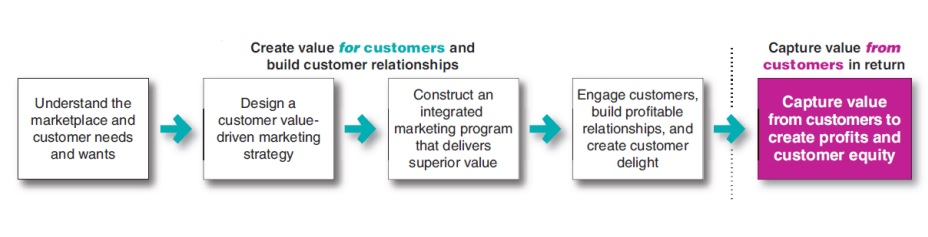
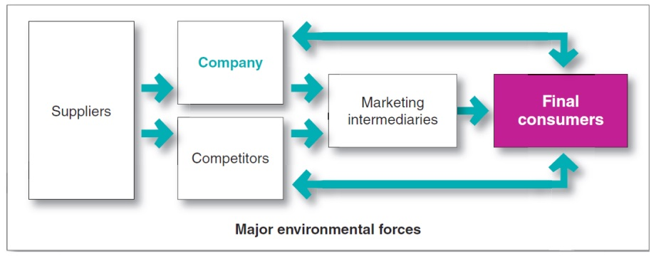
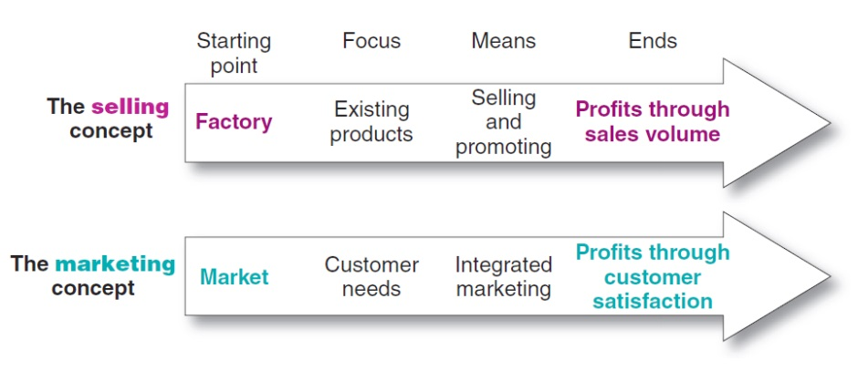
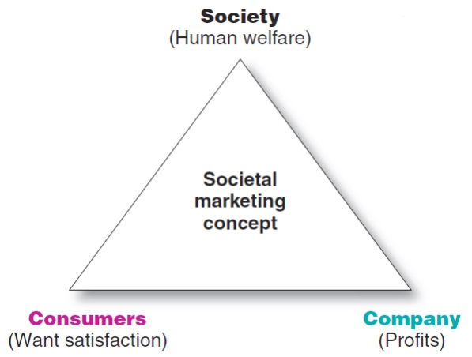
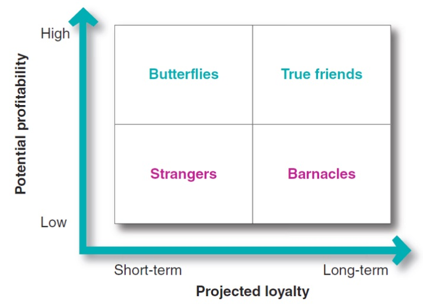
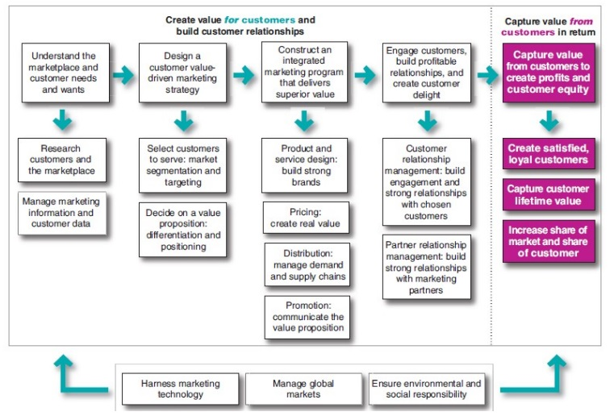

Objectives
+ Define marketing and the steps in marketing process
+ Explain the importance of understanding the marketplace and customers and identify the five core marketplace concepts
+ Identify the key elements of a customer value-driven marketing strategy and discuss the marketing management orientations that guide marketing strategy
+ Discuss customer relationship management and identify strategies for creating value for customers and capturing value from customers in return
+ Describe the major trends and forces that are changing the marketing landscape in this age of relationships

Emirate's Customer-Value Driven Marketing

Emirates' sucess is due to its diverse product offerings, such as its onboard information, communication and entertainment system.

Define marketing and outline the steps in the marketing process

Marketing is engaging customers and managing profitable customer relationships.

Goals of Marketing
+ Atrract new customers by promising superior value
+ Keep and grow current customers by delivering satisfaction

### Form of Marketing

| Traditional | Contemporary |
|-|-|
| Making a scale | Satisfying customer needs |
| Abundance of products in the nearby shopping centers | Imaginvative websites and mobile apps, blogs, online videos and social media |
| Television, magazine and direct-mail ads | Reach customers directly, personally and interactively |

Figure 1.1 - The marketing process: creating and capturing customer value

Marketing creates value for customers
+ understand marketplace and customers
+ design a customer value-driven marketing strategy
+ construct a marketing program
+ engage customers and build relationships

Captures value from customers

Explain the importance of understanding the marketplace and customers and identify the five core marketplace concepts

Five core customers and marketplace concepts:
+ Necessity
+ Market offerings
+ Value and satisfaction
+ Exchanges and relationships
+ Markets

### Market Offerings

Products, services, information or experiences

Offered to satisfy a need or want

Marketing myopia - paying more attention to the specific products than to the benefits and experiences produced

Customers form expectations about the value and satisfaction of market offerings
+ Satisfied customers buy again
+ Dissatisfied customers switch to computers

Setting the right level of expectations
+ Low expectation may fail to attract buyers
+ High expectation may disappoint buyers

### Exchanges and Relationships

Exchange is the act of obtaining a desired object by offering something in return.

Marketing consists of creating, maintaining and growing desirable exchange relationships

Strong relationships are built by consistently delivering superior customer value

Market

All actual and potential buyers of a product

Sellers and consumers market

Customer-managed relationships

Figure 1.2 - A modern marketing systems

Summary
+ Needs
+ Customer lifetime value and share of customer
+ Long-term customer equity
+ Other marketplace concepts
  + market offerings
  + value and satisfaction
  + exchange and relationships
  + markets
+ value proposition

Identify the key elements of a customer value-driven marketing strategy and discuss the marketing management orientations that guide marketing strategy

### Designing a customer value-driven marketing strategy

Marketing management: choosing target markets and building profitable relationships

Designing a winning marketing strategy
+ Target market
+ Value proposition

Market segmenetation refers to dividing the markets into segments of customers

Target marketing refers to which segments to go after

Choosing a value proposition - the comapny must decide how it will differentiate and position itself in the marketplace

Marketing management orientations
+ Production concept
+ Product concept
+ Selling concept
+ Marketing concept
+ Societal marketing concept

Figure 1.3 - The selling and marketing concepts contrasted

Figure 1.4 - Three considerations underlying the societal marketing concepts

### Marketing mix

4 Ps of marketing
+ Product
+ Price
+ Place
+ Promotion

Marketing mix tools should be blended into a comprehensive integrated marketing program

Summary
+ Market segmentation
+ Target marketing
+ Differentiation and positioning
+ Production and product concepts
+ Selling and marketing concepts
+ Societal marketing concepts

Discuss customer relationship management and identify strategies for creating value for customers and capturing value from customers in return

### Customer relationship management

Delivering superior customer value and satisfaction to build and maintain profitable customer relationships
+ Customer-perceived value: customer's evaluation of a marketing offer relative to those of competing offers
+ Customer satisfaction: Extent to which a product's perceived performance matches a buyer's expectations

Customer relationship levels and tools

Walgreens: relationship marketing tools

Customer engagement marketing

Customer-engagement marketing makes the brand a meaningful part of customers' conversations and lives

Greater consumer empowerment means that companies must practice marketing by attraction

Marketing must find ways to enter consumers' conversations with engaging and relevant brand messages

Brand exchanges created by consumers
+ Consumers play an increasing role in shaping their own brand experiences and those of other consumers

Uninvited and invited
+ Consumer-to-consumer exchanges
+ Consumers invited by companies
  + New product and service ideas
  + Active role in shaping ads
  
Working closely with partners both inside and outside the company to jointly bring more value to customers
+ Partners inside the firms - cross-functional teams
+ Partners outside the firms - suppliers, channel partners

Creating cutomer loyalty and retention

Keeping customers loyal makes good economic sense

Customer lifetime value is the value of the entire stream of purchases a customer makes over a lifetime of patronge

Customer defections can be costly
+ Lose customers' lifetime value
+ Cause other customers to defect

Share of customer

Portion of the customer's purchasing in their product categories

Share of customer is increased by
+ Good customer relationship management
+ Offering greatr variety to current customers
+ Creating programs to cross-sell and up-sell to existing customers

Customer equity

Total combined customer lifetime values of  all of the company's customers

Measures the future value of the company's customer base

Increases when the loyalty of the firm's profitable customers increases

Better measure of a firm's performance than current sales or market share

Cadialic: managing customer equity

Figure 1.5 - Customer relationship groups

Summary
+ Customer relationship management
+ Customer-engagement marketing
+ customer equity
+ Customer value and satisfaction
+ Creating value for customers and capturing value from customers in return

## Describe the major trends and forces that are changing the marketing landscape in this age of relationships

The changing marketing landscape
+ Digital age
+ Changing economic enviornment
+ Growth of not-for-profit marketing
+ Rapid globalization
+ Sustainable marketing

Digital and social media marketing: engaging consumers via their digital devices using digital marketing tools

Mobile marketing: using mobile channels to stimulate immediate buying, make shopping easier and enrich the brand experience

Blending the new digital approaches with traditaional marketing creates a smoothy integrated marketing strategy and mix

Changing economic enviornmenet

The great recession undermined consumer confidence

Post-recession era

Consumers have become more frugal

New consumer spending values emphasize simpler living

Marketers are focusing on value, practicality and durability in their product offerings

Growth of not-for-profit marketing

Sound marketing can help not-for-profit attract membership, funds and support

Rapid globalization and sustainable marketing

Managers around the world are taking both local and global views of the company's
+ Industry
+ Competitors
+ Opportunities

Corporate ethics and social responsibility have become important for every business

Summary
+ Online, mobile and social media marketing
+ Post-recession economy
+ Not-for-profit marketing
+ Connecting globally
+ Ethical and social responsibilities

Figure 1.6 - An expanded model of the marketing process
