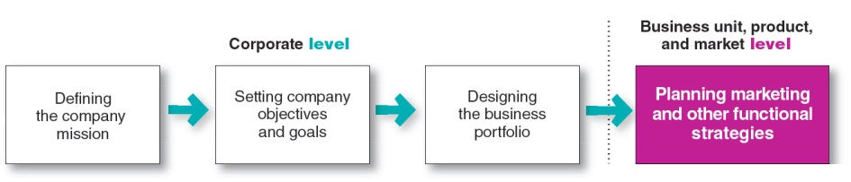
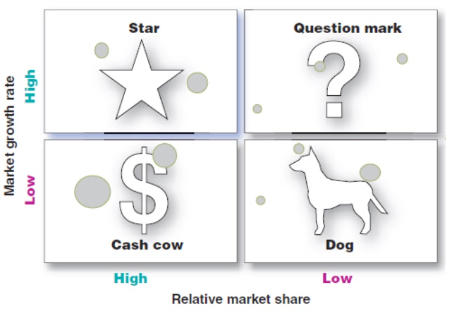
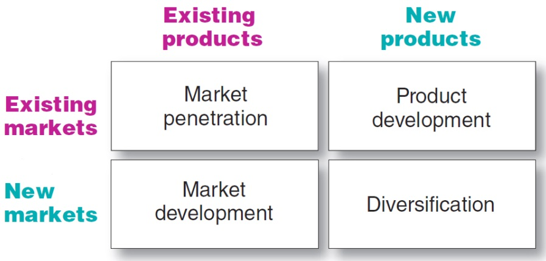
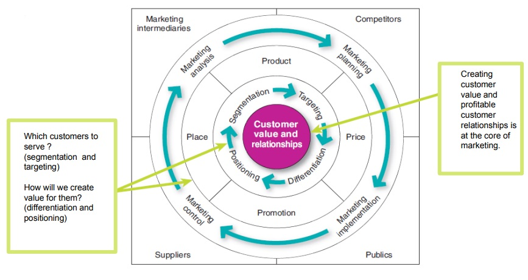
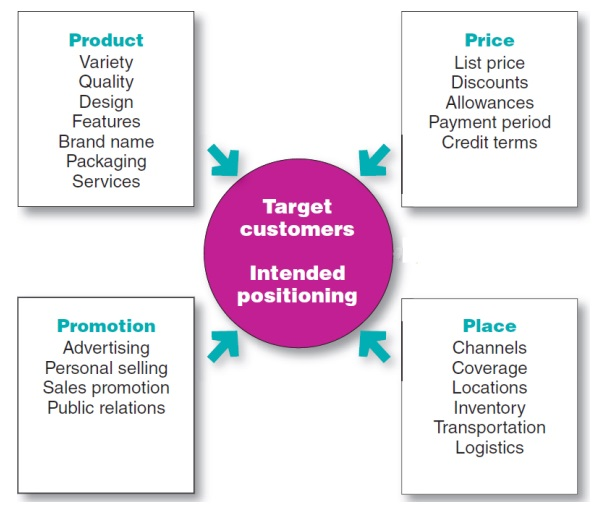
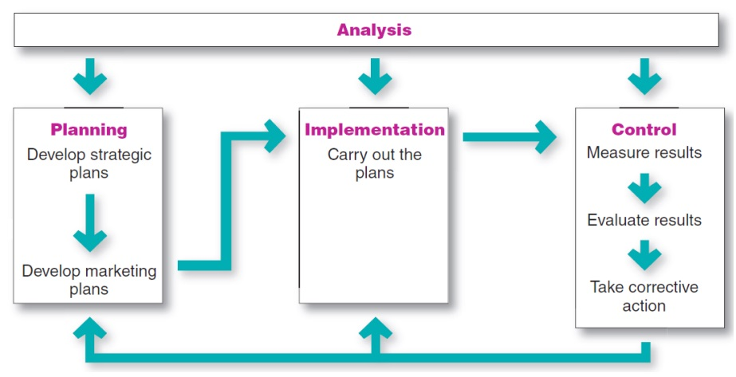
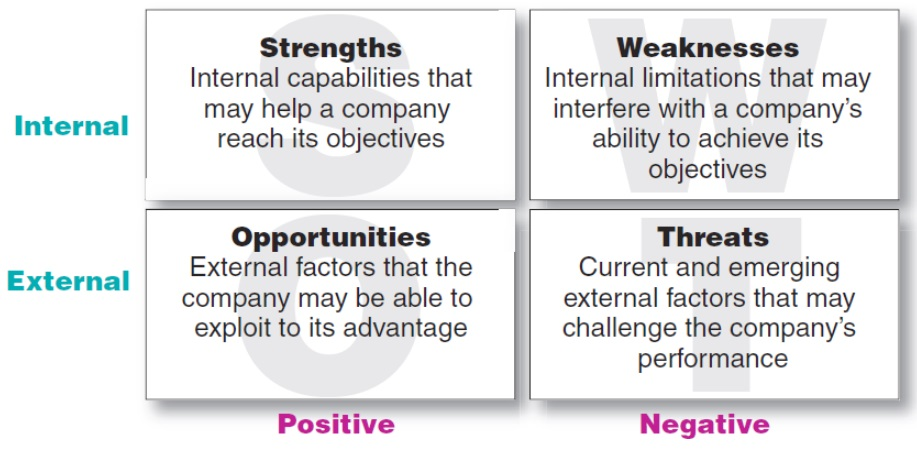
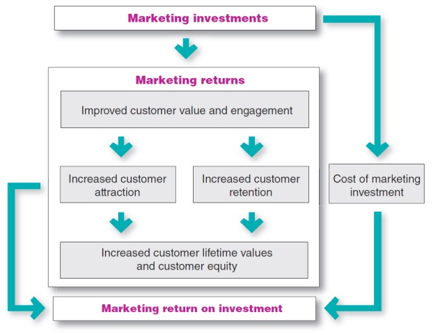

Explain company-wide strategic planning and its four steps

Discuss how to design business porfolios and develop growth strategies

Explain marketing's role in strategic planning and how marketing works with its partners to create and deliver customer value

Describe the elements of a customer value-driven marketing strategy and mix and the forces that influences it

List the marketing management functions, including the elements of a marketing plan, and discuss the importance of measuring and managing marketing return on investment

Rolex

Building brand equity through a customer-driven marketing mix

Rolex endorses sports that reinforce the values of the brand-archivement and exclusivity

Explain company-wide strategic planning and its four steps

## Strategic planning

Game plan for long-run survival and growth

Helps to maintain a strategic fit between its goals and capabilities and changing marketing opportunities

Figure 2.1 - Steps in strategic planning

## Mission statement

Statement of the organization's purpose

Market oriented-defined in terms of satisfying basic customer needs

Emphasize the company's strengths

## Setting company objectives and goals

Detailed supporting objectives for each level of management

Setting a hierarchy of objectives
+ Business objectives
+ Marketing objectives

Summary
+ Stategic planning
  + Defining the company's mission
  + Setting objectives and goals
  + Designing a business portfolio
  + Developing functional plans
+ Company mission statement
  + Market oriented, realistic, specific
  + Motivating, consistent with market environment

Discuss how to design business portfolios and develop growth strategies

## Busiess Portfolio

Collection of businesses and products that make up the company

Steps in business portfolio planning:
+ Analyze the firm's current business portfolio
+ Develop strategies to shape the future portfolio

Disney has become a sprawling collection of media and entertainment businesses

Portfolio Analysis

Management's evaluation of the products ad business that make up the company
+ Identify the strategic business units
+ Assess strategic business units attractiveness and decide on the level of support strategic business unit deserves

Direct resources toward more profitable businesses and phase down or drop its weaker ones

## The Boston Consulting Group Growth-Share Matrix

Figure 2.2 - Growth-Share Matrix

Evaluates a company's strategic business units in terms of market growth rate and relative market share

Problems with Growth-Share Matrix
+ Difficult, time consuming and costly
+ Difficult to define and measure
+ Provides little advice for future planning

Figure 2.3 - The Product/Market Expansion Grid

## Developping strategies for growth

Under Armour has grown at a blistering rate under its multipronged growth strategy

Downsizing

Products or business units that are unprofitable or no longer fit the company's overall strategy

Reasons to abandon products or markets
+ Rapid growth of the company
+ Lack of experience in a market
+ Change in market environment
+ Decline of a particular product

Summary
+ Portfolio analysis
+ Growht-Share Matrix
+ Product market expansion grid
+ Strategies for growth and downsizing

Explain marketing's role in strategic planning and how marketing works with its parteners to create and deliver customer value

## Planning marketing: partnering to build customer relationships

+ Provides a guilding philiosophy
  + Marketing concept-company strategy should create customer value and build profitable relationships
+ Provide inputs to strategic planners
  + Identify market opportunities and potential to take advantages of them
+ Design Strategies for reaching the business unit's objectives

Partnering with other company departments

Company departments are links in the company's internal value chain

Firm's success depends on how well the various departments coordinate their activities

Marketers should ensure all the departments are customer-focused and develop a smooth functioning value chain

Partnering with other company departments

True Value's internal value chain

Companies should assess value chains
  + Internal departments
  + External: suppliers, distributors and customers

Value delivery network is composed of the company, its suppliers, its distributors and its customers

Summary
+ Planning marketing
+ Partnering to build customer relationships
+ Partnering with other company departments
+ Partnering with suppliers, distributors and customers
+ Value delivery network

Describe the elements of the a customer value-dirven marketing strategy and mix and the forces that influence it

Figure 2.5 - Managing marketing strategy and the marketing mix

## Customer value-driven marketing strategy

Marketing logic by which the company creates customer value and acheives profitable customer relationships

Integrated marketing mix: product, price, place and promotion

Activities for best marketing strategy and mix
+ marketing analysis
+ planning, implementation and control

Marketing segmentation and market targeting

Positioning

Positiong the product to occupy a clear, distinctive and desirable place relative to competing products

Differentiaing the market offering to create superior customer value

The entire marketing program should support the chosen positioning strategy

Figure 2.5 - The four Ps of the marketing matrix

## Criticism of the four Ps
+ Omits or underemphasizes service products
+ Needs to include packaging as a product decision
+ Buyer's perspective would emphasize the four As:
  + Acceptabilty
  + Affordability
  + Accessibility
  + Awareness

Figure 2.6 - Managing marketing: analysis, planning, implementation and control

Figure 2.7 - [SWOT](https://www.business.qld.gov.au/running-business/planning/swot-analysis) analysis: strength, weakness, opporuntities and threats

Summary
+ Customer value-driven marketing strategy
+ market segmentation and market segment
+ market targeting
+ positiong and differentiating
+ Four Ps of the marketing mix
+ Analysis, planning implementation and control
+ SWOT analysis

List the marketing management functions, including the elements of a marketing plan and discuss the importance of measuring and managing marketing return on investment

## Content of a marketing plan

| Section | Purpose |
|-|-|
| Executive summary | Brief summary of the main goals and recommendations |
| Current marketing situation | Gives the market description and the product, competition and distribution review | Decentralized design; business units decide how to meet customer needs |
| Threats and opportunities analysis | Helps management to anticipate important positive or negatived developments |
| Objectiveness and issues | States and discuss marketing objectives and key issues |
| Marketing strategy | Outlines the brand marketing logic and the specifics of target markets, positiong, marketing expenditures levels and strategs for each marketing mix element |
| Action programs | Spells out how marketing strategies will be turned into specific action programs |
| Budgets | Details a supporting marketing budget that is a projected profit-and-loss statement |
| Controls | Outlines the controls that will be used to monitor progress, allow management to review implementation results, and spot products that are not meeting their goals |

### Market implementation

Turning marketing strategies and plans into marketing actions to accompolish strategic marketing obejctives

Addresses the who, where, when and how of the marketing activities

Marketing department organization

### Marketing control

Measuring and evaluating the results of marketing strategies and plans

Operating control ensures that the company acheives its sales, profits and other goals

Strategic control involves looking at whether the company's basic strategies are well matched to its opportuniteis

Figure 2.8 - Marketing return on investments

Net return from a marketing investment divided by the costs of the marketing investment

Assessment measures
+ Standard marketing performance measures
+ Customer-centered measures

Marketing return on investment