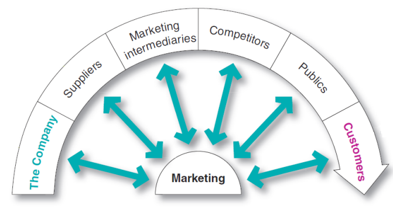
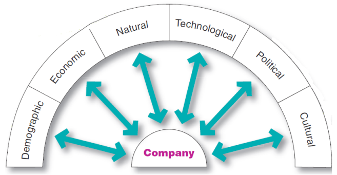

Learning Objectves

+ Describe the environmental forces that affect the companyss ability to serve its customers.
+ Explain how changes in the demographic and economic environments affect marketng decisions.
+ Identify the major trends in the firmss natural and technological environments.
+ Explain the key changes in the politcal and cultural environments.
+ Discuss how companies can react to the marketng environment.

First Stop: Philips

Analyzing the Marketng Environment in the Middle East

Philipss analysis of market needs—such as demands for energyefcient products like LEDs—has driven its  contnuous growth in this region.

## Describe the environmental forces that affect the companyss ability to serve its customers.

Marketng Environment

+ Outside forces that affect marketng managementss ability to build and maintain successful relatonships with target customers
  + Microenvironment: Actors close to the company that affect its ability to serve its customers
  + Macroenvironment: Larger societal forces that affect the microenvironment

Figure 3.1 - Actors in the Microenvironment

The Company
+ Interrelated groups in a company form the internal environment
+ Departments share the responsibility for understanding customer needs and creatng customer value.

Suppliers

+ Provide the resources needed by the company to produce its goods and services
+ Supplier problems seriously affect marketng
+ Supply shortages or delays
+ Labor strikes
+ Price trends of key inputs

Suppliers Honda has developed healthy, long-term supplier relatonships.

Marketng Intermediaries
+ Marketng intermediaries help the company to promote, sell, and distribute its products to final buyers.
+ Resellers
+ Physical distributon firms
+ Marketng services agencies
+ Financial intermediaries

Marketng Intermediaries

Coca-Cola provides its retail partners with much more than just soft drinks. It also pledges powerful
marketng support.

Compettors

+ Marketers must gain strategic advantage by positoning products strongly against
compettors.

+ No single strategy is best for all companies.

Publics

Publics: any group that has an actual or potental interest in or impact on an organizatons' ability to achieve its objectves

+ Financial
+ Media
+ Government
+ Citzen acton
+ Local
+ General
+ Internal

Customers
+ Five types of customer markets
+ Consumer markets
+ Business markets
+ Reseller markets
+ Government markets
+ Internatonal markets

Figure 3.2 - Major Forces in the Companys' Macroenvironment

### Summary

+ Companys's microenvironment
+ Company, suppliers, marketng intermediaries
+ Compettors, publics, customers
+ Forces in the companys's macroenvironment
+ Demographic
+ Economic
+ Natural
+ Technological
+ Politcal and cultural

## Explain how changes in the demographic and economic environments affect marketng decisions.

Demographic Environment
+ Demography is the study of human populatons in terms of size, density, locaton, age, gender, race, occupaton, and other statstcs.
+ Marketers analyze:
  + Changing age and family structures
  + Geographic populaton shifs
  + Educatonal characteristcs
  + Populaton diversity

Demographic Environment
+ The U.S. populaton contains several generatonal groups:
  + Baby Boomers
  + Generaton X
  + Millennials (or Generaton Y)
  + Generaton Z

General Electric's Artstry appliance line is designed to target Millennials.

Economic Environment
+ Economic factors affect consumer purchasing power and spending
+ Changes in consumer spending
+ Differences in income distributon

### Summary

+ Demographic environment
+ Age and family structures
+ Geographic populaton shifs
+ Educaton characteristcs
+ Populaton diversity
+ Economic environment
+ Changes in consumer spending and income distributon

## Identify the major trends in the firms's natural and technological environments.

Natural Environment

+ Physical environment and natural resources needed as inputs by marketers or affected by marketng actvites
+ Environmental sustainability concerns have grown steadily over the past three decades.
+ Trends:
  + Shortages of raw materials
  + Increased polluton
  + Increased government interventon

Technological Environment
+ New technologies create new markets and opportunites.
+ Radio-frequency identicaton (RFID) is technology to track products through various points in the distributon channel.
+ Government agencies investgate and ban potentally unsafe products.

Technological Environment

Disney is taking RFID technology to new levels with its cool new MagicBand RFID wristband.

Learning Objectve

### Summary

+ Natural environment
+ Shortage of raw materials and high polluton levels
+ Government interventon
+ Environmental sustainability
+ Technological environment
+ Radio-frequency identicaton (RFID)
+ Government regulaton

## Explain the key changes in the politcal and cultural environments.

Politcal Environment
+ Forces that infuence or limit various organizatons and individuals in a society
+ Laws, government agencies, and pressure groups

Major U.S. Legislaton Affectng Marketng

Legislaton regulatng business is intended to protect
+ companies from each other
+ consumers from unfair business practces
+ the interests of society against unrestrained business behavior

| Legislaton | Purpose |
|-|-|
| Childrenss Television Act | Limits the number of commercials aired during childrenss programs |
| Nutriton Labeling and Educaton Act | Requires that food product labels provide detailed nutritonal informaton| 
| Telephone Consumer Protecton Act | Establishes procedures to avoid unwanted telephone solicitatons |
| Americans with Disabilites Act | Makes discriminaton against people with disabilites illegal |
| Childrenss Online Privacy Protecton Act | Prohibits online collecton of informaton from children without parental consent Allows parents to review informaton collected from their children |
| Do-Not-Call Implementaton Act | Collects fees from telemarketers for the enforcement of a Do-Not-Call Registry | 
| CAN-SPAM Act | Regulates the distributon and content of unsolicited commercial e-mail |
| Financial Reform Law | Created the Bureau of Consumer Financial Protecton: Writes and enforces rules for the marketng of inancial products to consumers |

### Socially Responsible 

+ Socially responsible companies actvely seek out ways to protect the long-run interests of consumers and the environment.
+ Companies develop policies, guidelines, and other responses to complex social responsibility issues.

Cause-Related Marketng
+ Companies use cause-related marketng to
+ Exercise their social responsibility
+ Build more positve images
+ Primary form of corporate giving
+ Controversy—strategy for selling more rather than a strategy for giving

AT&T joined forces with compettors Verizon, Sprint, and T-Mobile to spearhead the “It Can Wait” campaign.

Cultural Environment
+ Insttutons and other forces that affect a societyss basic values, perceptons, and behaviors
+ Persistence of cultural values
+ Core beliefs and values have a high degree of persistence.
+ Secondary beliefs and values are more open to change.
+ Shifs in secondary cultural values of peopless views about
+ Themselves
+ Others
+ Organizatons
+ Society
+ Universe

Yogi appeals to tea drinkers with a more spiritual view of themselves, their lives, and their teas.

Politcal environment
+ Laws, government agencies, and pressure groups
+ Legislaton affectng marketng
+ Socially responsible behavior

Cultural environment
+ Core and secondary beliefs
+ Shifs in secondary cultural values

## Discuss how companies can react to the marketng environment.

Responding to the Marketng Environment
+ Reactve firms passively accept the marketng environment and do not try to change it.
+ Proactve firms develop strategies to change the environment.
+ They take aggressive actons to affect the publics and forces in their marketng environment.

Responding to the marketng environment
+ Reactve firms
+ Proactve firms

Summary
+ Describe the environmental forces that affect the companyss ability to serve its customers.
+ Explain how changes in the demographic and economic environments affect marketng decisions.
+ Identify the major trends in the firmss natural and technological environments.
+ Explain the key changes in the politcal and cultural environments.
+ Discuss how companies can react to the marketng environment.